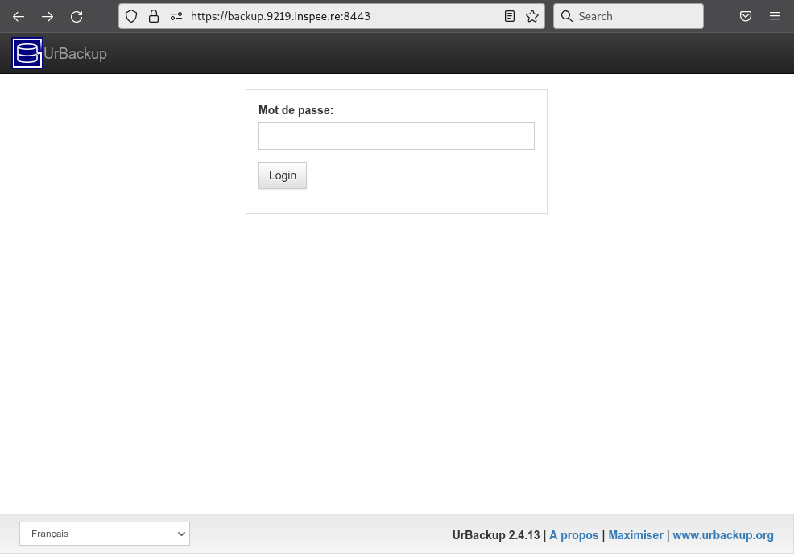
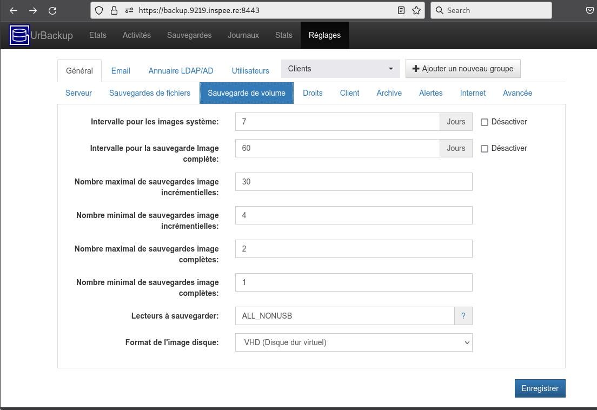
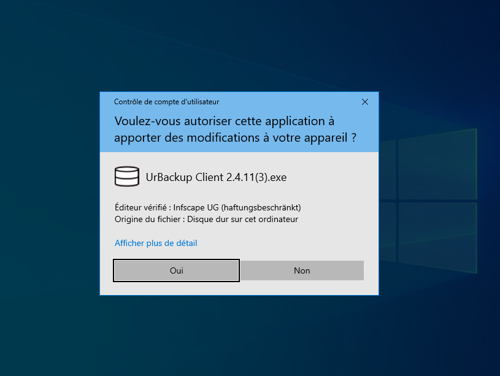
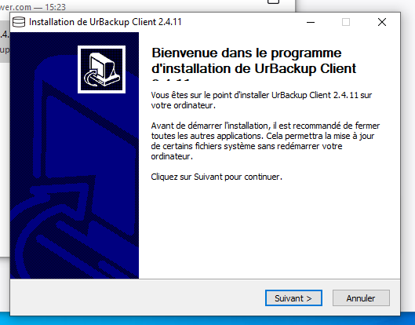
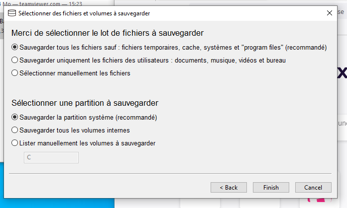

.. role:: red

2. Configuration du Système DATIS
=================================

Opérations courantes :
* 

2.1 Sauvegardes
---------------

Configuration sauvegarde niveau 1
^^^^^^^^^^^^^^^^^^^^^^^^^^^^^^^^^

.. _config_client_urbackup:

Configuration sauvegarde niveau 2 : UrBackup
^^^^^^^^^^^^^^^^^^^^^^^^^^^^^^^^^^^^^^^^^^^^

La sauvegarde des postes de travail, serveurs et machines virtuelles windows 
est assurée à l'aide de l'outil UrBackup (documentation: `EN <https://www.urbackup.org/>`_ | 
`FR <https://www-urbackup-org.translate.goog/?_x_tr_sl=en&_x_tr_tl=fr&_x_tr_hl=fr-FR>`_).

.. panels::
  :header: text-center
  :column: col-lg-12 

  A propos du choix de l'outil UrBackup
  ^^^^^^^^^^^^^^^^^^^^^^^^^^^^^^^^^^^^^

  Urbackup est un outil issu du monde OpenSource.

  Il a été choisi pour son niveau de maturité (le projet existe et est activement 
  maintenu depuis plus de 10 ans) et ses performances lors des phases de 
  sauvegarde et de restauration.

.. _intro_interface_gestion_urbackup:

Interface de gestion centralisée
################################

L'interface de gestion centralisée est accessible depuis l'intranet auquel 
est connecté DATIS, via l'URL ``https://backup.XXXX.inspee.re`` où XXXX 
est l'identifiant à 4 digits hexa de la Datis (cad les 4 derniers digits
de son adresse MAC).

Le mot de passe pour accéder à cette interface est généré automatiquement
lors de l'activation et transmis:

- soit par Inspeere au technicien en charge de l'installation

- soit reçu directement par le partenaire Inspeere lors de l'activation 
  du contrat

Contacter le `support Inspeere <mailto:support@inspeere.com>`_ si ce 
code n'a pas été reçu.

Certains réglages de l'interface de gestion sont automatiquement préconfigurés 
par le système DATIS:

- configuration mail sortant (pour recevoir les notifications et alertes)

- plan de sauvegarde en mode fichier

- plan de sauvegarde en mode image

Suivant la philosophie DATIS, la sauvegarde est donc en état de fonctionner 
dès l'ajout des premiers clients. Il est néanmoins toujours possible de modifier 
les réglages par défaut via l'onglet des réglages.

.. _intro_agents_collecte_urbackup:

Agents de sauvegarde
####################

Le client de sauvegarde pour un poste Windows peut-être téléchargé directement 
sur le site UrBackup depuis le poste à sauvegarder, 
`à l'aide de ce lien <https://hndl.urbackup.org/Client/2.4.11/UrBackup%20Client%202.4.11.exe>`_.

Une fois le téléchargement terminé, il suffit de cliquer sur l'exécutable pour
lancer l'installation.

Donnez l'autorisation à l'application d'installation d'apporter des 
 modifications et accepter tous les choix par défaut jusqu'a la fin de l'installation
 

   

Une fois l'application installée, le menu de configuration s'ouvre automatiquement:

Acceptez les choix par défaut, vous pourrez de toutes façon les changer par
l'interface de supervision de la Datis.

.. warning::
  :strong:`Action requise après chaque installation de client Urbackup`

  Un bug dans l'outil d'installation de la version courante du client Urbackup 
  conduit à une configuration incomplète du pare-feux windows.
  
  Pour éviter toute interruption du service de sauvegarde il est **IMPÉRATIF**
  de :ref:`reconfigurer_le_pare_feu` (sur tous les postes sur lesquels sont déployés 
  les agents Urbackup)

À ce stade deux situations sont possibles:

1. Le client (le poste windows) **EST sur le même subnet que le serveur DATIS**

   Dans ce cas, le client peut fonctionner directement en mode "INTRA-net", 
   qui est le mode par défaut. La configuration du client est alors terminée 
   sur le poste Windows à sauvegarder, car elle pourra éventuellement être 
   modifiée par la suite au niveau de l'interface de gestion.

2. Le client **N'EST PAS sur le même subnet** (par exemple si la DATIS est en DMZ, ou si 
le client est sur un autre site) 

   Dans ce cas, il faut configurer manuellement le client pour un mode de 
   fonctionnement dit "INTER-net". Il reste alors encore une étape de la procédure
   d'association à réaliser sur le poste à sauvegarder, mais cette étape 
   ne pourra être réalisée qu'après avoir lancé la procédure d'association 
   depuis l'interface de gestion centralisée. (décrite au paragraphe suivant). 

.. _intro_procedure_association_urbackup:

Procédure d'association
#######################

UrBackup propose deux formes d'association, qui NE sont PAS exclusives (on peut associer 
un poste Windows des deux façon en même temps):

- association INTRA-net

- association INTER-net

Pour lancer l'une ou l'autre forme, il faut cliquer sur le bouton bleu "Ajouter un client"
sur la page d'accueil de l'interface de gestion.

<Screenshot>

**L'association INTRA-net**:

Comme indiqué sur la copie d'écran suivante, il suffit d'ajouter le nom ou 
l'IP du poste

.. _config_client_timemachine:

Configuration sauvegarde niveau 2 : TimeMachine
^^^^^^^^^^^^^^^^^^^^^^^^^^^^^^^^^^^^^^^^^^^^^^^

Configuration du client de sauvegarde TimeMachine faisant partie 
du système MacOS, en 6 étapes:

**1. Ouvrir les réglages Time Machine**

.. figure:: ActivationTimeMachine/1-TimeMachineSettings.jpg
  :width: 480px
  :align: center

**2. Ouvrir le menu de sélection des disques TimeMAchine**

.. figure:: ActivationTimeMachine/2-SelectTimeMachineDisk.jpg
  :width: 480px
  :align: center

**3. Sélectionner le disque de votre DATIS**

NB: l'identifiant de la DATIS apparaît à la fin du nom du disque. 
Si vous avez plusieurs DATIS actives sur votre réseau, vous pouvez en sélectionner
plusieurs en recommençant la procédure: votre MAC sauvegardera alternativement
sur chacune des DATIS.

.. figure:: ActivationTimeMachine/3-SelectDisk.jpg 
  :width: 480px
  :align: center

**4. Acceptez la connexion au partage SAMBA de votre DATIS**

.. figure:: ActivationTimeMachine/4-ConnectionTimeMachine.jpg
  :width: 480px
  :align: center

**5. Donnez vos identifiants**

Attention, il s'agit de vos identifiants DATIS, et non pas vos identifiants MAC.
Si vous avez plusieurs MAC à sauvegarder, vous devrez créér autant de comptes
sur DATIS que de MAC.

NB: La procédure de création de comptes DATIS est décrite ici.

.. figure:: ActivationTimeMachine/5-IdentifiantDatisAdmin.jpg
  :width: 480px
  :align: center

**6. C'est fait!**

Vous devez voir le dique ``TimeMachine-XXXX`` dans la liste des disques 
utilisés par TimeMachine, et la première sauvegarde doit commencer bientôt.

.. figure:: ActivationTimeMachine/6-BackupIsRunning.jpg
  :width: 480px
  :align: center

.. _config_VEEAM:

Mise en place sauvegarde niveau 2 : VEEAM
^^^^^^^^^^^^^^^^^^^^^^^^^^^^^^^^^^^^^^^^^

Sauvegarde Office 365
^^^^^^^^^^^^^^^^^^^^^

2.2 Interface DatisAdmin
------------------------

Gestion des utilisateurs
^^^^^^^^^^^^^^^^^^^^^^^^

Fonctions système
^^^^^^^^^^^^^^^^^

Récupération d'un fichier dans sauvegarde niveau 1
^^^^^^^^^^^^^^^^^^^^^^^^^^^^^^^^^^^^^^^^^^^^^^^^^^

2.3 Serveur de fichiers (SMB)
-----------------------------

Types de Partages
^^^^^^^^^^^^^^^^^

Partages avec sauvegardes
^^^^^^^^^^^^^^^^^^^^^^^^^

Partages et Nextcloud
^^^^^^^^^^^^^^^^^^^^^

2.4 Option Nextcloud
--------------------

Fonctionalités par défaut
^^^^^^^^^^^^^^^^^^^^^^^^^

Espace de partage (dossier COMMUN)
^^^^^^^^^^^^^^^^^^^^^^^^^^^^^^^^^^
