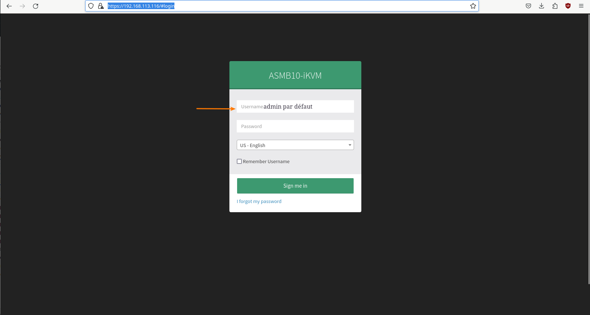
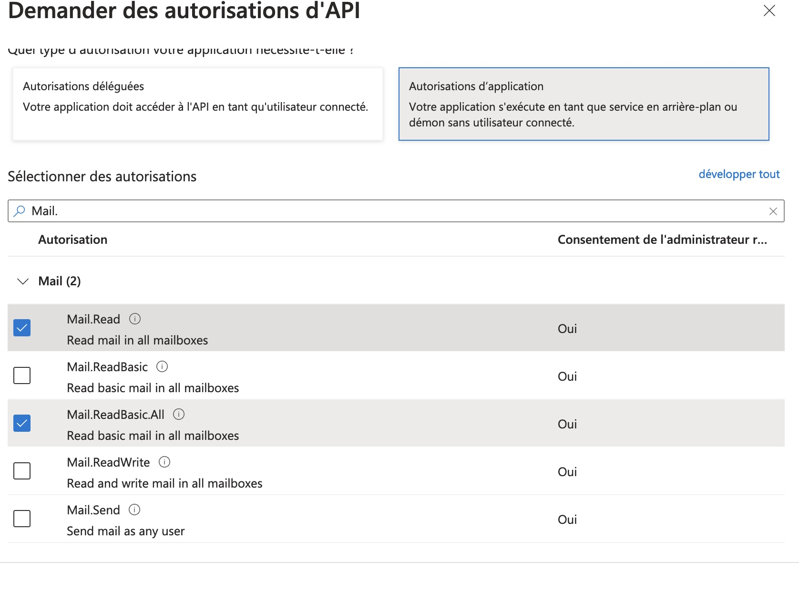

.. role:: red

4. Configuration du Système DATIS
=================================

Opérations courantes :
*
 
Fonction IPMI de la DATIS
^^^^^^^^^^^^^^^^^^^^^^^^^

.. NOTE::

  Certaines DATIS (Les Terra) possèdent une "fonction" IPMI qui permet l'administration de celle-ci
  via le réseau.

**Tout d'abord entrer l'adresse IP partagée dans un navigateur pour accéder au serveur**

  image 1

  image 2

**Pour avoir accès à l'interface en ligne de commande par le réseau il faut cliquer sur le bouton "jviewer".**

.. figure:: ./Figures_ipmi/jviewer_ipmi.png
  :width: 480px
  :align: center

  image 3

.. NOTE::
  Il est possible qu'en cliquant sur le bouton "launch jviewer" la console ne se lance pas mais qu'un
  fichier nommé jviewer.jnlp soit téléchargé. Il faut alors se placer dans ce dossier avec le terminal
  et taper la commande suivante :

.. code-block:: bash

  $ javaws jviewer.jnlp

**Suivre les instructions proposées par les images suivantes.**

.. figure:: ./Figures_ipmi/jviewer2_ipmi.png
  :width: 480px
  :align: center

  image 4

.. figure:: ./Figures_ipmi/jviewer3_ipmi.png
  :width: 480px
  :align: center

  image 5

.. figure:: ./Figures_ipmi/jviewer4_cli_ipmi.png
  :width: 480px
  :align: center

  image 6

  image 7

2.1 Sauvegardes
---------------

.. _config_client_urbackup:

Configuration sauvegarde urbackup niveau 1
^^^^^^^^^^^^^^^^^^^^^^^^^^^^^^^^^^^^^^^^^^

.. panels::
  :header: text-center
  :column: col-lg-12

  Le Client Urbackup
  ^^^^^^^^^^^^^^^^^^

  La configuration du client Urbackup nécessite tout d'abord le téléchargement de ce dernier
  à l'adresse indiquée (Téléchargement:  `ICI <https://hndl.urbackup.org/Client/2.5.25/UrBackup%20Client%202.5.25.exe>`_)
  Lancer l'installation et paramétrer comme suit :

Paramétrage du Client
^^^^^^^^^^^^^^^^^^^^^

**Clic droit sur l'icône (voir encadré sur l'image).**

  
  figure 1

**Choisir settings.**

  figure 2

**Sélectionner les fichiers à sauvegarder et ceux à exclure.**

  figure 3

**Indiquer le volume C pour la sauvegarde image du système.**

  figure 4

**Puis le créneau horaire et journalier.**

  figure 5

.. _config_client_timemachine:

Configuration sauvegarde niveau 2 : TimeMachine
^^^^^^^^^^^^^^^^^^^^^^^^^^^^^^^^^^^^^^^^^^^^^^^

Configuration du client de sauvegarde TimeMachine faisant partie 
du système MacOS, en 6 étapes:

**1. Ouvrir les réglages Time Machine**

.. figure:: ActivationTimeMachine/1-TimeMachineSettings.jpg
  :width: 480px
  :align: center

**2. Ouvrir le menu de sélection des disques TimeMAchine**

.. figure:: ActivationTimeMachine/2-SelectTimeMachineDisk.jpg
  :width: 480px
  :align: center

**3. Sélectionner le disque de votre DATIS**

NB: l'identifiant de la DATIS apparaît à la fin du nom du disque. 
Si vous avez plusieurs DATIS actives sur votre réseau, vous pouvez en sélectionner
plusieurs en recommençant la procédure: votre MAC sauvegardera alternativement
sur chacune des DATIS.

.. figure:: ActivationTimeMachine/3-SelectDisk.jpg 
  :width: 480px
  :align: center

**4. Acceptez la connexion au partage SAMBA de votre DATIS**

.. figure:: ActivationTimeMachine/4-ConnectionTimeMachine.jpg
  :width: 480px
  :align: center

**5. Donnez vos identifiants**

Attention, il s'agit de vos identifiants DATIS, et non pas vos identifiants MAC.
Si vous avez plusieurs MAC à sauvegarder, vous devrez créér autant de comptes
sur DATIS que de MAC.

NB: La procédure de création de comptes DATIS est décrite ici.

.. figure:: ActivationTimeMachine/5-IdentifiantDatisAdmin.jpg
  :width: 480px
  :align: center

**6. C'est fait!**

Vous devez voir le disque ``TimeMachine-XXXX`` dans la liste des disques 
utilisés par TimeMachine, et la première sauvegarde doit commencer bientôt.

.. figure:: ActivationTimeMachine/6-BackupIsRunning.jpg
  :width: 480px
  :align: center

.. _config_VEEAM:

Mise en place sauvegarde niveau 2 : VEEAM
^^^^^^^^^^^^^^^^^^^^^^^^^^^^^^^^^^^^^^^^^

**En cours de construction.**

Sauvegarde Office 365
^^^^^^^^^^^^^^^^^^^^^

.. NOTE::
  Ce chapitre comporte 2 parties:
  
  La connexion individuelle à un compte Microsoft personnel et La connexion "multi-tenants" gérée par un administrateur au profit d'utilisateurs d'un Active Directory

Pour la connexion individuelle:
-------------------------------

**Voici en images la procédure de connexion au compte Microsoft 0365**

.. figure:: ./Figures_o365/1_connexion_compte.png
  :width: 480px
  :align: center

  image 1

**Cliquer sur le bouton "connexion"**

.. figure:: ./Figures_o365/2_cjohan.png
  :width: 480px
  :align: center

  image 2

**Choisir ensuite le nom de connexion**

.. figure:: ./Figures_o365/2_connexion_johan.png
  :width: 480 px
  :align: center

  image 3

**Une fois celle-ci établie les sauvegardes commencent**

.. figure:: ./Figures_o365/3_onedrive_saves.png
  :width: 480px
  :align: center

  image 4

.. figure:: ./Figures_o365/4_explorer.png
  :width: 480px
  :align: center

  image 5

**Il suffit ensuite de choisir le fichier ou dossier à restaurer**

La connexion multi-tenant:
--------------------------

Création de l'application
~~~~~~~~~~~~~~~~~~~~~~~~~

.. NOTE::
  Il faut impérativement se rendre sur le portail Microsoft Azure pour 
  créer une page d'enregistrement d'une application à cette adresse : `cliquer ici <https://portal.azure.com/#view/Microsoft_AAD_IAM/ActiveDirectoryMenuBlade/~/RegisteredApps>`_ .
  Ensuite suivre les étapes:

.. figure:: ./Figures_app_azure/01_Welcome.jpg
  :width: 480px
  :align: center

  image 1  

**Cocher les deux réponses montrées par la capture d'écran:**

.. figure:: ./Figures_app_azure/2_USAGE_QUESTION.jpg
  :width: 480px
  :align: center

  image 2

**Passer la visite guidée.**

.. figure:: ./Figures_app_azure/3_SKIP_TOUR.jpg
  :width: 480px
  :align: center

  image 3

**Enregistrer une nouvelle app en cliquant sur + Nouvelle inscription**

.. figure:: ./Figures_app_azure/4_NEW_REGISTRATION.jpg
  :width: 480px
  :align: center

  image 4

**Une page s'affiche**

- Donner un nom à l'application

- Sous l'option "Types de compte pris en charge",
  sélectionnez "Comptes dans n'importe quel annuaire organisationnel (tout locataire Microsoft Entra ID - Multilocataire)
  et comptes personnels Microsoft (par exemple Skype, Xbox)".  

- Laisser URI de redirection vide (Cette option ne sera pas utilisée.)

- Pour finir, cliquer sur "s'incrire"

  image 5

**La page est redirigée**

- Sur celle-ci on trouve:
  L'ID d'application
  L'ID de l'annuaire
  Bien noter ces deux valeurs.

  image 6

**Sur la même page, colonne de gauche, sélectionner:**

- Certificats & secrets
- Cliquer sur + Nouveau secret client

  image 7

**Renseigner:**

- La description
- La date d'expiration
- Cliquer sur ajouter

.. figure:: ./Figures_app_azure/8_New_SECRET.jpg
  :width: 480px
  :align: center

  image 8

.. figure:: ./Figures_app_azure/9_FILL_SECRET_FORM.jpg
  :width: 480px
  :align: center

  image 9

**Ceci va donner:**

- Une valeur de clé
- Une ID de secret

.. figure:: ./Figures_app_azure/10_DISPLAY_SECRET.jpg
  :width: 480px
  :align: center

  image 10

**Copier la valeur de la clé et l'enregistrer.**

.. figure:: ./Figures_app_azure/11_COPY_SECRET_TO_CLIPBOARD.jpg
  :width: 480px
  :align: center

  image 11

Configurer les permissions
~~~~~~~~~~~~~~~~~~~~~~~~~~

**A partir de la page d'application vue à l'étape précédente:**

- Sélectionnner (Dans la colonne de gauche) "API autorisées".
- Cliquer sur + Ajouter une autorisation et sélectionner "Microsoft Graph"

.. figure:: ./Figures_app_azure/13_ADD_PERMISSION_BUTTON.jpg
  :width: 480px
  :align: center

  image 12

.. figure:: ./Figures_app_azure/14_DISPLAY_MICROSOFT_GRAPH.jpg
  :width: 480px
  :align: center

  image 13

**Comme le montre l'image suivante:**
- Choisir "autorisations d'application"

.. figure:: ./Figures_app_azure/15_APPLICATION_PERMISSIONS.jpg
  :width: 480px
  :align: center

  image 14

**Une page s'ouvre avec une barre de recherche.Tapez les mots clés pour:**

- Applications
- Directory
- Files
- Mail
- Sites
- User

**Suivre la procédure ci-dessous.**

.. figure:: ./Figures_app_azure/16_Application_ReadWriteALL.jpg
  :width: 480px
  :align: center

  image 15

.. figure:: ./Figures_app_azure/17_Application_ReadWriteALL.jpg
  :width: 480px
  :align: center

  image 16

.. figure:: ./Figures_app_azure/17_Application_ReadWriteALL.jpg
  :width: 480px
  :align: center

  image 17

.. figure:: ./Figures_app_azure/18_Files_Permissions.jpg
  :width: 480px
  :align: center

  image 18

  image 19

.. figure:: ./Figures_app_azure/20_Sites_Permissions.jpg 
  :width: 480px
  :align: center

  image 20

  image 21

**Résumé de l'opération.**
-Cliquer sur "Accorder un consentement d'administrateur pour..." (image 22)
-Choisir le type d'autorisations déléguées (image 23)

.. figure:: ./Figures_app_azure/22_AFTER_ADDPERM_BUTTON.jpg
  :width: 480px
  :align: center

  image 22

.. figure:: ./Figures_app_azure/23_BEFORE_DELEGATED_PERMISSION.jpg
  :width: 480px
  :align: center

  image 23

**Il ne reste plus alors qu'à entrer les clé dans le dashboard de la Datis:**
- Application(client) ID
- Tenant (Directory) ID
- La Secret Value

.. figure:: ./Figures_app_azure/24_ADD_KEYS_DATISADMIN.png
  :width: 480px
  :align: center

  image 24

**Avant de lancer la sauvegarde, tester les clés**

  image 25

2.2 Interface DatisAdmin
------------------------
.. figure:: ./Figures/1_DatisAdmin_DashBoard_Annot.png
  :width: 480px
  :align: center

  figure 1

**1. Tableau de bord de la console d'administration**

 La figure 1 présente le tableau de bord de la console d’administration,
 avec un menu en partie gauche, un rappel de l’état général du système en partie centrale haute,
 et un rappel de l’état de sauvegarde de chaque poste sauvegardé par UrBackup en partie centrale basse.
 Un lien vers la documentation est proposé dans le coin inférieur droit

.. figure:: ./Figures/2_DatisAdmin_2FA_annot.png
  :width: 480px
  :align: center

  figure 2

**2. Chaque utilisateur de la console peut activer une authentification à deux facteurs**

 La console peut-être accessible par différents utilisateurs. Chacun peut activer une authentification à double facteur (figure 2).
 Les utilisateurs créés avec le profil Administrateur ont le droit d’ajouter de nouveaux utilisateurs. 
 Les accès des utilisateurs sont centralisés dans une base interne LDAP,
 qui permet d’utiliser les mêmes identifiants pour accéder aux différents services du système INSPEERE Datis.

  figure 3

**3. Le menu de gestion des utilisateurs permet de créer ou modifier des comptes 
utilisateurs et de leur générer des profils VPN Individuels.**

 Le Menu des gestion des utilisateurs (figure 3) permet d’ajouter de nouveaux utilisateurs, de les activer/désactiver, 
 ou de leur délivrer un profil pour établir une connexion VPN (la clé en partie droite). 
 Le profile VPN permet d’accéder aux consoles de gestion et de supervision, ou à certains services trop vulnérables 
 pour être exposés directement sur Internet (SMB, FTP, ...). Initialement, chaque Datis est livrée avec un premier utilisateur « admin »,
 dont les identifiants sont transmis de façon sécurisée à l'administrateur.

.. figure:: ./Figures/4_DatisAdmin_Systeme_General_Annot.png
  :width: 480px
  :align: center

  figure 4

**4. Le menu de gestion du système propose plusieurs onglets de configuration.**

 Le menu de gestion du système (figure 4) permet de configurer ou de consulter les éléments de la configuration système. 
 Nous revenons plus en détail sur les deux derniers concernant les versions et les rapports ci-après.

.. figure:: ./Figures/5_DatisAdmin_Systeme_Version_annot.png
  :width: 480px
  :align: center

  figure 5

**5. Affichage des versions des principaux composants du système, pour une meilleure prise en compte des vulnérabilité potentielles.**

 L’onglet VERSION du menu système (figure 5) permet d’afficher les versions actuellement déployées des composants utilisés par le système : 
 version du noyau, du serveur LDAP, VPN, etc. Cette liste permet de vérifier rapidement si le système est vulnérable lors de l’annonce de nouvelles CVE.
 La version courante du système INSPEERE Datis est quant à elle toujours visible en bas à gauche de l’interface DatisAdmin.

  figure 6

**6. Interface de gestion des Rapports.**

 L’onglet RAPPORTS du menu système (figure 6) permet d’accéder à l’interface de gestion et consultation des rapports de synthèse. 
 Ces rapports sont complémentaires des rapports techniques et alertes mail produits par UrBackup. 
 Ils sont destinés à un public non spécialiste et permettent de vérifier le bon déroulement des sauvegardes de postes.
 Ce menu permet aussi d’activer l’envoi d’un rapport quotidien à une liste d’utilisateurs convenus (par exemple le client final / adhérent).

.. figure:: ./Figures/7_DatisAdmin_Systeme_Rapport_Visu_Annot.png
  :width: 480px
  :align: center

  figure 7

**7. Visualisation d’un rapport.**

 Chaque rapport peut-être soit visualisé sous forme HTML (figure 7), soit téléchargé au format PDF. 
 C’est le même format PDF qui est envoyé par mail lorsque la demande de rapport quotidien est activée.

.. figure:: ./Figures/8_DatisAdmin_Recup_Annot.png
  :width: 480px
  :align: center
  
  figure 8

**8. La première des deux interfaces de restauration, permet de récupérer des fichiers dans le stockage local 
(fichiers déposés par Samba, Rsync, FTP, etc.)**

 Le menu Récupération (figure 8) permet d’accéder à l’historique de la première des deux formes de sauvegardes, 
 celle des fichiers « déposés » sur le système INSPEERE Datis, 
 à l’aide de protocoles tels que Samba, Rsync, FTP, NFS, etc.

 Le système DATIS prend des instantanés ZFS de l’état du stockage fichier selon la politique de rétention locale planifiée. 
 Cette politique est configurable, avec une granularité variable. Par exemple il est possible de prendre un instantané 
 toutes les 5 minutes pendant 1 heure, puis un toutes les heures pendant 24h, puis un par jour pendant 30j, 
 puis un par semaine pendant 3 mois, etc.

 Une fois l’intervalle de recherche affiné (barre de sélection encadrée en rouge au milieu, figure 8), 
 il suffit de cliquer sur le bouton explorer pour accéder à l’explorateur des instantanés et récupérer le fichier ou dossier voulu. 
 La restitution se fait alors soit en écrasant le contenu actuel, soit a côté en ajoutant la date de l’instantané 
 en suffixe du nom de fichier/dossier. 

.. figure:: ./Figures/9_DatisAdmin_Urbackup_Liste_Annot.png
  :width: 480px
  :align: center

  figure 9

**9. La deuxième interface de restauration est plus spécifiquement dédiée aux sauvegardes de postes et VMs par UrBackup.**

 Le menu Machines Sauvegardées (figure 9) permet d ‘accéder à la deuxième interface de restauration plus spécifiquement dédiée à UrBackup. 
 Elle permet d’obtenir la liste des sauvegardes de postes et VMs gérées par la système UrBackup. Le bouton d’action en bout de ligne permet 
 d’accéder plus spécifiquement aux sauvegardes d’un poste en particulier.
 Il est important de noter que cette interface est complémentaire de l’interface fournie par le système UrBackup. 
 Elle fournit la fonction de restauration granulaire, qui n’est pas disponible autrement par l’interface de UrBackup.

 La restauration granulaire consiste à permettre l’ouverture d’un instantané d’Image disque pour en extraire un fichier. 
 Elle est rendue possible grâce à l’utilisation du backend ZFS avec UrBackup.
 
 Ce backend permet de proposer avec UrBackup une sauvegarde incrémentale perpétuelle, dans laquelle chaque incrément de sauvegarde 
 contient le contenu d’une sauvegarde image complète, mais ne requiert que l’espace supplémentaire d’un incrément. 
 Avec cette forme de sauvegarde, les techniques de sauvegardes complètes,  « full synthetique », ou incrémentales inversée 
 deviennent totalement inutiles : l’espace disque occupé est minimal, et il est possible de réduire le nombre d’instantanés 
 en supprimant n’importe le(s)quel(s), en fonction des objectifs de la politique de rétention.

.. figure:: ./Figures/10_DatisAdmin_Urbackup_ListeOne.png
  :width: 480px
  :align: center

  figure 10

**10. Navigation dans les sauvegardes images UrBackup d’un poste en particulier.**

 En cliquant sur le bouton d’action à fin de la ligne correspondant à un poste sauvegardé (figure 9), 
 on obtient la liste des sauvegardes de type image et de type fichier de UrBackup. Pour chaque instantané de sauvegarde de type image, 
 il est possible d’ouvrir une nouvelle  page de détails spécifique à cet instantané (bouton action en fin de ligne sur la figure 10).

  figure 11

**11.Ouverture d’un instantané de volume du poste sauvegardé.**

 Lorsque le volume explorer correspond à une partition d’origine (disque C, D, ...), il est possible de « monter » l’image 
 afin d’accéder à son contenu (figure 11). Il est alors possible d’explorer le contenu de l’image et d’en télécharger 
 des fichier à l’aide des boutons d’action en fin de ligne.

 Il est important de noter que toute cette séquence d’ouverture est très rapide, car grâce au stockage ZFS, 
 l’accès au contenu d’un instantané ne requiert aucune phase de reconstruction/consolidation : en pratique, 
 chaque instantané est une sauvegarde complète, immédiatement disponible.

Tableau de bord de supervision centralisé
^^^^^^^^^^^^^^^^^^^^^^^^^^^^^^^^^^^^^^^^^

  figure 1

**1. La zone supérieure du tableau de bord présente un « cartouche » par serveur. Chaque cartouche est une matrice 3x2 d’indicateurs de couleur. 
La zone suivante offre un niveau de détail plus élevé. Elle constituée d’une série de lignes d’indicateurs, les « one-liner », une pour chaque serveur.**

 

 La figure 1 montre la partie haute du tableau de bord. Tout en haut, on trouve la zone des « cartouches » qui présente de façon compacte 
 l’état de chaque serveur, à l’aide de 6 indicateurs, organisés en matrice 3x2. Le code couleur est intuitif : 
 vert quand tout va bien, bleu quand un indicateur est sans objet (par exemple lorsque la sauvegarde UrBackup de type fichier n’est pas utilisée), 
 et jaune, puis orange, puis rouge en fonction du niveau d’alerte. Dans le cas présent, les cases oranges indiquent que des sauvegardes UrBackup 
 de type fichier ou image sont en retard sur 3 des 4 serveurs.

 Vient ensuite la zone des « one-liners » qui donne un peu plus d’information sur l’état du stockage ZFS local et distant, 
 pour chaque serveur, sur une ligne par serveur (cadre rouge en partie basse de la figure 23).

.. figure:: ./Figure_Graf/2_Etat_Systeme_Annot.png
  :width: 480px
  :align: center

  figure 2

**2. En faisant défiler la page vers le bas, on atteint la zone centrale du tableau de bord, avec les indicateurs système de chaque serveur.
Ici la figure présente les indicateurs pour un serveur. Il faut faire défiler la page pour obtenir les même indicateurs avec les serveurs suivants.**

 La figure 2 montre la zone des indicateurs système d’un serveur. A coté des indicateurs classique de charge et d’occupation mémoire, 
 on trouve les indicateurs concernant l’état du stockage primaire ZFS. La aussi le code couleur est conservé : lorsque c’est vert (ONLINE), 
 le stockage n’a pas d’erreur. Si un disque venait à perdre des secteur, l’état passerait en orange (DEGRADED), et en cas de défaillance grave, 
 il passe en rouge (FAULTED). La quantité de stockage libre/utilisé est aussi un indicateur important à surveiller 
 (2e cadre rouge en partant du haut, dans la figure 13). Enfin, tout en bas de cette zone système, on trouve la courbe du trafic de sauvegarde, 
 avec des couleurs différentes pour le trafic en provenance des postes sauvegardés, et celui à destination des réplicats externes.

.. figure:: ./Figure_Graf/3_Etat_Urbackup_Annot.png
  :width: 480px
  :align: center

  figure 3

**3. En faisant encore défiler jusqu’en bas de la page du tableau de bord, on atteint la zone concernant l’état des sauvegardes UrBackup
sur chacun des serveurs. Les informations présentées sont les mêmes que celles présentées sur la console UrBackup, mais regroupées
en un seul et même endroit pour tous les serveurs Datis d’un même client ou tous les clients d’un même partenaire.**

.. _gestion_des_utilisateurs:

Gestion des utilisateurs
^^^^^^^^^^^^^^^^^^^^^^^^

Sur DatisAdmin voici comment se passe la gestion des utilisateurs:
Dans l'exemple quelques utilisateurs ont été créés.

.. figure:: ./Figures_SMB/Selection_001.png
  :width: 480px
  :align: center

  image 1

**Afin de créer un nouvel utilisateur cliquer sur l'icone "Nouvel Utilisateur".**

.. figure:: ./Figures_SMB/Selection_004.png
  :width: 480px
  :align: center

  image 2

**Ensuite il en reste qu'à renseigner les champs proposés.**

.. figure:: ./Figures_SMB/Selection_006.png
  :width: 480px
  :align: center

  image 3

Fonctions système
^^^^^^^^^^^^^^^^^

Récupération d'un fichier dans sauvegarde niveau 1
^^^^^^^^^^^^^^^^^^^^^^^^^^^^^^^^^^^^^^^^^^^^^^^^^^

**Grâce à DatisAdmin, cette opération est simple :**
Dans l'onglet "Machines sauvegardées" de DatisAdmin cliquer sur l'explorateur (l'oeil) d'une machine

.. figure:: ./Figures/DatisAdmin_restor1.png
  :width: 480px
  :align: center
  
  image 1

Repérer le disque "C" qui contient tous vos fichiers et dossiers

.. figure:: ./Figures/DatisAdmin_restor2.png
  :width: 480px
  :align: center
  
  image 2

Cliquer ensuite sur le bouton "MONTER"

.. figure:: ./Figures/DatisAdmin_restor3.png
  :width: 480px
  :align: center

  image 3

Utiliser le menu déroulant jusqu'à l'utilisateur

.. figure:: ./Figures/DatisAdmin_restor4.png
  :width: 480px
  :align: center

  image 4

  image 5

Choisir enfin le fichier recherché et cliquer le la flèche de téléchargement

.. figure:: ./Figures/DatisAdmin_restor6.png
  :width: 480px
  :align: center

  image 6

2.3 Serveur de fichiers (SMB)
-----------------------------

Types de Partages
^^^^^^^^^^^^^^^^^

Partages avec sauvegardes
^^^^^^^^^^^^^^^^^^^^^^^^^

Partages et Nextcloud
^^^^^^^^^^^^^^^^^^^^^

**Il est possible d'avoir tous les dossiers présents sur Nextcloud en local sur son PC.**

Il faut pour cela tout d'abord créer un dossier spécifique que l'on nomme comme on veut par exemple :
SMB situé dans les Documents :

.. code-block:: bash

  $ /home/luke/Documents# sudo mkdir SMB

.. code-block:: bash

  $ sudo mount -v -t cifs -o user=hsolo //192.168.113.99/hsolo/ SMB/

Output:
Password for hsolo@//192.168.113.99/hsolo/:``<Entrer le mot de passe>``

mount.cifs kernel mount options: ip=192.168.113.99,unc=\\192.168.113.99\hsolo,user=hsolo,pass=********
Pour vérifier que les dossiers sont bien synchronisés créer un dossier "Titi" dans Nextcloud

.. figure:: ./Figures_SMB/Selection_003.png
  :width: 480px
  :align: center

  image1

.. code-block:: bash

  root@skywalker:/home/luke/Documents#cd SMB

.. code-block:: bash

  luke@skywalker:~/Documents/SMB$ ls

**Output:**
Documents   Modèles  'Nextcloud intro.mp4'  'Nextcloud Manual.pdf'   Nextcloud.png   
NOBACKUP   Photos   Readme.md  'Reasons to use Nextcloud.pdf'   Talk   ``Titi`` 

2.4 Option Nextcloud
--------------------

Fonctionalités par défaut
^^^^^^^^^^^^^^^^^^^^^^^^^

Espace de partage (dossier COMMUN)
^^^^^^^^^^^^^^^^^^^^^^^^^^^^^^^^^^

.. panels::
  :header: text-center
  :column: col-lg-12

  A propos du dossier commun
  ^^^^^^^^^^^^^^^^^^^^^^^^^^
  Après avoir créé des utilisateurs dans la DatisAdmin :ref:`gestion_des_utilisateurs` ceux-ci ont accès au
  dossier ``COMMUN``.   
  Le dossier commun est à la fois visible sur le PC en local et dans le serveur Nextcloud. Etant synchronisés
  tout ce qu'un utilisateur créera dans le dossier commun le sera aussi dans le même dossier Nextcloud
  ...et inversement!

  image 1

.. figure:: ./Figures_SMB/SMB_2.png
  :width: 480px
  :align: center

  image 2

  image 3

**Un dossier nommé OWEN LARS créé dans le dossier COMMUN du PC est synchonisé dans Nextcloud**

.. figure:: ./Figures_SMB/SMB_4.png
  :width: 480px
  :align: center

  image 4

