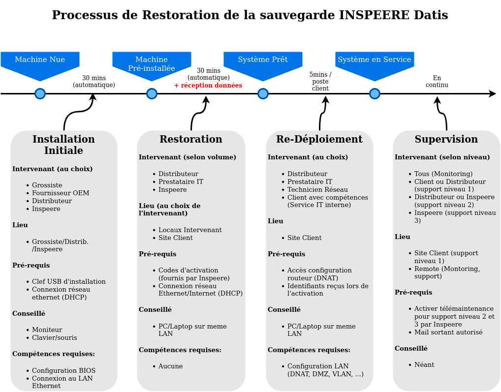

.. role:: red

1. Mise en Service
==================

   Les étapes de mise en service de l'appliance INSPEERE DATIS.

.. _installation_système:

1.1 Installation du firmware DATIS
----------------------------------

Si vous êtes partenaire revendeur, il est possible que vous ayez reçu de Inspeere ou 
du grossiste une Datis pré-installée. Dans ce cas vous n'avez rien à faire, 
vous pouvez passer à l'étape suivante:

    :ref:`activation_du_systeme_DATIS`

a. Clef USB d'installation
^^^^^^^^^^^^^^^^^^^^^^^^^^

Dans ce qui suit, nous supposons que disposez d'un serveur ou d'un équipement 
nu, compatible DATIS et que vous souhaitez faire l'installation initiale du système DATIS. 

Bonne nouvelle! L'installation du système DATIS se fait de façon complètement automatisée à 
partir d'une clef USB.

Soit vous avez reçue cette clef prête à l'emploi de Inspeere, soit vous avez reçu
une image ISO à copier sur une clef USB. Dans ce cas, vous aurez besoin d'une clef 
d'au moins 4GO, au standard USB 3.1 ou plus rapide.

Pour copier l'image ISO sur la clef USB vous pouvez soit utiliser un outil tel que 
Rufus sur PC, soit la commande ``dd`` sur un mac ou PC linux. En supposant que la clef USB est 
détectée comme ``/dev/sdb`` sur linux, vous utiliserez la commande suivante:

.. code-block:: bash

  $ dd if=fichier_image.iso of=/dev/sdb bs=1M

b. Procédure d'Installation du firmware DATIS
^^^^^^^^^^^^^^^^^^^^^^^^^^^^^^^^^^^^^^^^^^^^^

Pour installer le firmware DATIS, vous devez déballer le matériel, et connecter 
le boitier DATIS au secteur ET au réseau. 

Attention: pour que l'installation du firmware réussisse, le boitier doit 
impérativement avoir accès à Internet pour télécharger certains éléments et 
des mises-à-jour. Les pré-requis sont les même que pour un déploiement sur site du 
client (voir :ref:`config_dnat` et :ref:`filtrage_sortant` )  

Même si l'installation est en principe possible sans aucune intervention sur un 
matériel vierge, il est fortement recommandé de connecter un écran (HDMi), un clavier 
et une souris pour en suivre le bon déroulement.

Il est d'ailleurs recommandé de procéder aux réglages suivants dans le BIOS avant de 
démarrer sur la clef:

- Mettre en place l'option de sélection de l'état précédent en cas de panne 
  de courant (pour que la Datis redémarre toute seule en cas de coupure de courant)

- Réduire le partage de mémoire vive de la carte vidéo à seulement 32MO

- Désactiver les options de boot secure si elle sont actives (en principe elles ne 
  le sont pas)

Insérez ensuite la clef USB dans un des ports USB frontal, et dérmarrez (ou redémarrez 
la machine) en pressant la touche de sélection du périphérique de démarrage (souvent F8 
ou F11, selon constructeur).

Le menu de sélection affiche géneralement un choix 'USB partition 2' (mode BIOS `Legacy`)
et 'UEFI USB partition 2' (mode BIOS `UEFI`).

Préférez toujours le choix UEFI, mais en cas d'échec de la procédure d'installation par 
UEFI (par exemple sur un serveur reconditionné), vous pourrez tenter le mode Legacy, qui 
conduit à un démarrage plus lent.

Si la clef est correctement détectée, vous devez voir s'afficher l'écran de démarrage 
de la distribution Proxmox. En principe, aucune intervention n'est plus nécessaire à 
partir de ce point (sauf instruction contraire au préablable du support Inspeere 
pour des installations très spécifiques.)

Au bout de 5 secondes, le premier écran de démarrage de Proxmox doit automatiquement 
basculer vers la "ceinture d'astéroides" de la version Inspeere de Proxmox.

.. note:: Si une boite de dialogue apparaît demandant de préciser la langue ou un autre 
   paramètre, c'est qu'il y a un problème de connexion réseau. Vérifier la connexion, la 
   configuration de votre serveur DHCP et les filtrages au niveau du firewall, puis 
   recommencez l'installation en démarrant sur la clef USB.

Lorsque l'installation s'est bien passée, vous devez voir s'afficher un écran de 
connexion tel que le suivant. Félicitations, vous avez terminé cette première 
phase d'installation!

.. _activation_du_systeme_DATIS:

1.2 Activation du système DATIS
-------------------------------

.. panels::
   :header: text-center

   :column: col-lg-12 

    Philosophie Datis
    ^^^^^^^^^^^^^^^^^

    La philosophie de Inspeere Datis est de préférer les conventions à la configuration 
    (pattern CoC : `Convention over Configuration <https://en.wikipedia.org/wiki/Convention_over_configuration>`_)

    Contrairement à d'autres produits, cette philosophie permet d'éviter au maximum le 
    besoin de naviguer dans des menus de configuration, et donc d'éviter à l'utilisateur ou
    au technicien en charge de l'installation d'avoir à répondre à des questions inutilement 
    complexes et ambigus.

    Ce mode de fonctionnement permet de réduire le risque de mauvaise configuration, et donc 
    de potentiel dysfonctionnement. Il permet aussi de réduire le niveau d'expertise technique 
    requis pour l'installation d'un équipement Inspeere Datis.

    Dans tous les cas, le produit qui est livré au client est toujours dans un état de 
    configuration **raisonnable par défaut** lui permettant de fonctionner sans paramètrage 
    ni réglage, *out-of-the-box*.

a. Ajustement de la configuration par défaut
^^^^^^^^^^^^^^^^^^^^^^^^^^^^^^^^^^^^^^^^^^^^

L'activation d'un système DATIS entraîne le chargement et l'application automatique
de réglages prédéfinis contenus dans son `bundle de configuration`. 
Pour gagner du temps et éviter les reconfigurations, il est donc préférable de modifier 
ces réglages par défaut, si besoin, avant de déclencher l'activation.

Cette modification des réglages par défaut en amont de l'activation se fait par 
simple demande auprès du support Inspeere (ou du partenaire grossiste).

.. note:: Chaque Datis possède un `bundle de configuration` spécifique. C'est un fichier
   (format json) qui est conservé par Inspeere et est mis à jour (par Inspeere) tout au 
   long de la durée d'exploitation de la Datis. Lors d'une opération de reinstallation, 
   la Datis récupère automatiquement la dernière version du bundle.

.. note:: Si des besoins d'ajustements sont découverts au fil de l'eau, lors de la mise en 
  service ou après : l'interface d'administration DatisAdmin permet de procéder à quelques 
  réglages basiques, mais pour des besoins plus spécifiques, il suffit d'adresser la demande 
  au support Inspeere, qui procédera à la modification des réglages, à distance.  

L'interface d'administration d'une Datis est volontairement simple, car les réglages 
et points de configuration spécifiques à chaque client sont justement prévus pour être 
traîtés en amont de l'installation, ou par demande explicite au support.

Lors de sa première mise en service, la Datis récupère *automatiquement* son bundle de configuration 
auprès d'Inspeere, et se configure de façon complètement automatique.

Inspeere ne propose pas d'outil à ses revendeurs pour la gestion de bundle de 
configuration. Les demandes peuvent être formulées librement, par mail ou téléphone, auprès 
du support Inspeere. Chaque revendeur ayant ses propres habitudes, Inspeere part néanmoins 
d'une configuration type (template) spécifique à chaque revendeur, et l'ajuste ensuite en 
fonction des demandes formulées, toujours dans le but de réduire au minimum les questions 
liées à la configuration, et donc les risques d'erreur.

b. Liste des réglages
^^^^^^^^^^^^^^^^^^^^^

(NB: Cette section a besoin d'être actualisée.)

Voici la liste des réglages qui peuvent être pris en compte au niveau du bundle de configuration:

- Liste des services optionnels choisis: Nextcloud, UrBackup, VPN, mini-ged, wordpress...

- Limitation de bande passante : plages horaires et débit max souhaité en kbps

- Politiques de sauvegarde (voir paragraphe suivant)

- Volumes de stockage et politique de sauvegarde associée

- Adresses mail de contact : comptable, support technique, information

- Capacité utile de stockage (1TO, 2TO, 3TO, suivant contrat...) 

- Utilisation ou non du service dyndns d'inspeere (actif par défaut)

Voici la liste des réglages supplémentaires qui sont disponibles une fois que la Datis 
est en service, par simple demande au support Inspeere:

- configuration réseau statique (IP, masque, passerelle, serveur DNS,...)
  
- port HTTPS alternatif (par exemple 4343 au lieu de 443)

- autoriser le routage du trafic VPN vers l'intranet (avec liste de ports a défiltrer)

- version minimale du protocole SMB (par défaut niveau SMB2)

- nom de domaine privé et certificats SSL fournis par le client (au lieu de ceux fournis par défaut par Inspeere)

- numéro de port OpenVPN (par défaut UDP/1194) 

- activation/désactivation du scan périodique de fichiers Nextcloud toutes les heures (option nextcloud)

- liste initiale de dossiers dans l'espace de partage NC (option mini-ged)

- volumes de partages samba supplémentaires non sauvegardés par Inspeere (stockage d'archives locales)

- désactivation des ACLs posix sur l'espace commun (car mal supporté par MacOS)

- désignation de volumes/dossiers à synchroniser par rsync

- désignation de volumes externes à monter par SMB (voir complément d'info ci après)

- paramètres du service optionel AD/DC samba4 (domaine DATIS):
  
  * IP (cidr) du serveur AD/DC sur intranet (différente de l'IP de la Datis)

  * IP passerelle sur intranet

- paramètres du service optionel fileserver dans domaine AD 'DATIS'

  * IP (cidr) du fileserver

- désignation d'un volume ZFS alternatif pour les sauvegardes UrBackup/ZFS

c. Politiques de sauvegarde Datis (niveau 1)
^^^^^^^^^^^^^^^^^^^^^^^^^^^^^^^^^^^^^^^^^^^^

.. dropdown:: TL;DR

    La sauvegarde de niveau 1 (bas niveau), capture toutes les données qui sont 
    stockées sur Datis. Les données capturées sont disponibles localement, 
    sous forme de *snapshots*. C'est aussi à ce niveau que les données 
    capturées (et leur historique) sont externalisées vers les sites distants. 

    Les durées de conservation locale et externalisée sont ajustables 
    indépendamment, selon une politique de rétention. On peut définir autant 
    de politiques de rétention que nécessaire, et les appliquer selon les 
    besoins à différents volumes de stockage: archives, backup, documents 
    comptables, etc.

La sauvegarde Datis de niveau 1 s'appuie sur les instantanés de ZFS. Il s'agit d'une 
sauvegarde dite *de niveau blocs*, incrémentielle perpetuelle. Cette technologie de sauvegarde 
très efficace et très robuste ne requiert qu'**une seule phase initiale de sauvegarde complète** 
(la première sauvegarde). Les sauvegardes suivantes sont toutes incrémentales, et donc après la première 
sauvegarde, aucune autre sauvegarde complète ne sera jamais nécessaire, même après des années.

La fiabilité est garantie par ZFS, qui **contrôle continuellement l'intégrité 
des données**, et sait les **réparer de façon automatique** en cas de détection d'erreur. Le système ZFS
**remonte les alertes SMART immédiatement par mail** auprès d'Inspeere (ou du support désigné par le 
client), ainsi que les erreurs d'entrées/sorties. Cette notification au plus tôt permet de mettre 
en place une **stratégie préventive**, afin par exemple d'envoyer un disque de **remplacement avant
qu'un disque défecteux ne tombe définitivement en panne**.

Chaque politique de sauvegarde Datis porte un nom, et peut-être appliquée à de multiples volumes 
de stockage (les *datasets* en jargon ZFS). Une politique est constituée d'une succession 
de paires <durée,périodicité>, correspondant aux fréquences de prise des instantanés 
et à la durée sur laquelle la fréquence est appliquée, comme par exemple:

``continuous: <2heures, 5minutes>, <4heures, 15 minutes>, <24heures, 1heure>, <30jours, 1jour>``

Dans cet exemple, la politique s'appelle *continuous*, et fonctionne de la façon suivante:

- sur la période des 2 dernières heures: conservation d'un instantané toutes les 5 minutes

- sur la période des 4 dernières heures: conservation d'un instantané toutes les 15 minutes

- sur la période des 24 dernières heures: conservation d'un instantané toutes les 1 heure

- sur la période des 30 derniers jours: conservation d'un instantané toutes les jours

A 14h05, la liste des instantanés capturés par cette politique est donc la suivante:

- (5 mins) 14h05, 14h00, 13h55, 13h50, ... , 12h10, 

- (15 mins) 12h00, 11h45, 11h30, ... , 10h30, 10h15

- (1h) 10h00, 9h00, 8h00, ... (j-1) 16h00, (j-1) 15h00

- (1j) (j-1) 00h00, (j-2) 00h00, ... (j-29) 00h00

Comme on le voit sur cet exemple, il est donc très facile de construire des politiques avec 
un espacement variable de prise des instantanés, chaque instantané produisant un incrément 
de sauvegarde.

.. panels::
   :header: text-center

   :column: col-lg-12 

    Discussion sur la gestion des instantanés
    ^^^^^^^^^^^^^^^^^^^^^^^^^^^^^^^^^^^^^^^^^^

    Le nombre d'instantanés n'influe que très peu sur le volume des sauvegardes: par exemple avec 
    une fréquence élevée de 5 minutes, les nouvelles données qui sont capturées dans un 
    incrément produit à 14h05 n'auront plus besoin d'être capturées à 14h10, alors qu'avec un 
    incrément de 10 minutes (ou plus), il faudra capturer la totalité en une seule fois à 14h10.

    Une fréquence élevée n'a qu'un seul inconvénient, celui d'augmenter la taille de l'espace de 
    recherche: il est plus facile de retrouver la dernière modification d'une donnée en fouillant 
    dans un seul incrément que dans dix. Mais d'un autre coté, si on sait quand la donnée cherchée 
    a été produite, une fréquence élevée est intéressante et donne plus de chance de retrouver
    une modification ou un contenu qui aurait été effacé peu de temps après avoir été produit. 
    D'où cette idée d'une reduction progressive de la fréquence.

    Inspeere propose par défaut un certain nombre de politiques pour les sauvegardes : continue, 
    archive sur 5 ans, quotidienne, backup sur 30j, éternelle (conservation sans limite de durée). 

    Dans tous les cas, sauf cas particulier de production importante de données en continu, il 
    faut retenir que le volume de données résultant sera peu sensible à la fréquence et que l'impact 
    en terme de charge d'une fréquence élevée sur le système Datis est très faible.

    En revanche la durée de rétention des instantanés peut être très impactante. En effet, lorsqu'une 
    donnée est effacée, notamment lorsqu'un fichier est détruit, les données correspondantes ne sont 
    pas immédiatement effacées. Elles sont conservées jusqu'à ce que le dernier instantané qui y 
    faisait référence a disparu.

    Par exemple, si un fichier de 10Go est téléchargé par mégarde à 14h00, et qu'à cette date 
    un instantané est produit, alors un effacement du fichier à 14h01 ne libèrera pas les 10Go 
    d'espace occupés. Ces 10 Go ne seront libérés, au mieux, que lorsque l'instantané de 14h00 
    disparaîtra à son tour. Si cet instantané fait partie de la politique éternelle, l'espace 
    ne sera jamais libéré.

    Il est important aussi de retenir que les instantanés ne sont pas modifiables. Il n'est donc 
    pas possible de supprimer des données dans un instantané qui auraient été capturées par mégarde 
    (sauf en supprimant l'instantané).
    En revanche il est possible de monter un instantané (en lecture seule), ce qui permet de 
    retrouver l'état des données à la date précise de capture de l'instantané. Notons aussi que 
    l'opération de capture est **atomique**, ce qui, en jargon informatique, signifie que toutes
    les données qui en font partie ont été "attrapées" exactement au même instant (d'ou le nom 
    d'instantané).

    Il est aussi possible de créer un clone modifiable d'un instantané. Ces opérations avancées 
    de clônage et de montage ne sont pas mises à disposition des utilisateurs. Elle peuvent néanmoins
    faire l'objet d'une demande auprès du support en cas de besoin. Pour cela le support de niveau 2
    dispose d'une bibliothèque de commandes qui permettant la manipulation et le montage 
    des instantannés. (NB: Cette bibliothèque fonctionne en mode "Zero-Trust" avec ssh, ce qui 
    permet de facilement déléguer la réalisation de certaines tâches spécifiques à des 
    utilisateurs désignés et identifiés par leur clef ssh privée.)

    La configuration type proposée par défaut par Inspeere, implique une conservation locale sur 30 
    jours et une conservation externalisée sur 90 jours, avec un incrément toutes les 15 minutes sur 
    les 2 premières heures, puis un espacement progressif jusqu'à la fréquence d'un imncrément 
    quotidien sur 30 ou 90 jours. 

.. _etapes_déploiement:

1.3 Etapes de déploiement (sur site)
------------------------------------

La mise en service d'une DATIS sur le site du client suit les étapes suivantes:

- :ref:`mise_en_place`

- :ref:`config_dnat`

- :ref:`ip_statique`

- :ref:`filtrage_sortant`

- :ref:`config_backup`

- :ref:`compte_admin`

.. _mise_en_place:

A/ Mise en place physique
^^^^^^^^^^^^^^^^^^^^^^^^^

Le plus souvent, l'équipement est pré-installé en usine ou par le revendeur. 
La mise en place physique est donc très simple, il suffit de le connecter au réseau
interne de l'entreprise et à une source d'alimentation protégée.

Neanmoins, dans la mesure où cet équipement a pour but de vous protéger des 
catastrophes, nous conseillons, dans la mesure du possible, d'éviter de le placer 
juste à coté du ou des serveurs qu'il est supposé protéger.

Comme un serveur, cet équipement devra rester en service 24h/24, 7j/7. Pensez à 
en informer les personnels, au besoin à l'aide d'une signalétique adéquate, pour
éviter sa mise hors tension (week-end, vacances).

Après son installation, pour fonctionner, l'équipement d'Inspeere n'a besoin 
d'aucun écran, clavier ou souris et il est entièrement supervisé à distance. 

Comme tout équipement qui comporte des disques durs, l'équipement Inspeere est
sensible aux fortes chaleurs. Il est normalement très bien ventilé, ce qui permet
d'éviter le recours systématique à la climatisation. En revanche vous devez 
impérativement veiller à ne pas obstruer les orifices de ventilation, en laissant 
un espace raisonnable pour la circulation d'air.

Une ventilation bruyante est un signe courant de surchauffe, et souvent 
précurseur d'une défaillance matérielle. N'hésitez pas à en avertir votre 
revendeur.

.. _config_dnat:

B/ Routage du trafic entrant
^^^^^^^^^^^^^^^^^^^^^^^^^^^^

L'équipement Inspeere Datis est un équipement ACTIF sur Internet. 
Bien entendu, il doit impérativement pouvoir envoyer les données de sauvegarde 
vers d'autres équipements Inspeere sur Internet. Mais réciproquement, 
il doit aussi pouvoir recevoir des données de sauvegarde des autres 
équipements. Et, selon les options choisies, il peut aussi
fournir d'autres services, qui peuvent être accessibles au reste d'Internet.

Cet équipement doit donc être *joignable* depuis Internet, alors 
qu'il se trouve connecté sur le réseau **intranet** du client.
Il faut donc faire en sorte que les données trouvent toujours leur chemin.
Ce travail est en grande partie automatisé par le système Datis, qui met
en place de multiple mécanismes automatiques pour garantir que le trafic
trouve toujours son chemin.

En revanche, il y a une partie du problème que le système Datis ne peut
pas (encore) résoudre tout seul, c'est la '*redirection DNAT*'.
En effet, pour être joignable sur Internet, un équipement doit 
être litéralement *schyzophrène*: il doit avoir deux personalités, sous
la forme de deux adresses IP: une adresse IP *publique* dans Internet, et 
une adresse IP *privée* dans l'intranet.

.. image:: dnat.png
   :width: 300px
   :align: center

La redirection DNAT est un réglage, généralement très simple, qui se 
configure au niveau de la box Internet de votre opérateur, et qui permet 
d'associer les deux identités, l'IP publique avec l'IP privée, pour certains 
*ports* choisis. De plus, la redirection peut éventuellement être restreinte
à certaines origines, mais l'équipement d'Inspeere n'utilise pas cette
possibilité.  

Pour fonctionner dans de bonnes condition, l'appliance Inspeere doit donc 
être joignable depuis l'extranet, sur les ports suivants, à l'aide de ces 
redirections DNAT:

+------------------+-----------+-------+-----------------------------------+
| IP origine       | port dest | proto | description                       |
+==================+===========+=======+===================================+
| toutes           | 443       |  TCP  | Services extranet (selon options) |
+------------------+-----------+-------+-----------------------------------+
| toutes           | 1194      |  UDP  | VPN (en option)                   |
+------------------+-----------+-------+-----------------------------------+
| toutes           | 600       |  TCP  | Sauvegardes (requis)              |
+------------------+-----------+-------+-----------------------------------+

NB: La configuration des redirections DNAT doit être mise en place au niveau 
de la box Internet, et éventuellement au niveau des équipements réseau 
intermédiaires (routeurs, firewall) présents sur l'intranet du client, 
sur le trajet entre la box internet et l'équipement DATIS.

.. _ip_statique:

C/ Affectation d'une IP statique
^^^^^^^^^^^^^^^^^^^^^^^^^^^^^^^^

Le problème du routage DNAT décrit ci-dessus est qu'il est *statique* 
(l'association entre IP publique et privée est figée), alors que 
l'IP intranet est souvent *dynamique* (elle peut changer sans prévenir). 
Et donc, sans précaution particulière, ce qui a marché pendant un certain 
temps, finit invariablement par tomber en panne dès que l'IP privée 
change, et cela, bien-sûr, de façon imprévisible.

Pour éviter ce problème, il faut donc changer la configuration du service
qui affecte l'IP privée (DHCP, qui se trouve sur la box de l'opérateur 
Internet), pour le forcer à donner toujours la même IP privée, pour qu'elle 
devienne ainsi une IP *statique*.

Sur le principe cette opération est très simple: elle consiste à associer l'adresse 
MAC de l'appliance à sa future adresse IP dans le réseau local.

Mais attention, l'adresse IP devra être choisie pour faire partie du sous-réseau 
intranet auquel sera connecté l'appliance Inspeere. Les serveurs DHCP des FAI sont 
généralement configurés pour distribuer des adresses IP sur une plage 
"centrale" de valeurs entre la valeur minimum 0 (qui est réservée) et la 
valeur 255 (qui est réservée aussi).
Les adresses entre 200 et 250 sont généralement de bons choix.

.. note:: Pour être sûr de ne pas créer un conflit, la personne en charge de 
   l'installation devra vérifier que l'adresse IP choisie en intranet n'est 
   pas déjà utilisée, par exemple à l'aide la commande ``ping`` depuis un terminal.

.. _filtrage_sortant: 

D/ (De)filtrage du trafic sortant
^^^^^^^^^^^^^^^^^^^^^^^^^^^^^^^^^

Les mesures de sécurité sont variables d'un site d'installation à un autre. Dans 
les environnements les plus stricts, les connexions sortantes sont systématiquement 
bloquées ou relayées par un *proxy* filtrant.

Dans ce cas, il faut configurer le Firewall (ou le faire configurer) afin de "défiltrer" 
les connexions sortantes depuis la DATIS qui ont les caractéristiques suivantes:

+-----------------------+-------------+-----+----------------------------+
| IP dest               | port dest   |proto| description                |
+=======================+=============+=====+============================+
| toutes                | 600-606     | TCP | ssh serveur backup         |
+-----------------------+-------------+-----+----------------------------+
| docker.inspeere.com   | 5000-5001   | TCP | Dépôt docker Inspeere      |
+-----------------------+-------------+-----+----------------------------+
| toutes                | 443         | TCP | HTTPS                      |
+-----------------------+-------------+-----+----------------------------+
| toutes                | 80          | TCP | HTTP                       |
+-----------------------+-------------+-----+----------------------------+
| toutes                | 11371       | TCP | HKP                        |
+-----------------------+-------------+-----+----------------------------+
| mail.inspeere.net     | 25          | TCP | Notifications systemes/mail|
+-----------------------+-------------+-----+----------------------------+
| toutes                | 587         | TCP | Soumission mail            |
+-----------------------+-------------+-----+----------------------------+
| toutes                | 20-21       | TCP | FTP downloads              |
+-----------------------+-------------+-----+----------------------------+
| reverse1.inspeere.net | 22          | TCP | Reverse ssh                |
+-----------------------+-------------+-----+----------------------------+
| toutes                | 3478-3479   | UDP | STUN (visio)               |
+-----------------------+-------------+-----+----------------------------+

Les postes de travail windows qui ne sont pas physiquement connectés au même sous-réseau 
que l'équipement DATIS doivent aussi être défiltrés dans le sens sortant pour 
pouvoir envoyer les sauvegardes vers DATIS:

+-----------------------+-------------+-----+----------------------------+
| IP dest               | port dest   |proto| description                |
+=======================+=============+=====+============================+
| toutes                | 55415       | UDP | sauvegarde  postes         |
+-----------------------+-------------+-----+----------------------------+

.. _config_backup:

E/ Configuration de la sauvegarde de postes de travail
^^^^^^^^^^^^^^^^^^^^^^^^^^^^^^^^^^^^^^^^^^^^^^^^^^^^^^

Comme expliqué dans cette introduction sur le :ref:`fonctionnement_sauvegarde`, 
la sauvegarde d'Inspeere, selon les cas d'usage, peut comporter un ou deux niveaux:

1. **niveau haut ou applicatif**, avec un système de sauvegarde des postes de 
   travail qui va concentrer les données éparses depuis les postes utilisateur 
   vers l'équipement Datis;

2. **niveau bas ou stockage**, avec le système de sauvegarde innovant breveté 
   qui assure l'externalisation de la sauvegarde.

Selon les cas d'usage, ces deux niveaux ne sont pas forcément actifs. 
Dans certaines situations, seul le niveau stockage est utilisé.
C'est le cas, par exemple, lorsque la Datis est utilisée directement comme serveur 
de fichiers. Dans ce cas, les données des usagers sont écrites directement sur 
la Datis lors de la création ou de la modification du contenu d'un fichier, 
au travers d'un protocole tel que samba.

De plus, la sauvegarde proposée au niveau services n'est pas imposée et dépend 
du type de poste de travail ou serveur à sauvegarder: 

- **pour les postes windows**, par défault DATIS inclut une solution OpenSource 
  connue pour sa robustesse: `UrBackup <https://urbackup.org>`__.
  En plus de sa grande fiabilité, le gros avantage de la solution UrBackup 
  est son coût, très faible, voire nul lorsqu'il n'y a pas de serveur de
  virtualisation à sauvegarder.
  
  Néanmoins, des solutions plus *mainstream* (et coûteuses), telles que 
  `VEEAM <https://veeam.com>`_ peuvent être préférées, ou ajoutées, pour 
  répondre au mieux aux besoins des clients. (Le coût de ces solutions 
  devant être assumé en sus par le client.) (voir aussi :ref:`config_VEEAM`)

- **pour les postes MACOS**, la solution de sauvegarde est 
  `TimeMachine <https://support.apple.com/en-us/HT201250>`_ que fait partie 
  de MacOS. La solution DATIS est simplement prévue pour être facilement 
  désignée comme cible de sauvegarde MacOS Time Machine suivant une procédure 
  qui ne requiert que 6 clics de souris!

- **pour les postes Linux**, de multiples solutions sont possibles, mais DATIS n'en
  prévoit qu'une très simple défaut, sachant qu'il est très facile de mettre en place
  des alternatives en s'appuyant sur le stockage DATIS. La solution DATIS par défaut 
  est une simple procédure de synchronisation de volumes en 
  réseau par l'utilitaire ``rsync``. Ce mécanisme permet de facilement 
  rapatrier les données depuis les postes Linux vers DATIS, qui 
  assure ensuite la sauvegarde normalement prevue, au niveau du stockage. 
  Néanmoins, il est toujours possible de mettre en place une solution de sauvegarde 
  plus évoluée que ``rsync`` au niveau service, comme la solution OSS 
  `amanda <http://www.amada.org>`_ par exemple. 

- **pour les serveurs Windows, Hyper-V et VmWare**, la solution fournie en standard 
  par DATIS pour les postes de travail, UrBackup, propose des extensions 
  gratuites ou à faible coût qui permettent d'assurer la sauvegarde des 
  bases de données et machines virtuelles.

- **pour les serveurs linux, Xen, Proxmox**, deux cas de figures: soit le 
  serveur s'appuie sur le système de fichier ZFS et dans ce cas la 
  synchronisation avec DATIS peut se faire de façon très efficace par 
  l'envoi direct de flux ZFS vers DATIS, soit il s'appuie sur un autre 
  système de fichiers, et dans ce cas, on se ramène au cas du poste linux 
  décrit ci-dessus.

.. _config_client_windows:

a/ Configuration de la sauvegarde des postes Windows
""""""""""""""""""""""""""""""""""""""""""""""""""""

:Durée d'intervention: 
  - 1 à 5 minutes par poste windows
  - 5 à 10 minutes pour l'interface de gestion

La sauvegarde des postes Windows s'appuie sur le système OpenSource 
`UrBackup <https://www.urbackup.org>`__.

Ce système fournit un service de sauvegarde complet, constitué d'**agents de collecte** 
qui doivent être déployés sur chaun des postes à sauvegarder, et d'une **interface 
de gestion centralisée**. La configuration de chaque poste sauvegardé peut-être soit 
délocalisée au niveau du poste, soit centralisée au niveau de la console de gestion.

Ces éléments sont décrits sur la page :ref:`config_client_urbackup`, ainsi 
que la **procédure d'association**:

.. _config_client_macos:

b/ Configuration backup des postes MACOS via TimeMachine
""""""""""""""""""""""""""""""""""""""""""""""""""""""""

:Durée d'intervention: 1 minute par poste MacOS.

La configuration de postes client MacOS par Time Machine se fait 
très simplement, en six étapes décrite sur la page :ref:`config_client_timemachine`.

.. _compte_admin:

F/ Création d'un compte administrateur
^^^^^^^^^^^^^^^^^^^^^^^^^^^^^^^^^^^^^^

:Durée d'intervention: 1 minute.

La console d'administration locale de la Datis est accessible depuis l'intranet, 
via l'url ``<https://admin.xxxx.inspee.re>`` ou xxxx est l'identifiant de la 
Datis (4 derniers digits de l'adress MAC).

La connexion initiale à cette interface se fait à l'aide de l'identifiant 
``sysadmin@inspeere.com`` et du mot de passe transmis par Inspeere.

.. note:: Lors de l'activation de la Datis, un mot de passe est généré aléatoirement et récupéré par 
   Inspeere de façon sécurisée à l'aide d'une connexion SSH. Ce mot de passe est transmis au 
   contact (support niveau 1) en charge de l'installation à l'aide d'un fichier keypass, dont le 
   mot de passe master a été transmis par une messagerie sécurisée (généralement Signal). 

   En cas de difficulté à retrouver ces informations, contacter le support niveau 2 (Inspeere ou 
   partenaire). 

Il est fortement conseillé de n'utiliser ce compte initial d'administration que pour créer un 
nouvel utilisateur administrateur, qui pourra ensuite ajouter de nouveaux utilisateurs. 
En effet le compte administrateur initial comporte des limitations: 

- impossibilité de changer l'adresse mail associée (donc changement du mot passe seulement 
  possible pour Inspeere)

- mot de passe a durée limitée (changement régulier de mot de passe sans notification)

- utilisateur sans accès à Nextcloud

   Interface DatisAdmin pour la gestion des utilisateurs

1.4 Réinstallation à partir de la dernière sauvegarde
-----------------------------------------------------

La réinstallation complète d'une Datis, à partir d'une sauvegarde externalisée est 
totalement automatisée dans le cas où l'objectif est de remettre la Datis dans le 
dernier état de sauvegarde externalisé.

Si la réinstallation doit être faite dans un état antérieur à celui de la dernière 
sauvegarde, la procédure doit être initiée en contactant le support de niveau 2 ou 3, 
afin de rechercher et sélectionner l'état de sauvegarde désiré pour la restoration.

Le schéma suivant montre les étapes de la restoration automatique, qui commence 
exactement comme une installation, avec une clef USB sur une machine nue.

   Processus de restoration complète d'une Datis depuis la sauvegarde 
   externalisée (partant d'une machine nue) 

La seule différence se situe au niveau de la phase d'activation, pour laquelle il 
faut se rendre sur l'URL ``http://saferbox-xxxx.local/restore/`` pour activer une 
opération de restoration au lieu d'une installation initiale.

.. sectionauthor:: Olivier Dalle <olivier@inspeere.com>
