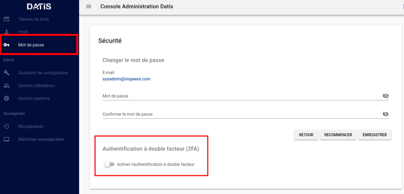
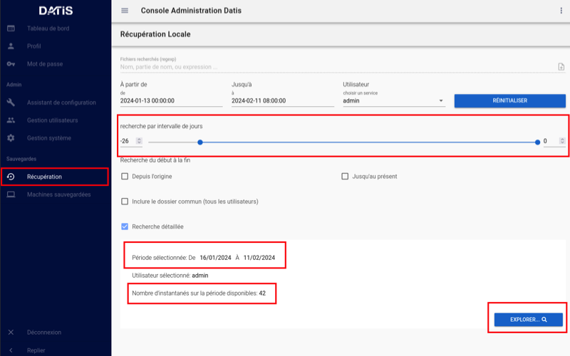

.. role:: red

2. Interface de Gestion du Système DATIS
========================================

.. figure:: ./Figures/1_DatisAdmin_DashBoard_Annot.png
  :width: 480px
  :align: center

  image 1

2.1 Tableau de bord
-------------------

 L'image 1  présente le tableau de bord de la console d'administration,
 avec un menu en partie gauche, un rappel de l'état général du système en partie centrale haute,
 et un rappel de l'état de sauvegarde de chaque poste sauvegardé par UrBackup en partie centrale basse.
 Un lien vers la documentation est proposé dans le coin inférieur droit

  image 2

2.2 Authentification à deux facteurs
------------------------------------

La console peut-être accessible par différents utilisateurs. Chacun peut activer 
une authentification à double facteur (figure 2).

.. figure:: ./Figures/3_DatisAdmin_Users_Annot.png
  :width: 480px
  :align: center

  image 3

.. _gestion_des_utilisateurs:

2.3 Gestion des utilisateurs
----------------------------

Les utilisateurs créés avec le profil Administrateur ont le droit d'ajouter de 
nouveaux utilisateurs. 
Les accès des utilisateurs sont centralisés dans une base interne LDAP, qui permet 
d'utiliser les mêmes identifiants pour accéder aux différents services du système 
INSPEERE Datis.

 Le Menu des gestion des utilisateurs (image 3) permet d’ajouter de nouveaux utilisateurs, de les activer/désactiver, 
 ou de leur délivrer un profil pour établir une connexion VPN (la clé en partie droite). 
 Le profile VPN permet d’accéder aux consoles de gestion et de supervision, ou à certains services trop vulnérables 
 pour être exposés directement sur Internet (SMB, FTP, ...). Initialement, chaque Datis est livrée avec un premier utilisateur « admin »,
 dont les identifiants sont transmis de façon sécurisée à l'administrateur.

.. figure:: ./Figures/4_DatisAdmin_Systeme_General_Annot.png
  :width: 480px
  :align: center

  image 4

2.4 Gestion du système
----------------------

Le menu de gestion du système (image 4) permet de configurer ou de consulter les éléments de la configuration système. 
Nous revenons plus en détail sur les deux derniers concernant les versions et les rapports ci-après.

.. figure:: ./Figures/5_DatisAdmin_Systeme_Version_annot.png
  :width: 480px
  :align: center

  image 5

Affichage des versions des composants du système
^^^^^^^^^^^^^^^^^^^^^^^^^^^^^^^^^^^^^^^^^^^^^^^^

L'onglet VERSION du menu système (image 5) permet d'afficher les versions actuellement déployées des composants utilisés par le système : 
version du noyau, du serveur LDAP, VPN, etc. Cette liste permet de vérifier rapidement si le système est vulnérable lors de l'annonce de nouvelles CVE.
La version courante du système INSPEERE Datis est quant à elle toujours visible en bas à gauche de l’interface DatisAdmin.

.. figure:: ./Figures/6_DatisAdmin_Systeme_Rapports_Annot.png
  :width: 480px
  :align: center

  image 6

Gestion des Rapports
^^^^^^^^^^^^^^^^^^^^

L'onglet RAPPORTS du menu système (image 6) permet d'accéder à l'interface de gestion et consultation des rapports de synthèse. 
Ces rapports sont complémentaires des rapports techniques et alertes mail produits par UrBackup. 
Ils sont destinés à un public non spécialiste et permettent de vérifier le bon déroulement des sauvegardes de postes.
Ce menu permet aussi d'activer l'envoi d'un rapport quotidien à une liste d'utilisateurs convenus (par exemple le client final / adhérent).

.. figure:: ./Figures/7_DatisAdmin_Systeme_Rapport_Visu_Annot.png
  :width: 480px
  :align: center

  image 7

Chaque rapport peut-être soit visualisé sous forme HTML (image 7), soit téléchargé au format PDF. 
C'est le même format PDF qui est envoyé par mail lorsque la demande de rapport quotidien est activée.

  
  image 8

2.5 Interfaces de restauration
------------------------------

Comme Datis est un outil multi-fonctions, supportant plusieurs formes de sauvegarde, il 
est normal de retrouver plusieurs interfaces de restauration.

L'interface DatisAdmin permet d'accéder à deux d'entre-elles:
- Restauration de fichiers déposés dans le stockage local de Datis (utilisation en mode "NAS")
- Restauration de fichiers depuis les sauvegardes UrBackup

