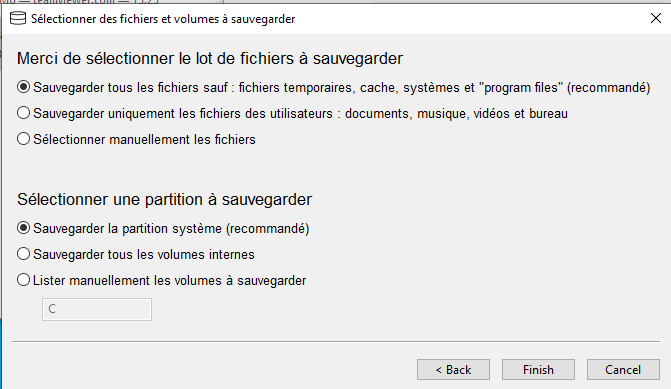
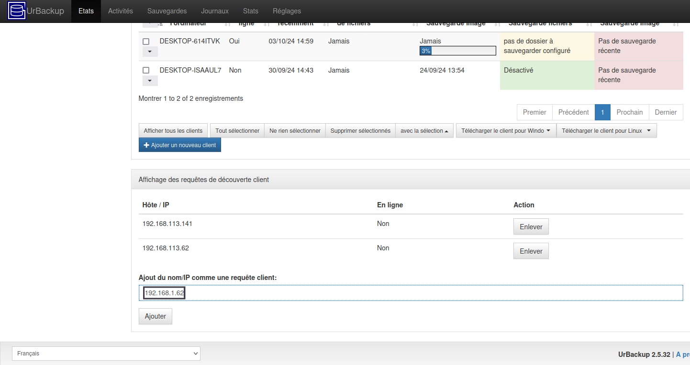
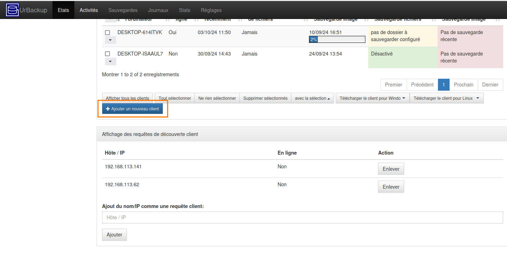
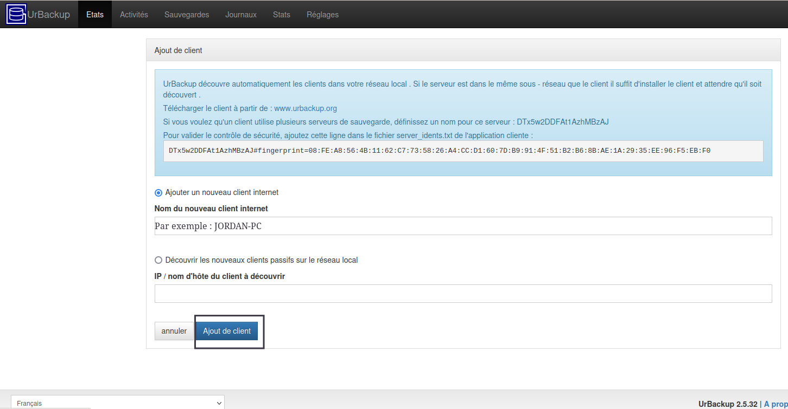

3. Agents de sauvegarde
=======================

Le client de sauvegarde pour un poste Windows peut-être téléchargé directement
sur le site UrBackup depuis le poste à sauvegarder,
`à l'aide de ce lien <https://hndl.urbackup.org/Client/2.5.25/UrBackup%20Client%202.5.25.exe>`_.

Une fois le téléchargement terminé, il suffit de cliquer sur l'exécutable pour
lancer l'installation.

Donnez l'autorisation à l'application d'installation d'apporter des
 modifications et accepter tous les choix par défaut jusqu'a la fin de l'installation

.. figure:: ./Figures2/Install_client_privilege.png
  :width: 480px
  :align: center

  image 1

.. figure:: ./Figures2/Urbackup_Installer_Bienvenue.png
  :width: 480px
  :align: center

  image 2

Une fois l'application installée, le menu de configuration s'ouvre automatiquement:

  image 3

Acceptez les choix par défaut, vous pourrez de toutes façon les changer par
l'interface de supervision de la Datis.

.. warning::
  :strong:`Action requise après chaque installation de client Urbackup`

  Un bug dans l'outil d'installation de la version courante du client Urbackup
  conduit à une configuration incomplète du pare-feux windows.

  Pour éviter toute interruption du service de sauvegarde il est **IMPÉRATIF**
  de :ref:`reconfigurer_le_pare_feu` (sur tous les postes sur lesquels sont déployés
  les agents Urbackup)

À ce stade deux situations sont possibles:

1. Le client (le poste windows) **EST sur le même subnet que le serveur DATIS**

   Dans ce cas, le client peut fonctionner directement en mode "INTRA-net",
   qui est le mode par défaut. La configuration du client est alors terminée
   sur le poste Windows à sauvegarder, car elle pourra éventuellement être
   modifiée par la suite au niveau de l'interface de gestion.

2. Le client **N'EST PAS sur le même subnet** (par exemple si la DATIS est en DMZ, ou si
le client est sur un autre site)

   Dans ce cas, il faut configurer manuellement le client pour un mode de
   fonctionnement dit "INTER-net". Il reste alors encore une étape de la procédure
   d'association à réaliser sur le poste à sauvegarder, mais cette étape
   ne pourra être réalisée qu'après avoir lancé la procédure d'association
   depuis l'interface de gestion centralisée. (décrite au paragraphe suivant).

.. _intro_procedure_association_urbackup:

**Procédure d'association**

UrBackup propose deux formes d'association, qui NE sont PAS exclusives (on peut associer
un poste Windows des deux façon en même temps):

- association INTRA-net

- association INTER-net

Pour lancer l'une ou l'autre forme, il faut cliquer sur le bouton bleu "Ajouter un client"
sur la page d'accueil de l'interface de gestion.

**Pour la procédure intra-net, il suffit d'ajouter l'IP du PC (voir encadré) puis de cliquer sur le bouton "Ajouter".**

  image 1

**La procédure inter-net nécessite de cliquer sur le bouton bleu (au-dessus) "+Ajouter un nouveau client".**

  image 2

**Entrer le nom du PC.**

Comment trouver le nom du PC dans Windows?
^^^^^^^^^^^^^^^^^^^^^^^^^^^^^^^^^^^^^^^^^
.. NOTE:: 

  Il faut simplement faire un clic droit sur l'icône "CePC" sur le bureau et de choisir "Propriétes"
  Une fenêtre s'ouvre. Le nom est situé en haut de page.

  Si l'icône n'est pas présente il faut alors ouvrir l'explorateur de fichier et cliquer sur la même icône qui sera 
  présente dans la colonne de gauche de l'explorateur.

Renseigner la case comme ci-dessous

  image 3

.. warning::
  :strong:`Votre attention est requise:`

  Bien repérer les informations qui sont encadrées
  car il faudra les renseigner dans le Client Urbackup du ou des PC à sauvegarder
  (image 4 et 5)

.. figure:: ./Figures2/urb_client_internet_4.png
  :width: 480px
  :align: center

  image 4

.. figure:: ./Figures2/urb_client_internet_5.png
  :width: 480px
  :align: center

  image 5
