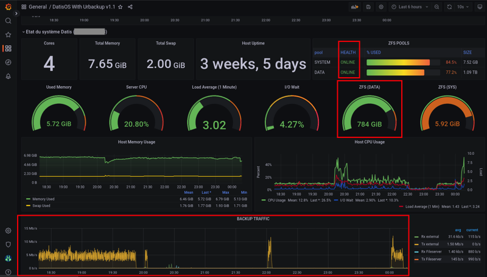
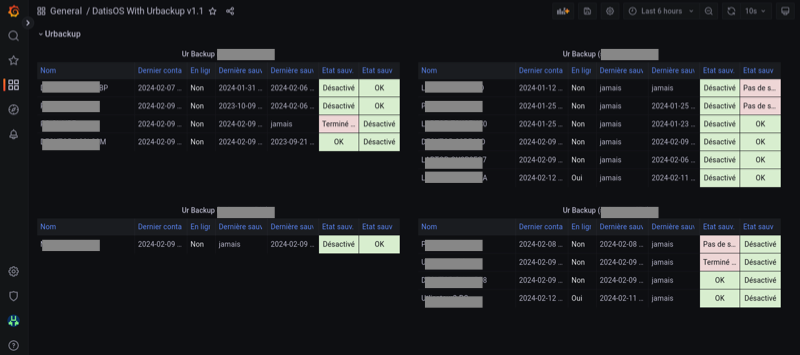

.. role:: red

3. Supervision du Système DATIS
===============================

3.1 Tableau de bord de supervision centralisé
---------------------------------------------

.. figure:: ./Figure_Graf/1_Etat_global_Grafana_Annot.png
  :width: 480px
  :align: center

  image 1

**1. La zone supérieure du tableau de bord présente un « cartouche » par serveur. Chaque cartouche est une matrice 3x2 d’indicateurs de couleur. 
La zone suivante offre un niveau de détail plus élevé. Elle constituée d’une série de lignes d’indicateurs, les « one-liner », une pour chaque serveur.**

 La figure 1 montre la partie haute du tableau de bord. Tout en haut, on trouve la zone des « cartouches » qui présente de façon compacte 
 l’état de chaque serveur, à l’aide de 6 indicateurs, organisés en matrice 3x2. Le code couleur est intuitif : 
 vert quand tout va bien, bleu quand un indicateur est sans objet (par exemple lorsque la sauvegarde UrBackup de type fichier n’est pas utilisée), 
 et jaune, puis orange, puis rouge en fonction du niveau d’alerte. Dans le cas présent, les cases oranges indiquent que des sauvegardes UrBackup 
 de type fichier ou image sont en retard sur 3 des 4 serveurs.

 Vient ensuite la zone des « one-liners » qui donne un peu plus d’information sur l’état du stockage ZFS local et distant, 
 pour chaque serveur, sur une ligne par serveur (cadre rouge en partie basse de la figure 23).

  image 2

**2. En faisant défiler la page vers le bas, on atteint la zone centrale du tableau de bord, avec les indicateurs système de chaque serveur.
Ici la figure présente les indicateurs pour un serveur. Il faut faire défiler la page pour obtenir les même indicateurs avec les serveurs suivants.**

 La figure 2 montre la zone des indicateurs système d’un serveur. A coté des indicateurs classique de charge et d’occupation mémoire, 
 on trouve les indicateurs concernant l’état du stockage primaire ZFS. La aussi le code couleur est conservé : lorsque c’est vert (ONLINE), 
 le stockage n’a pas d’erreur. Si un disque venait à perdre des secteur, l’état passerait en orange (DEGRADED), et en cas de défaillance grave, 
 il passe en rouge (FAULTED). La quantité de stockage libre/utilisé est aussi un indicateur important à surveiller 
 (2e cadre rouge en partant du haut, dans la figure 13). Enfin, tout en bas de cette zone système, on trouve la courbe du trafic de sauvegarde, 
 avec des couleurs différentes pour le trafic en provenance des postes sauvegardés, et celui à destination des réplicats externes.

  image 3

**3. En faisant encore défiler jusqu’en bas de la page du tableau de bord, on atteint la zone concernant l’état des sauvegardes UrBackup
sur chacun des serveurs. Les informations présentées sont les mêmes que celles présentées sur la console UrBackup, mais regroupées
en un seul et même endroit pour tous les serveurs Datis d’un même client ou tous les clients d’un même partenaire.**

 
