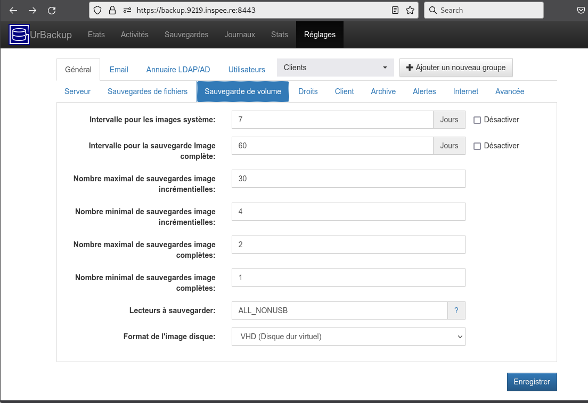
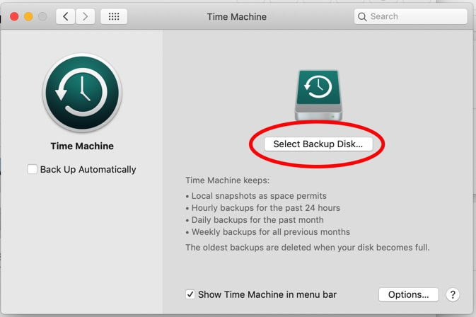
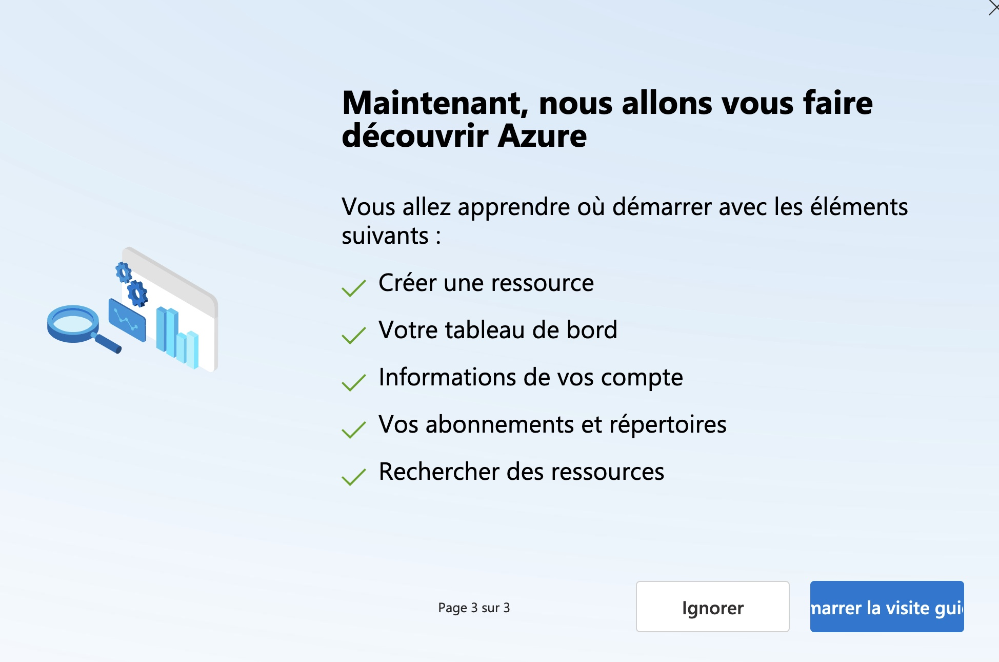
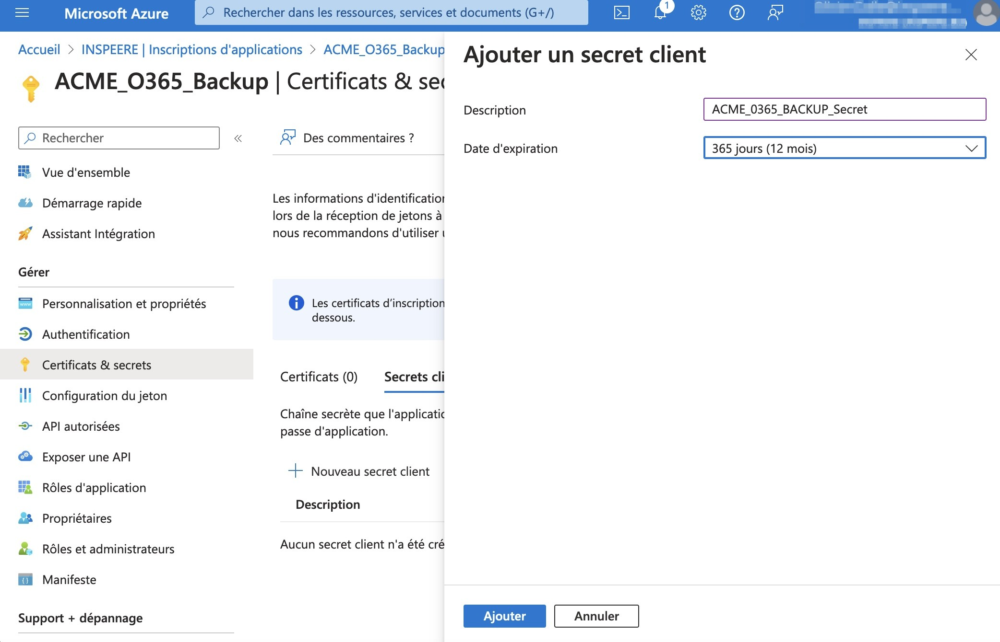
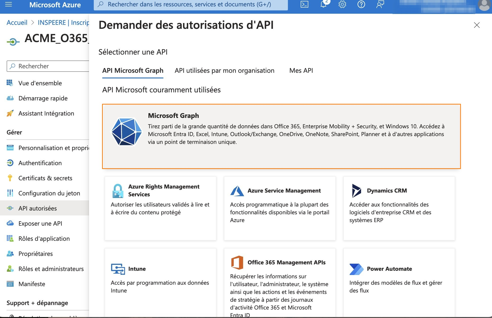
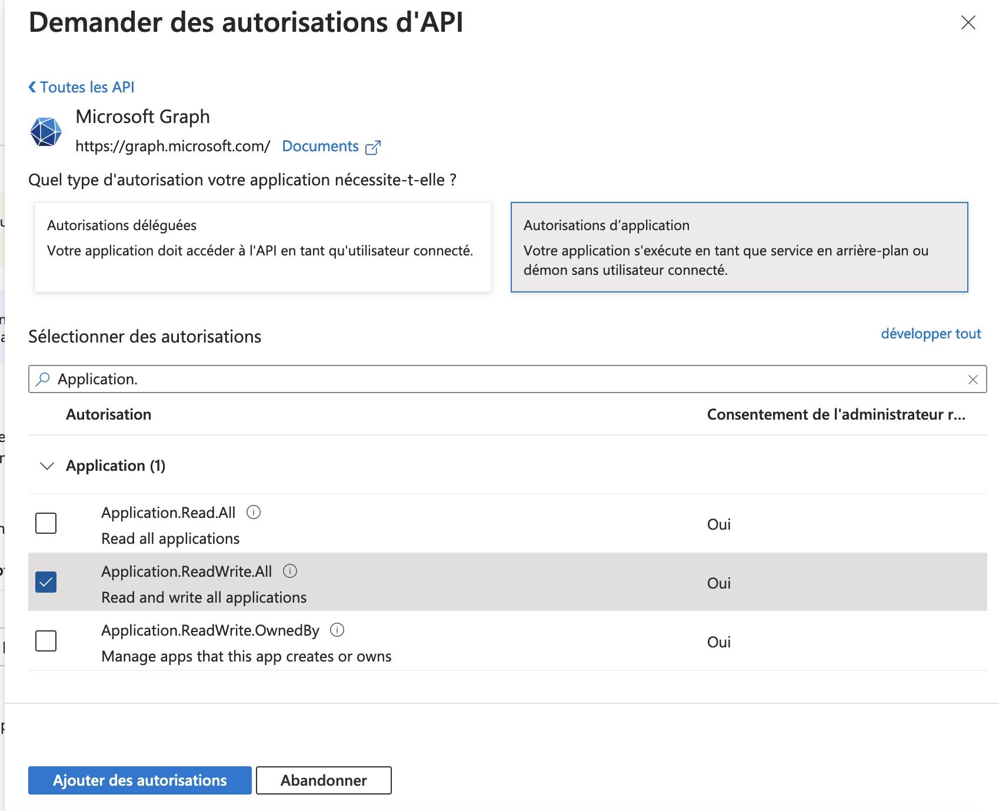
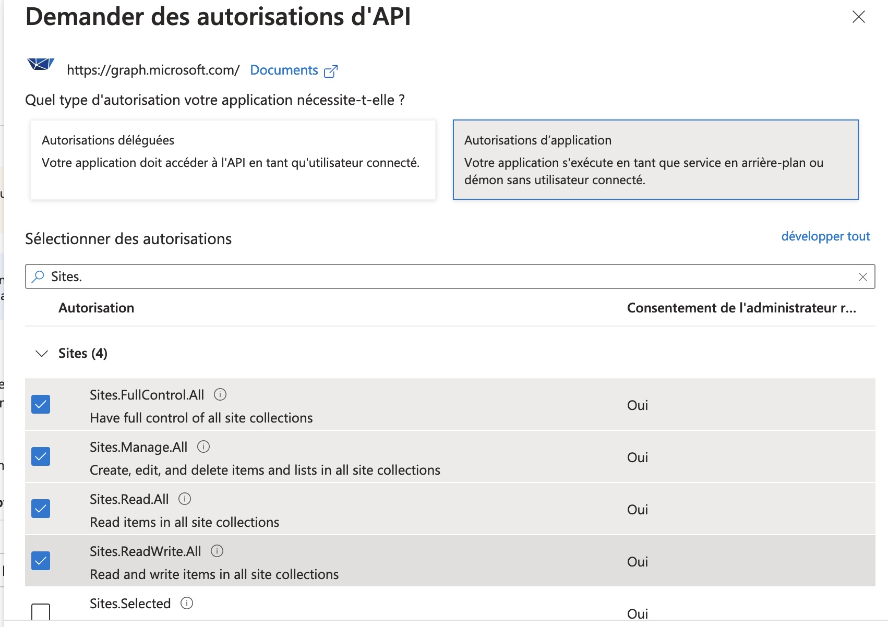
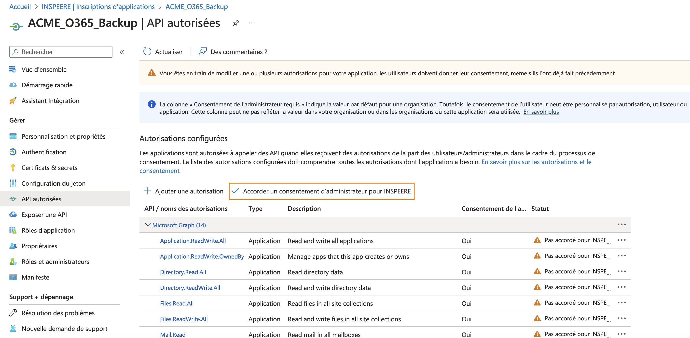
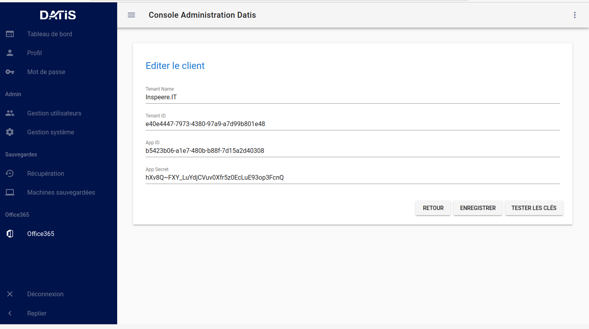

.. role:: red

4. Sauvegardes
==============

.. _config_client_urbackup:

5.1 Configuration sauvegarde niveau 2 : UrBackup
^^^^^^^^^^^^^^^^^^^^^^^^^^^^^^^^^^^^^^^^^^^^^^^^

La sauvegarde des postes de travail, serveurs et machines virtuelles windows
peut-être assurée à l'aide de l'outil UrBackup (documentation: `EN <https://www.urbackup.org/>`_ |
`FR <https://www-urbackup-org.translate.goog/?_x_tr_sl=en&_x_tr_tl=fr&_x_tr_hl=fr-FR>`_).

.. panels::
  :header: text-center
  :column: col-lg-12

  A propos de l'outil UrBackup
  ^^^^^^^^^^^^^^^^^^^^^^^^^^^^

  Urbackup est un outil issu du monde OpenSource.

  Il a été choisi pour son niveau de maturité (le projet existe et est activement
  maintenu depuis plus de 10 ans) et ses performances lors des phases de
  sauvegarde et de restauration.

  Il comporte deux éléments:
  * Un agent à installer sur chaque poste à sauvegarder, que l'on appelle aussi *le client*
  * Une interface de gestion centralisée, pour tous les postes sauvegardés, que l'on 
  appelle aussi *le serveur*

  Pour que la sauvegarde d'un poste démarre, il faut d'abord installer *le client* 
  sur le poste, puis l'associer *au serveur* qui s'exécute sur la Datis.

L'interface de Gestion Centralisée de UrBackup
""""""""""""""""""""""""""""""""""""""""""""""

.. _intro_interface_gestion_urbackup:

L'interface de gestion centralisée, *le serveur*, s'exécute sur l'équipement Datis.
Elle est donc accessible depuis l'intranet auquel est connecté DATIS, via l'URL 
``https://zbackup.XXXX.inspee.re`` où XXXX est l'identifiant à 4 digits hexa 
de la Datis (cad les 4 derniers digits de son adresse MAC).

.. figure:: accueil_urbackup.png
  :width: 480px
  :align: center

  image 1

Le mot de passe pour accéder à cette interface est généré automatiquement
lors de l'activation et transmis:

- soit par Inspeere au technicien en charge de l'installation

- soit reçu directement par le partenaire Inspeere lors de l'activation
  du contrat

Contacter le `support Inspeere <mailto:support@inspeere.com>`_ si ce
code n'a pas été reçu.

Certains réglages de l'interface de gestion sont automatiquement préconfigurés
par le système DATIS:

- configuration mail sortant (pour recevoir les notifications et alertes)

- plan de sauvegarde en mode fichier

- plan de sauvegarde en mode image

Suivant la philosophie DATIS, la sauvegarde est donc en état de fonctionner
dès l'ajout des premiers clients. Il est néanmoins toujours possible de modifier
les réglages par défaut via l'onglet des réglages.

  image 2

.. _intro_agents_collecte_urbackup:

Le Client Urbackup
""""""""""""""""""

.. panels::
  :header: text-center
  :column: col-lg-12

  Récupération du client Urbackup
  ^^^^^^^^^^^^^^^^^^^^^^^^^^^^^^^

  La configuration du client Urbackup nécessite tout d'abord le téléchargement de ce dernier
  à cette adresse:  `ICI <https://hndl.urbackup.org/Client/2.5.25/UrBackup%20Client%202.5.25.exe>`_)
  Lancer l'installation par défaut, tous les paramètres de sauvegardes seront effectués 
  à partir du Serveur Urbackup

Une fois le téléchargement terminé, il suffit de cliquer sur l'exécutable pour lancer 
l'installation.

Donnez l'autorisation à l'application d'installation d'apporter des modifications et 
acceptez tous les choix par défaut jusqu'a la fin de l'installation

  image 1

  image 2

Une fois l'application installée, le menu de configuration s'ouvre automatiquement:

.. figure:: ./Figures2/Client_Urbackup_Default_1.png
  :width: 480px
  :align: center

  image 3

Acceptez les choix par défaut, vous pourrez de toutes façon les changer par
l'interface de supervision de la Datis.

.. warning::
  :strong:`Action requise après chaque installation de client Urbackup`

  Un bug dans l'outil d'installation de la version courante du client Urbackup
  conduit à une configuration incomplète du pare-feux windows.

  Pour éviter toute interruption du service de sauvegarde il est **IMPÉRATIF**
  de :ref:`reconfigurer_le_pare_feu` (sur tous les postes sur lesquels sont déployés
  les agents Urbackup)

À ce stade deux situations sont possibles:

1. Le client (le poste windows) **EST sur le même subnet que le serveur DATIS**

   Dans ce cas, le client peut fonctionner directement en mode "INTRA-net",
   qui est le mode par défaut. La configuration du client est alors terminée
   sur le poste Windows à sauvegarder, car elle pourra éventuellement être
   modifiée par la suite au niveau de l'interface de gestion.

2. Le client **N'EST PAS sur le même subnet** (par exemple si la DATIS est en DMZ, ou si
le client est sur un autre site)

   Dans ce cas, il faut configurer manuellement le client pour un mode de
   fonctionnement dit "INTER-net". Il reste alors encore une étape de la procédure
   d'association à réaliser sur le poste à sauvegarder, mais cette étape
   ne pourra être réalisée qu'après avoir lancé la procédure d'association
   depuis l'interface de gestion centralisée. (décrite au paragraphe suivant).

.. _intro_procedure_association_urbackup:

Procédure d'association du client au serveur
""""""""""""""""""""""""""""""""""""""""""""

UrBackup propose deux formes d'association, qui NE sont PAS exclusives (on peut associer
un poste Windows des deux façons en même temps):

- association INTRA-net

- association INTER-net

Pour lancer l'une ou l'autre forme, il faut cliquer sur le bouton bleu "Ajouter un client"
sur la page d'accueil de l'interface de gestion.

Pour la procédure INTRA-net, cliquer sur le bouton bleu "+Ajouter un nouveau client" et saisir 
**l'adresse IP** du poste dans la **deuxième zone** de saisie, sans toucher a la première.

.. figure:: ./Figures2/urb_nouv_client1a.png
  :width: 480px
  :align: center

  image 1

Pour la **premiere étape** de la procédure INTER-net, cliquer sur le bouton bleu "+Ajouter un nouveau client" et saisir 
le **nom** du poste dans la **premiere zone** de saisie, sans toucher a la seconde.

.. figure:: ./Figures2/urb_nouv_client1.png
  :width: 480px
  :align: center

  image 2

.. panels::
  :header: text-center
  :column: col-lg-12

  A propos: comment trouver le nom du PC dans Windows?
  ^^^^^^^^^^^^^^^^^^^^^^^^^^^^^^^^^^^^^^^^^^^^^^^^^^^^

  Il faut simplement faire un clic droit sur l'icône "CePC" sur le bureau et de choisir "Propriétes"
  Une fenêtre s'ouvre. Le nom est situé en haut de page.

  Si l'icône n'est pas présente il faut alors ouvrir l'explorateur de fichier et cliquer sur la même icône qui sera 
  présente dans la colonne de gauche de l'explorateur.

Renseigner la case comme ci-dessous

.. figure:: ./Figures2/urb_nouv_client2.png
  :width: 480px
  :align: center

  image 3

.. warning::
  :strong:`Votre attention est requise:`

  **Pour la deuxième étape**, bien repérer les informations qui sont encadrées
  afin de les renseigner dans le Client Urbackup du ou des PC à sauvegarder
  (image 4 et 5)

  image 4

  image 5

.. _config_client_timemachine:

5.2 Configuration sauvegarde niveau 2 : TimeMachine
^^^^^^^^^^^^^^^^^^^^^^^^^^^^^^^^^^^^^^^^^^^^^^^^^^^

Configuration du client de sauvegarde TimeMachine faisant partie 
du système MacOS, en 6 étapes:

**1. Ouvrir les réglages Time Machine**

.. figure:: ActivationTimeMachine/1-TimeMachineSettings.jpg
  :width: 480px
  :align: center

  image1

**2. Ouvrir le menu de sélection des disques TimeMAchine**

  image 2

**3. Sélectionner le disque de votre DATIS**

NB: l'identifiant de la DATIS apparaît à la fin du nom du disque. 
Si vous avez plusieurs DATIS actives sur votre réseau, vous pouvez en sélectionner
plusieurs en recommençant la procédure: votre MAC sauvegardera alternativement
sur chacune des DATIS.

.. figure:: ActivationTimeMachine/3-SelectDisk.jpg 
  :width: 480px
  :align: center

  image 3

**4. Acceptez la connexion au partage SAMBA de votre DATIS**

.. figure:: ActivationTimeMachine/4-ConnectionTimeMachine.jpg
  :width: 480px
  :align: center

  image 4

**5. Donnez vos identifiants**

Attention, il s'agit de vos identifiants DATIS, et non pas vos identifiants MAC.
Si vous avez plusieurs MAC à sauvegarder, vous devrez créér autant de comptes
sur DATIS que de MAC.

NB: La procédure de création de comptes DATIS est décrite ici.

.. figure:: ActivationTimeMachine/5-IdentifiantDatisAdmin.jpg
  :width: 480px
  :align: center

  image 5

**6. C'est fait!**

Vous devez voir le disque ``TimeMachine-XXXX`` dans la liste des disques 
utilisés par TimeMachine, et la première sauvegarde doit commencer bientôt.

.. figure:: ActivationTimeMachine/6-BackupIsRunning.jpg
  :width: 480px
  :align: center

  image 6

.. _config_VEEAM:

5.3 Mise en place sauvegarde niveau 2 : VEEAM
^^^^^^^^^^^^^^^^^^^^^^^^^^^^^^^^^^^^^^^^^^^^^

Le système Datis peut être configuré comme *Dépôt VEEM Durci*. La 
mise en place de cette option requiert une intervention du support Inspeere.

5.4 Sauvegarde Office 365
^^^^^^^^^^^^^^^^^^^^^^^^^

.. NOTE::
  Ce chapitre comporte 2 parties:
  
  La connexion individuelle à un compte Microsoft individuel et la connexion 
  à un locataire O365 (*tenant*) multi-utilisateurs.

Connexion individuelle
""""""""""""""""""""""

**Voici en images la procédure de connexion au compte Microsoft 0365**

.. figure:: ./Figures_o365/1_connexion_compte.png
  :width: 480px
  :align: center

  image 1

**Cliquer sur le bouton "connexion"**

.. figure:: ./Figures_o365/2_cjohan.png
  :width: 480px
  :align: center

  image 2

**Choisir ensuite le nom de connexion**

.. figure:: ./Figures_o365/2_connexion_johan.png
  :width: 480 px
  :align: center

  image 3

**Une fois celle-ci établie les sauvegardes commencent**

.. figure:: ./Figures_o365/3_onedrive_saves.png
  :width: 480px
  :align: center

  image 4

.. figure:: ./Figures_o365/4_explorer.png
  :width: 480px
  :align: center

  image 5

**Il suffit ensuite de choisir le fichier ou dossier à restaurer**

Connexion au tenant
"""""""""""""""""""

Suivez les étapes A et B ci-après:

A. **Création de l'application**

.. NOTE::
  Il faut impérativement se rendre sur le portail Microsoft Azure pour 
  créer une page d'enregistrement d'une application à cette adresse : `cliquer ici <https://portal.azure.com/#view/Microsoft_AAD_IAM/ActiveDirectoryMenuBlade/~/RegisteredApps>`_ .
  Ensuite suivre les étapes:

.. figure:: ./Figures_app_azure/01_Welcome.jpg
  :width: 480px
  :align: center

  image 1  

**Cocher les deux réponses montrées par la capture d'écran:**

.. figure:: ./Figures_app_azure/2_USAGE_QUESTION.jpg
  :width: 480px
  :align: center

  image 2

**Passer la visite guidée.**

  image 3

**Enregistrer une nouvelle app en cliquant sur + Nouvelle inscription**

.. figure:: ./Figures_app_azure/4_NEW_REGISTRATION.jpg
  :width: 480px
  :align: center

  image 4

**Une page s'affiche**

- Donner un nom à l'application

- Sous l'option "Types de compte pris en charge",
  sélectionnez "Comptes dans n'importe quel annuaire organisationnel (tout locataire Microsoft Entra ID - Multilocataire)
  et comptes personnels Microsoft (par exemple Skype, Xbox)".  

- Laisser URI de redirection vide (Cette option ne sera pas utilisée.)

- Pour finir, cliquer sur "s'incrire"

.. figure:: ./Figures_app_azure/5_NEW_APP_FORM.jpg
  :width: 480px
  :align: center

  image 5

**La page est redirigée**

- Sur celle-ci on trouve:
  L'ID d'application
  L'ID de l'annuaire
  Bien noter ces deux valeurs.

.. figure:: ./Figures_app_azure/6_ApplicationId_and_TenantID.jpg
  :width: 480px
  :align: center

  image 6

**Sur la même page, colonne de gauche, sélectionner:**

- Certificats & secrets
- Cliquer sur + Nouveau secret client

.. figure:: ./Figures_app_azure/7_CERTIF_AND_SECRETS.jpg
  :width: 480px
  :align: center

  image 7

**Renseigner:**

- La description
- La date d'expiration
- Cliquer sur ajouter

.. figure:: ./Figures_app_azure/8_New_SECRET.jpg
  :width: 480px
  :align: center

  image 8

  image 9

**Ceci va donner:**

- Une valeur de clé
- Une ID de secret

.. figure:: ./Figures_app_azure/10_DISPLAY_SECRET.jpg
  :width: 480px
  :align: center

  image 10

**Copier la valeur de la clé et l'enregistrer.**

.. figure:: ./Figures_app_azure/11_COPY_SECRET_TO_CLIPBOARD.jpg
  :width: 480px
  :align: center

  image 11

B. **Configurer les permissions**

**A partir de la page d'application vue à l'étape précédente:**

- Sélectionnner (Dans la colonne de gauche) "API autorisées".
- Cliquer sur + Ajouter une autorisation et sélectionner "Microsoft Graph"

.. figure:: ./Figures_app_azure/13_ADD_PERMISSION_BUTTON.jpg
  :width: 480px
  :align: center

  image 12

  image 13

**Comme le montre l'image suivante:**
- Choisir "autorisations d'application"

.. figure:: ./Figures_app_azure/15_APPLICATION_PERMISSIONS.jpg
  :width: 480px
  :align: center

  image 14

**Une page s'ouvre avec une barre de recherche. Tapez les mots clés pour:**

- Applications
- Directory
- Files
- Mail
- Sites
- User

**Suivre la procédure ci-dessous.**

  image 15

.. figure:: ./Figures_app_azure/17_Application_ReadWriteALL.jpg
  :width: 480px
  :align: center

  image 16

.. figure:: ./Figures_app_azure/17_Application_ReadWriteALL.jpg
  :width: 480px
  :align: center

  image 17

.. figure:: ./Figures_app_azure/18_Files_Permissions.jpg
  :width: 480px
  :align: center

  image 18

.. figure:: ./Figures_app_azure/19_Mail_Permissions.jpg       
  :width: 480px
  :align: center

  image 19

  image 20

.. figure:: ./Figures_app_azure/21_User_Permissions.jpg
  :width: 480px
  :align: center

  image 21

**Résumé de l'opération.**
-Cliquer sur "Accorder un consentement d'administrateur pour..." (image 22)
-Choisir le type d'autorisations déléguées (image 23)

  image 22

.. figure:: ./Figures_app_azure/23_BEFORE_DELEGATED_PERMISSION.jpg
  :width: 480px
  :align: center

  image 23

**Il ne reste plus alors qu'à entrer les clé dans le dashboard de la Datis:**
- Application(client) ID
- Tenant (Directory) ID
- La Secret Value

  image 24

**Avant de lancer la sauvegarde, tester les clés**

.. figure:: ./Figures_app_azure/25_ADD_KEYS_TEST.png        
  :width: 480px
  :align: center

  image 25
