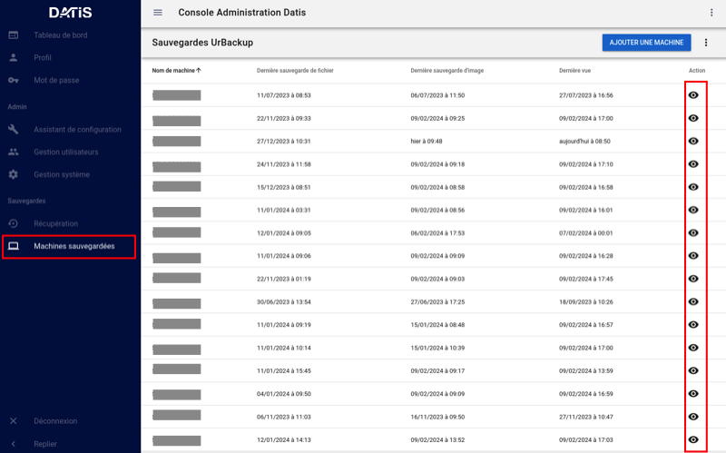
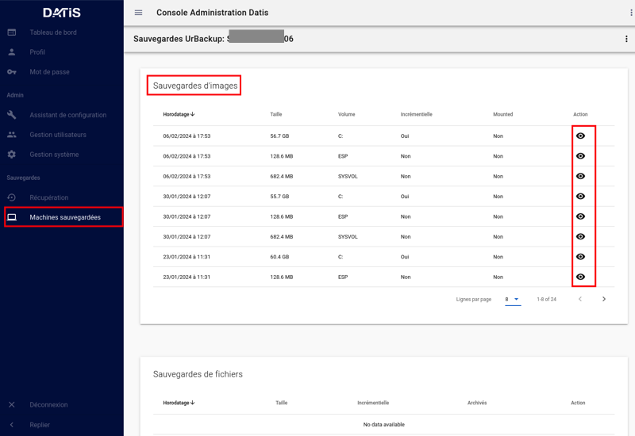
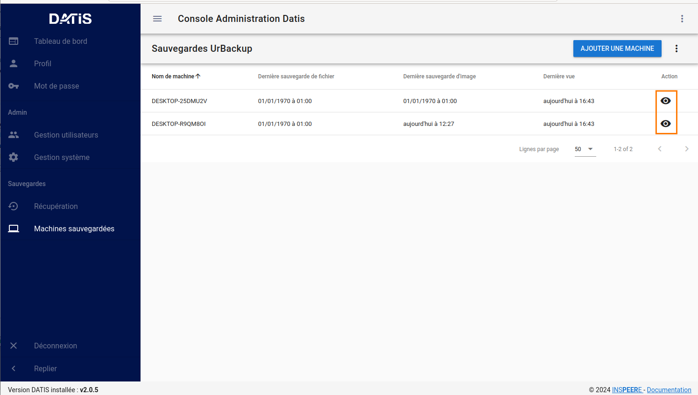
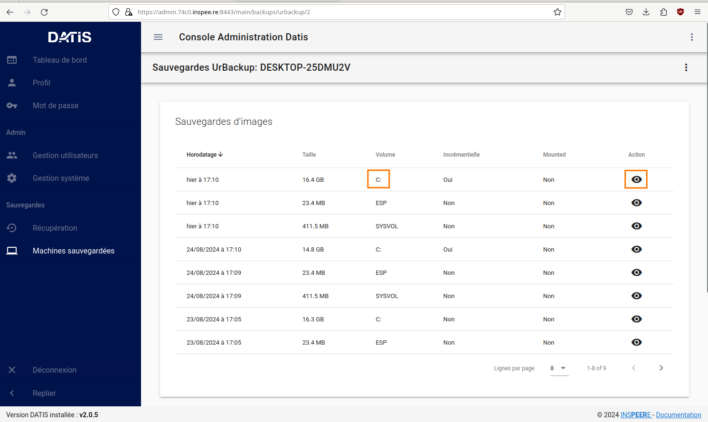
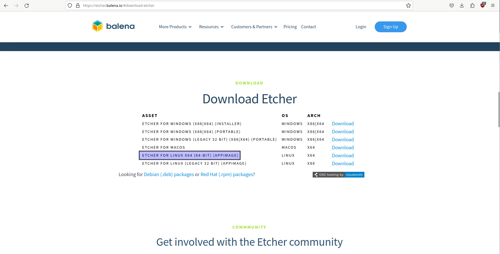
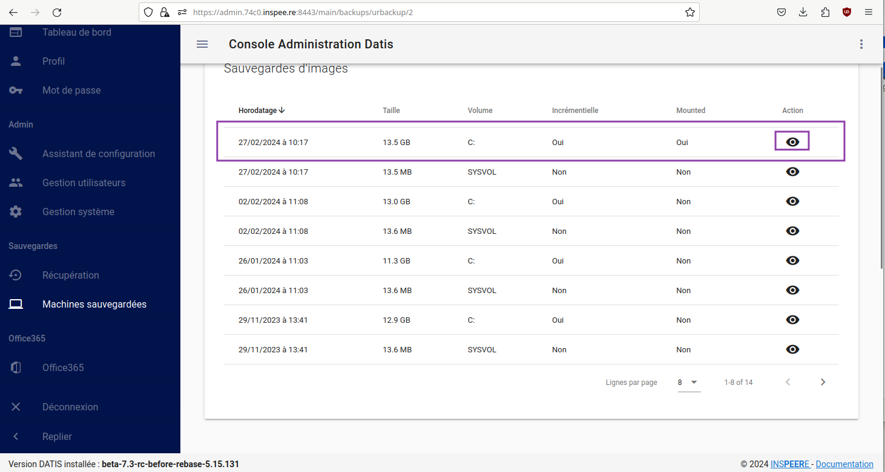

.. role:: red

5. Restaurations
================

5.1 Restauration dans le stockage local
---------------------------------------

Le menu Récupération (image 8) permet d'accéder à l'historique de la première des deux 
formes de sauvegardes, celle des fichiers « déposés » sur le système INSPEERE Datis, 
à l'aide de protocoles tels que Samba, Rsync, FTP, NFS, etc.

Le système DATIS prend des instantanés ZFS de l'état du stockage fichier selon la politique 
de rétention locale planifiée. Cette politique est configurable, avec une granularité variable. 
Par exemple il est possible de prendre un instantané toutes les 5 minutes pendant 1 heure, 
puis un toutes les heures pendant 24h, puis un par jour pendant 30j, puis un par semaine 
pendant 3 mois, etc.

Une fois l'intervalle de recherche affiné (barre de sélection encadrée en rouge au milieu, 
figure 8), il suffit de cliquer sur le bouton explorer pour accéder à l'explorateur des 
instantanés et récupérer le fichier ou dossier voulu. 
La restitution se fait alors soit en écrasant le contenu actuel, soit a côté en ajoutant 
la date de l’instantané en suffixe du nom de fichier/dossier. 

  image 9

5.2 Restauration depuis les sauvegardes UrBackup
------------------------------------------------

 Le menu Machines Sauvegardées (image 9) permet d'accéder à la deuxième interface de 
 restauration plus spécifiquement dédiée à UrBackup. 
 Elle permet d'obtenir la liste des sauvegardes de postes et VMs gérées par la système 
 UrBackup. Le bouton d'action en bout de ligne permet d'accéder plus spécifiquement aux 
 sauvegardes d'un poste en particulier.

 Il est important de noter que cette interface est complémentaire de l'interface fournie 
 par le système UrBackup. Elle fournit la fonction de restauration granulaire, qui 
 n'est pas disponible autrement par l'interface de UrBackup.

 La restauration granulaire consiste à permettre l'ouverture d'un instantané d'Image 
 disque pour en extraire un fichier. Elle est rendue possible grâce à l'utilisation du 
 backend ZFS avec UrBackup.
 
 Ce backend permet de proposer avec UrBackup une sauvegarde incrémentale perpétuelle, 
 dans laquelle chaque incrément de sauvegarde contient le contenu d'une sauvegarde image 
 complète, mais ne requiert que l'espace supplémentaire d'un incrément. 

 Avec cette forme de sauvegarde, les techniques de sauvegardes complètes,  « full 
 synthetique », ou incrémentales inversée deviennent totalement inutiles : l'espace 
 disque occupé est minimal, et il est possible de réduire le nombre d'instantanés 
 en supprimant n'importe le(s)quel(s), en fonction des objectifs de la politique de rétention.

  image 10

a. Navigation dans les sauvegardes UrBackup d'un poste en particulier
^^^^^^^^^^^^^^^^^^^^^^^^^^^^^^^^^^^^^^^^^^^^^^^^^^^^^^^^^^^^^^^^^^^^^

 En cliquant sur le bouton d'action à fin de la ligne correspondant à un poste sauvegardé (image 9), 
 on obtient la liste des sauvegardes de type image et de type fichier de UrBackup. Pour chaque instantané de sauvegarde de type image, 
 il est possible d'ouvrir une nouvelle  page de détails spécifique à cet instantané (bouton action en fin de ligne sur la figure 10).

.. figure:: ./Figures/11_DatisAdmin_UrBackup_ExploreImg_Annot.png
  :width: 480px
  :align: center

  image 11

b. Ouverture d'un instantané de volume du poste sauvegardé
^^^^^^^^^^^^^^^^^^^^^^^^^^^^^^^^^^^^^^^^^^^^^^^^^^^^^^^^^^

 Lorsque le volume explorer correspond à une partition d’origine (disque C, D, ...), il est possible de « monter » l’image 
 afin d’accéder à son contenu (image 11). Il est alors possible d’explorer le contenu de l’image et d’en télécharger 
 des fichier à l’aide des boutons d’action en fin de ligne.

 Il est important de noter que toute cette séquence d’ouverture est très rapide, car grâce au stockage ZFS, 
 l’accès au contenu d’un instantané ne requiert aucune phase de reconstruction/consolidation : en pratique, 
 chaque instantané est une sauvegarde complète, immédiatement disponible.

c. Restauration Granulaire
^^^^^^^^^^^^^^^^^^^^^^^^^^

**Grâce à DatisAdmin, cette opération est simple :**
Dans l'onglet "Machines sauvegardées" de DatisAdmin cliquer sur l'explorateur (l'oeil) d'une machine

  
  image 1

Repérer le disque "C" qui contient tous vos fichiers et dossiers

  
  image 2

Cliquer ensuite sur le bouton "MONTER"

.. figure:: ./Figures/DatisAdmin_restor3.png
  :width: 480px
  :align: center

  image 3

Utiliser le menu déroulant jusqu'à l'utilisateur

.. figure:: ./Figures/DatisAdmin_restor4.png
  :width: 480px
  :align: center

  image 4

.. figure:: ./Figures/DatisAdmin_restor5.png
  :width: 480px
  :align: center

  image 5

Choisir enfin le fichier recherché et cliquer le la flèche de téléchargement

.. figure:: ./Figures/DatisAdmin_restor6.png
  :width: 480px
  :align: center

  image 6

5.3 Procédures de Restauration
------------------------------

a. Restauration locale à partir de la sauvegarde de niveau 1
^^^^^^^^^^^^^^^^^^^^^^^^^^^^^^^^^^^^^^^^^^^^^^^^^^^^^^^^^^^^

La restauration de fichiers à partir de la sauvegarde de 
niveau 1 se fait à partir du menu sauvegarde de l'interface DatisAdmin.

.. figure:: ./Figures/DatisAdmin_restor4.png
  :width: 480px
  :align: center

  image

Elle se passe en cinq étapes:

1. Seléctionner une période de recherche. Cette étape à pour objectif 
   de réduire le nombre  d'instantanés (incréments de sauvegarde)
   car ils peuvent être trop nombreux. L'idéal est de ne pas dépasser 50 instantanés.
   Le recherche peut être calendaires ou sur une période d'un certain 
   de nombre de jours avant la date courante. 

2. Afficher les instantanés retenus

3. Naviguer dans les instantanés jusqu'à trouver le fichier ou le dossier
   recherchés

5. Choisir un mode restauration entre:
   
   * Restauration avec écrasement : la version restaurée écrase la version existante
   * Restauration sans écrasement : on ajoute la date au nom de l'élément restauré 
      afin qu'il n'écrase pas la version existante

b. Restauration locale d'une image système à partir de la sauvegarde UrBackup
^^^^^^^^^^^^^^^^^^^^^^^^^^^^^^^^^^^^^^^^^^^^^^^^^^^^^^^^^^^^^^^^^^^^^^^^^^^^^
.. NOTE::
  C'est une procédure relativement simple qui se déroule en 3 étapes:
  Créer une clé de restauration bootable

  * Booter sur cette clé et suivre les instruction de la page de restauration
  * Restaurer

**1°) Aller sur le site de Urbackup pour télécharger Urbackup Restaure CD.**
https://www.urbackup.org/download.html#restore_cd

  image 1

Une fois l'iso téléchargée, créer une clé usb bootable à l'aide de Balena Etcher
https://etcher.balena.io/#download-etcher

  
  image 2

**Lancer l'application et créer la clé bootable**

  image 3

**2°) Une fois la clé prête, booter sur la machine à restaurer.**
Voici la page d'accueil de Urbackup Restore:

.. figure:: ./Figures2/4_Accueil_urbackup.png
  :width: 480px
  :align: center

  image 4

Cliquer sur Start Urbackup Restore

  image 5

Puis configurer le pc et son réseau (Remplacer les IP par celles correspondant au réseau local)

.. NOTE::
  Il faut indiquer l'IP du PC à restaurer qui est enregistrée dans le serveur Urbackup si elle n'a pas été effacée.
  Dans le cas contraire il suffit simplement de noter l'IP du logiciel Restore Urbackup et de la
  rentrer dans le serveur. Après quoi il faut relancer la recherche à partir de l'onglet "TimeZone".

  image 6

  image 7

  image 8

**3°) Commencer la procédure de restauration (Start restore).**

Les images suivantes montrent la progression et la reprise d'activité du client et du serveur Urbackup

  image 9

  image 10

.. figure:: ./Figures2/9_urbackup_activité.png
  :width: 480px
  :align: center

  image 11

Une fois la procédure terminée, éteindre le PC, enlever la clé usb et redémarrer
L'image ci-dessous montre la reprise des sauvegardes par le client Urbackup

  image 12

**Pour la gestion des sauvegardes Veeam se référer à ce chapitre:**
:ref:`config_VEEAM`

 

c. Restoration granulaire en local
^^^^^^^^^^^^^^^^^^^^^^^^^^^^^^^^^^

.. NOTE::
  Datis Admin permet désormais la restauration de fichiers à partir de l'image 
  sauvegardée. Voici comment procéder:

**Dans la page DatisAdmin cliquer sur l'onglet "Machines sauvegardées" puis sur le bouton
"Explorer"** 

  image 1

**Choisir une image dans la liste proposée et cliquer sur l'oeil tout à droite (Explorer)**

  image 2

**Il faut ensuite "Monter" l'image pour avoir accès à son contenu.**

  image 3

**Après quoi il suffit donc d'explorer et de sélectionner un dossier (Ici il a été choisi "Users")**

  image 4

**User name (Ici Anakin)**

  image 5

**Et enfin de choisir un dossier à restaurer.**

  image 6

**Puis de le télécharger.**

  image 7  

d. Restoration locale à partir de la sauvegarde O365
^^^^^^^^^^^^^^^^^^^^^^^^^^^^^^^^^^^^^^^^^^^^^^^^^^^^

.. NOTE::
  Ce paragraphe fait référence a la dernière partie intitulée : Sauvegarde Office 365
  se trouvant dans "Configuration système Datis" 

  * En images:

.. figure:: ./Figures_o365/3_onedrive_saves.png
  :width: 480px
  :align: center

  image 1

.. figure:: ./Figures_o365/4_explorer.png
  :width: 480px
  :align: center

  image 2

e. Restauration Datis complète depuis sauvegarde distante
^^^^^^^^^^^^^^^^^^^^^^^^^^^^^^^^^^^^^^^^^^^^^^^^^^^^^^^^^

Pour cette opération vous aurez besoin des éléments suivants:

1. Une clef USB d'Installation (la même que pour une installation initiale)
   Vous pouvez créer une clef installation à partir d'un fichier image au format ISO.
   Si vous disposez pas déjà de ce fichier, vous pouvez le réclamer auprès 
   du `support technique Inspeere <mailto:support@inspeere.com>`_

2. Vos trois clefs d'activation du contrat Datis
   Si vous ne les avez pas conservées, vous pouvez les réclamer 
   auprès du `support technique Inspeere <mailto:support@inspeere.com>`_

3. La clef de chiffrement des données de sauvegarde.
   Vous devez être en possession de cette clef, ou avoir établi un protocole 
   pour sa conservation avec le prestatire en charge de l'installation initiale.
   N'hésitez pas à contacter le `support technique Inspeere <mailto:support@inspeere.com>`_ 
   à ce sujet.

4. Un équipement cible de la restauration.
   Soit la DatisBox originale dont le contenu sera écrasé, soit un nouvel équipement 
   compatible avec le système Datis.
   S'il n'est pas fourni par Inspeere, vous pouvez contacter le 
   `support technique Inspeere <mailto:support@inspeere.com>`_ pour vérifier sa compatibilité.

5. Un écran/clavier ou une console compatible avec l'équipement.
   NB: Si le BIOS a été préconfiguré au préalable et que les disques sont vierge, 
   il est possible de lancer une installation _headless_ en mode totalement 
   automatique.

L'opération de restauration est très simple:

1. Insérer la clef USB dans un port USB3 disponible

2. Démarrer l'équipement.
   Optionnel: en appelant le menu BIOS pour configurer 
   les paramètres du BIOS pour un fonctionnement optimal:
   - Activation du mode hotplug des disques
   - Réduction de la mémoire vidéo partagée au minimum (processeurs AMD)
   - Activation du redémarrage automatique en cas de coupure de courant
   Quitter le BIOS et démarrer sur la clef USB

3. Attendre la fin de l'installation initiale.
   La fin de l'installation est signalée par l'envoi d'un message de 
   terminaison par la Datis à un destinataire convenu d'avance.
   (Contacter le `support technique Inspeere <mailto:support@inspeere.com>`_ 
   pour changer ou vérifier ce destinataire.)
   Le mail contient le lien vers la page de restoration.

4. A défaut de recevoir le mail signalant la fin de l'étape précédente,
   vous pouvez naviguer directement sur la page http://saferbox-XXXX.local/restore/
   où XXXX représente les 4 derniers digits de l'adresse MAC de l'équipement.
   Cette page devient accessible après environ 10-15 minutes d'installation
   (astuce: patientez tant que les indicateurs d'activité des disques sont allumés) 

5. Renseignez les champs du formulaire de restauration avec les informations demandées 
   (clefs d'activation, clef de déchiffrement des disques, mot de passe administrateur)

6. Patientez jusqu'à la réception des messages de fin de restauration ET d'installation des des services (au minimum deux messages):

   * Datisadmin
   * Sauvegarde des postes
   * Autres services en option (p. ex Nextcloud)
      La durée de la restauration est de 40 mins minimum pour rétablir l'ensemble des services.
      Elle dépend du volume de données et de la bande passante disponible.
      Sur une connexion Internet par fibre Gbit, la vitesse de restauration sera au maximum de 110GO/h.
      Néanmoins, sur une connexion partagée, le débit est souvent moindre.  

.. note::
    Pour les clients qui n'ont pas une bande passante suffisante, Inspeere  ou 
    votre prestataire peuvent vous fournir un service de restauration à 
    partir de leur réseau.

    Dans ce cas vous recevez une Datis pré-restaurée mais chiffrée, dans laquelle il 
    ne reste plus qu'à insérer la clef de déchiffrement.

