5. Sauvegardes
==============

.. _config_client_urbackup:

5.1 Configuration sauvegarde urbackup niveau 1
^^^^^^^^^^^^^^^^^^^^^^^^^^^^^^^^^^^^^^^^^^^^^^

.. panels::
  :header: text-center
  :column: col-lg-12

  Le Client Urbackup
  ^^^^^^^^^^^^^^^^^^

  La configuration du client Urbackup nécessite tout d'abord le téléchargement de ce dernier
  à l'adresse indiquée (Téléchargement:  `ICI <https://hndl.urbackup.org/Client/2.5.25/UrBackup%20Client%202.5.25.exe>`_)
  Lancer l'installation par défaut, tout les paramètres de sauvegardes seront effectués à partir du Serveur Urbackup

Voir Agents de sauvegarde
-------------------------

.. _config_client_timemachine:

5.2 Configuration sauvegarde niveau 2 : TimeMachine
^^^^^^^^^^^^^^^^^^^^^^^^^^^^^^^^^^^^^^^^^^^^^^^^^^^

Configuration du client de sauvegarde TimeMachine faisant partie 
du système MacOS, en 6 étapes:

**1. Ouvrir les réglages Time Machine**

.. figure:: ActivationTimeMachine/1-TimeMachineSettings.jpg
  :width: 480px
  :align: center

  image1

**2. Ouvrir le menu de sélection des disques TimeMAchine**

.. figure:: ActivationTimeMachine/2-SelectTimeMachineDisk.jpg
  :width: 480px
  :align: center

  image 2

**3. Sélectionner le disque de votre DATIS**

NB: l'identifiant de la DATIS apparaît à la fin du nom du disque. 
Si vous avez plusieurs DATIS actives sur votre réseau, vous pouvez en sélectionner
plusieurs en recommençant la procédure: votre MAC sauvegardera alternativement
sur chacune des DATIS.

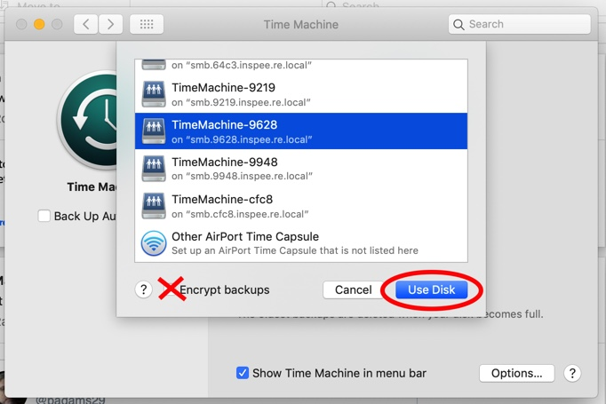

  image 3

**4. Acceptez la connexion au partage SAMBA de votre DATIS**

.. figure:: ActivationTimeMachine/4-ConnectionTimeMachine.jpg
  :width: 480px
  :align: center

  image 4

**5. Donnez vos identifiants**

Attention, il s'agit de vos identifiants DATIS, et non pas vos identifiants MAC.
Si vous avez plusieurs MAC à sauvegarder, vous devrez créér autant de comptes
sur DATIS que de MAC.

NB: La procédure de création de comptes DATIS est décrite ici.

.. figure:: ActivationTimeMachine/5-IdentifiantDatisAdmin.jpg
  :width: 480px
  :align: center

  image 5

**6. C'est fait!**

Vous devez voir le disque ``TimeMachine-XXXX`` dans la liste des disques 
utilisés par TimeMachine, et la première sauvegarde doit commencer bientôt.

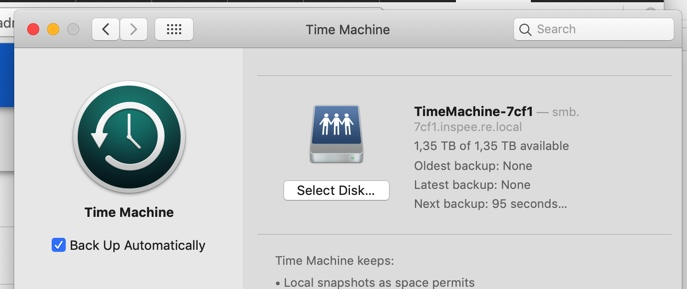

  image 6

.. _config_VEEAM:

5.3 Mise en place sauvegarde niveau 2 : VEEAM
^^^^^^^^^^^^^^^^^^^^^^^^^^^^^^^^^^^^^^^^^^^^^

**En cours de construction.**

5.4 Sauvegarde Office 365
^^^^^^^^^^^^^^^^^^^^^^^^^

.. NOTE::
  Ce chapitre comporte 2 parties:
  
  La connexion individuelle à un compte Microsoft personnel et La connexion "multi-tenants" gérée par un administrateur au profit d'utilisateurs d'un Active Directory

Connexion individuelle
----------------------

**Voici en images la procédure de connexion au compte Microsoft 0365**

.. figure:: ./Figures_o365/1_connexion_compte.png
  :width: 480px
  :align: center

  image 1

**Cliquer sur le bouton "connexion"**

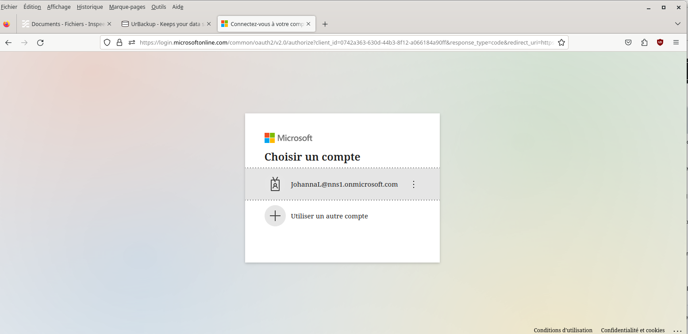

  image 2

**Choisir ensuite le nom de connexion**

.. figure:: ./Figures_o365/2_connexion_johan.png
  :width: 480 px
  :align: center

  image 3

**Une fois celle-ci établie les sauvegardes commencent**

.. figure:: ./Figures_o365/3_onedrive_saves.png
  :width: 480px
  :align: center

  image 4

.. figure:: ./Figures_o365/4_explorer.png
  :width: 480px
  :align: center

  image 5

**Il suffit ensuite de choisir le fichier ou dossier à restaurer**

Connexion multi-tenant
----------------------

Création de l'application
~~~~~~~~~~~~~~~~~~~~~~~~~

.. NOTE::
  Il faut impérativement se rendre sur le portail Microsoft Azure pour 
  créer une page d'enregistrement d'une application à cette adresse : `cliquer ici <https://portal.azure.com/#view/Microsoft_AAD_IAM/ActiveDirectoryMenuBlade/~/RegisteredApps>`_ .
  Ensuite suivre les étapes:

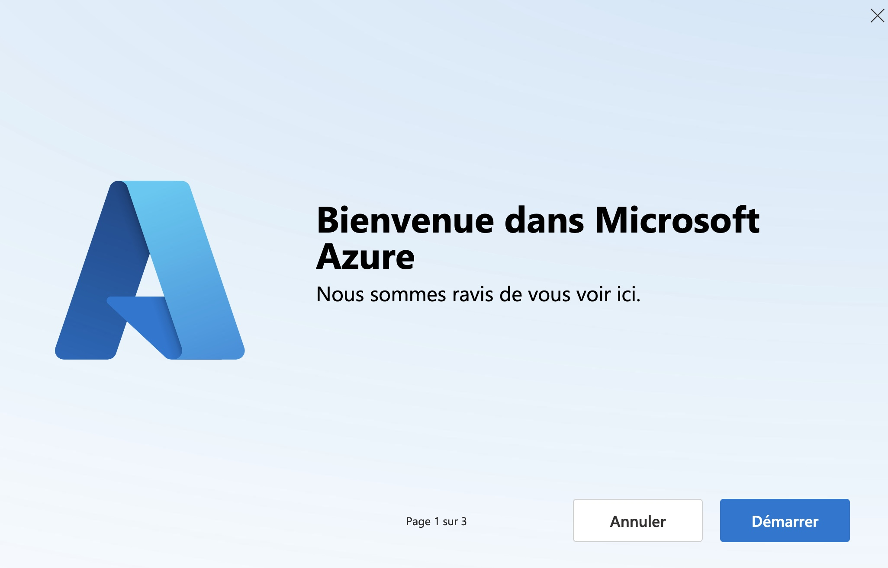

  image 1  

**Cocher les deux réponses montrées par la capture d'écran:**

.. figure:: ./Figures_app_azure/2_USAGE_QUESTION.jpg
  :width: 480px
  :align: center

  image 2

**Passer la visite guidée.**

.. figure:: ./Figures_app_azure/3_SKIP_TOUR.jpg
  :width: 480px
  :align: center

  image 3

**Enregistrer une nouvelle app en cliquant sur + Nouvelle inscription**

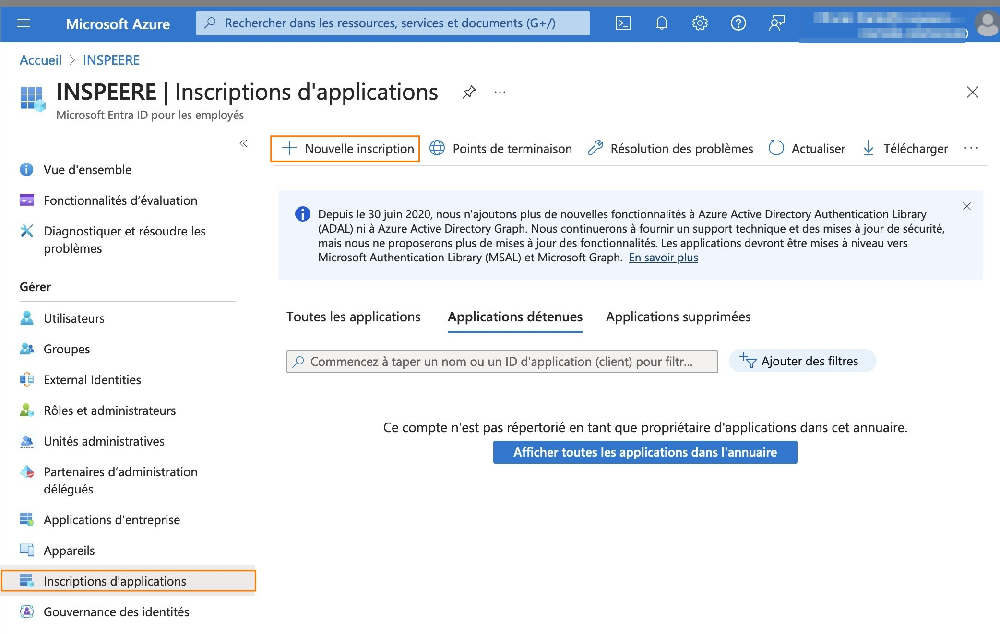

  image 4

**Une page s'affiche**

- Donner un nom à l'application

- Sous l'option "Types de compte pris en charge",
  sélectionnez "Comptes dans n'importe quel annuaire organisationnel (tout locataire Microsoft Entra ID - Multilocataire)
  et comptes personnels Microsoft (par exemple Skype, Xbox)".  

- Laisser URI de redirection vide (Cette option ne sera pas utilisée.)

- Pour finir, cliquer sur "s'incrire"

.. figure:: ./Figures_app_azure/5_NEW_APP_FORM.jpg
  :width: 480px
  :align: center

  image 5

**La page est redirigée**

- Sur celle-ci on trouve:
  L'ID d'application
  L'ID de l'annuaire
  Bien noter ces deux valeurs.

.. figure:: ./Figures_app_azure/6_ApplicationId_and_TenantID.jpg
  :width: 480px
  :align: center

  image 6

**Sur la même page, colonne de gauche, sélectionner:**

- Certificats & secrets
- Cliquer sur + Nouveau secret client

.. figure:: ./Figures_app_azure/7_CERTIF_AND_SECRETS.jpg
  :width: 480px
  :align: center

  image 7

**Renseigner:**

- La description
- La date d'expiration
- Cliquer sur ajouter

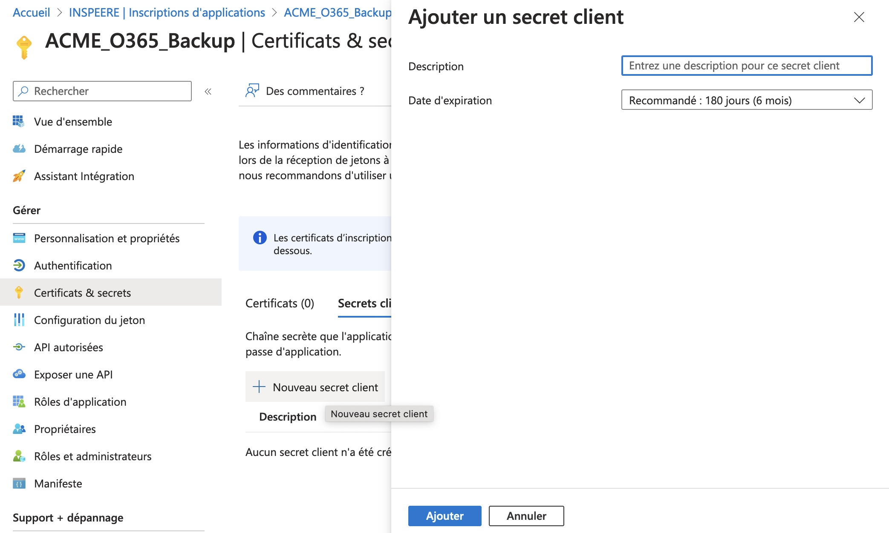

  image 8

.. figure:: ./Figures_app_azure/9_FILL_SECRET_FORM.jpg
  :width: 480px
  :align: center

  image 9

**Ceci va donner:**

- Une valeur de clé
- Une ID de secret

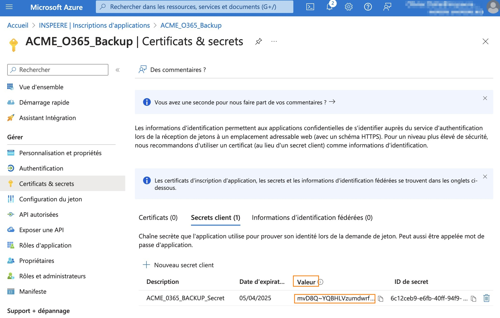

  image 10

**Copier la valeur de la clé et l'enregistrer.**

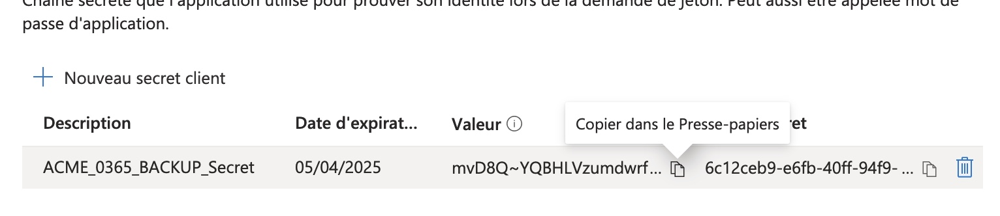

  image 11

Configurer les permissions
~~~~~~~~~~~~~~~~~~~~~~~~~~

**A partir de la page d'application vue à l'étape précédente:**

- Sélectionnner (Dans la colonne de gauche) "API autorisées".
- Cliquer sur + Ajouter une autorisation et sélectionner "Microsoft Graph"

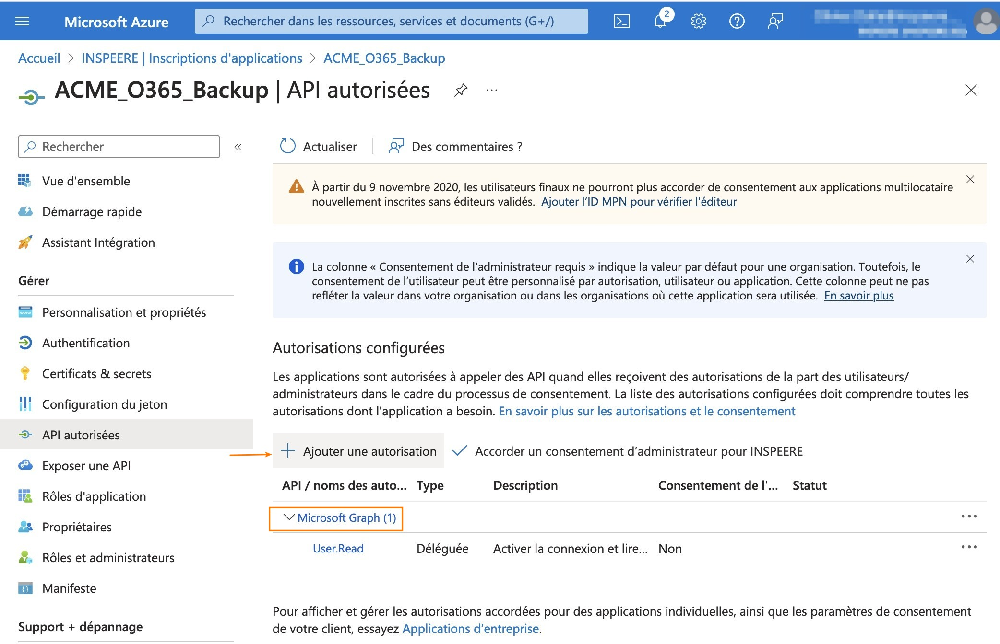

  image 12

.. figure:: ./Figures_app_azure/14_DISPLAY_MICROSOFT_GRAPH.jpg
  :width: 480px
  :align: center

  image 13

**Comme le montre l'image suivante:**
- Choisir "autorisations d'application"

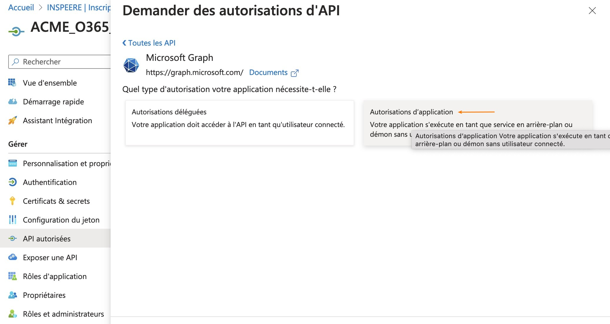

  image 14

**Une page s'ouvre avec une barre de recherche. Tapez les mots clés pour:**

- Applications
- Directory
- Files
- Mail
- Sites
- User

**Suivre la procédure ci-dessous.**

.. figure:: ./Figures_app_azure/16_Application_ReadWriteALL.jpg
  :width: 480px
  :align: center

  image 15

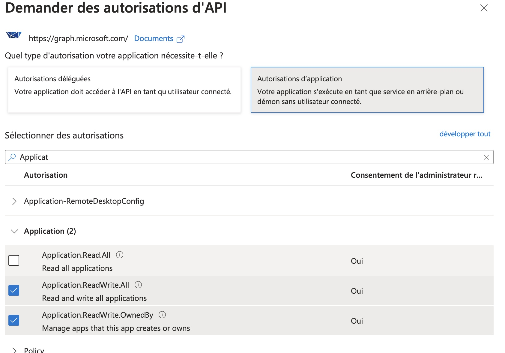

  image 16

  image 17

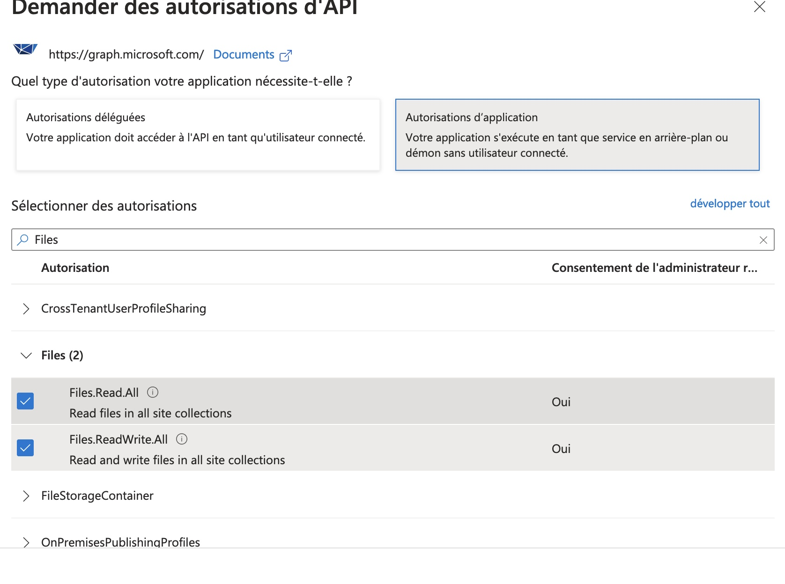

  image 18

.. figure:: ./Figures_app_azure/19_Mail_Permissions.jpg       
  :width: 480px
  :align: center

  image 19

.. figure:: ./Figures_app_azure/20_Sites_Permissions.jpg 
  :width: 480px
  :align: center

  image 20

.. figure:: ./Figures_app_azure/21_User_Permissions.jpg
  :width: 480px
  :align: center

  image 21

**Résumé de l'opération.**
-Cliquer sur "Accorder un consentement d'administrateur pour..." (image 22)
-Choisir le type d'autorisations déléguées (image 23)

.. figure:: ./Figures_app_azure/22_AFTER_ADDPERM_BUTTON.jpg
  :width: 480px
  :align: center

  image 22

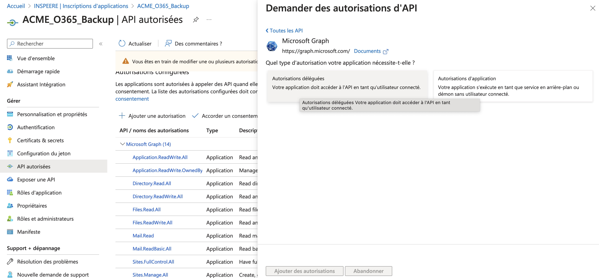

  image 23

**Il ne reste plus alors qu'à entrer les clé dans le dashboard de la Datis:**
- Application(client) ID
- Tenant (Directory) ID
- La Secret Value

.. figure:: ./Figures_app_azure/24_ADD_KEYS_DATISADMIN.png
  :width: 480px
  :align: center

  image 24

**Avant de lancer la sauvegarde, tester les clés**

.. figure:: ./Figures_app_azure/25_ADD_KEYS_TEST.png        
  :width: 480px
  :align: center

  image 25
