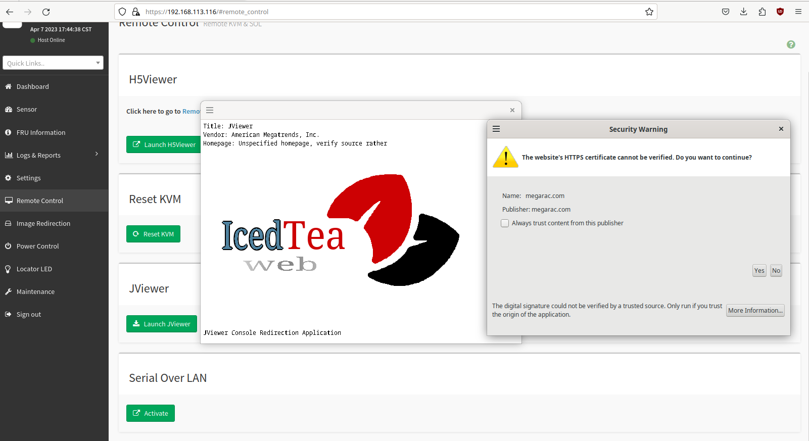
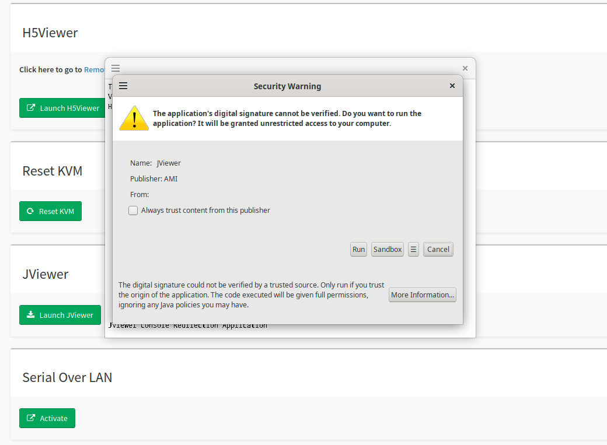

.. role:: red

6. Gestion du Matériel
======================

6.1 Gestion de l'Energie
------------------------

.. WARNING::
  Il est indispensable que la Datis redémarre toute seule en cas de coupure électrique que celle-ci soit branchée
  sur onduleur ou pas. Voici la vérification à effectuer avant de considérer un boitier d'alimentation défectueux.

.. figure:: ./DATIS_BIOS/Datis_power.jpg
  :width: 480px
  :align: center

  image 1

6.2 IPMI(BMC)
-------------

.. NOTE::
  Certaines DATIS (Les Terra) possèdent une "fonction" IPMI(BMC) qui permet l'administration de cette dernière
  via le réseau.
  Pour connaitre l'IP d'une Datis possédant cette option il y a deux possibilités :
  - Pendant le démarrage du serveur, l'adresse IP du BMC s'affiche généralement dans le coin inférieur droit de l'écran.

  - Elle s'affiche également dans le BIOS (Images 1 et 2)

.. figure:: ./DATIS_BIOS/BMC-network-config1.png
  :width: 480px
  :align: center

  image 1

.. figure:: ./DATIS_BIOS/BMC-network-config2.png
  :width: 480px
  :align: center

  image 2

6.3 Paramétrage IPMI de la DATIS
--------------------------------

**Tout d'abord entrer l'adresse IP partagée dans un navigateur pour accéder au serveur**

.. figure:: ./Figures_ipmi/login_ipmi.png
  :width: 480px
  :align: center

  image 1

.. figure:: ./Figures_ipmi/dashboard_ipmi.png
  :width: 480px
  :align: center

  image 2

**Pour avoir accès à l'interface en ligne de commande par le réseau il faut cliquer sur le bouton "jviewer".**

.. figure:: ./Figures_ipmi/jviewer_ipmi.png
  :width: 480px
  :align: center

  image 3

.. NOTE::
  Il est possible qu'en cliquant sur le bouton "launch jviewer" la console ne se lance pas mais qu'un
  fichier nommé jviewer.jnlp soit téléchargé. Il faut alors se placer dans ce dossier avec le terminal
  et taper la commande suivante :

.. code-block:: bash

  $ javaws jviewer.jnlp

**Suivre les instructions proposées par les images suivantes.**

  image 4

  image 5

.. figure:: ./Figures_ipmi/jviewer4_cli_ipmi.png
  :width: 480px
  :align: center

  image 6

.. figure:: ./Figures_ipmi/jviewer4_cli2_ipmi.png
  :width: 480px
  :align: center

  image 7

