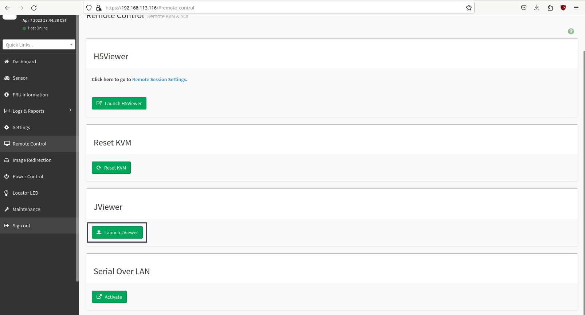
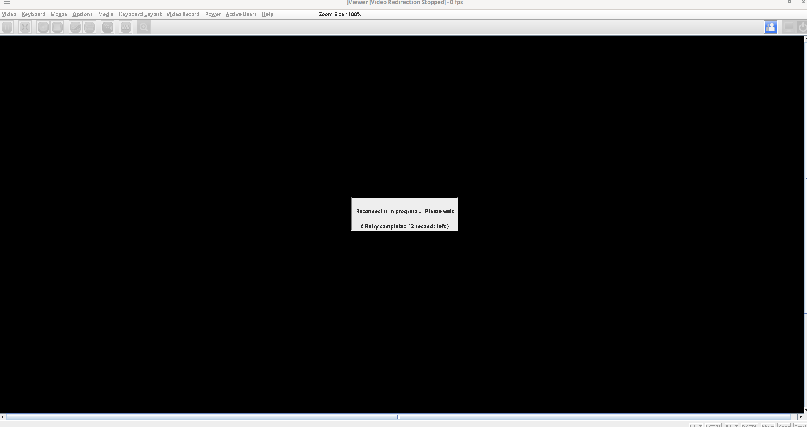

.. role:: red

6. Gestion du Matériel
======================

6.1 Fonction IPMI de la DATIS
-----------------------------

.. NOTE::

  Certaines DATIS (Les Terra) possèdent une "fonction" IPMI(BMC) qui permet l'administration de celle-ci
  via le réseau.
  Trouver l'adresse IP du BMC:
  Pendant le démarrage du serveur, l'adresse IP du BMC s'affiche généralement dans le coin inférieur droit de l'écran
  

**Tout d'abord entrer l'adresse IP partagée dans un navigateur pour accéder au serveur**

.. figure:: ./Figures_ipmi/login_ipmi.png
  :width: 480px
  :align: center

  image 1

.. figure:: ./Figures_ipmi/dashboard_ipmi.png
  :width: 480px
  :align: center

  image 2

**Pour avoir accès à l'interface en ligne de commande par le réseau il faut cliquer sur le bouton "jviewer".**

  image 3

.. NOTE::
  Il est possible qu'en cliquant sur le bouton "launch jviewer" la console ne se lance pas mais qu'un
  fichier nommé jviewer.jnlp soit téléchargé. Il faut alors se placer dans ce dossier avec le terminal
  et taper la commande suivante :

.. code-block:: bash

  $ javaws jviewer.jnlp

**Suivre les instructions proposées par les images suivantes.**

.. figure:: ./Figures_ipmi/jviewer2_ipmi.png
  :width: 480px
  :align: center

  image 4

.. figure:: ./Figures_ipmi/jviewer3_ipmi.png
  :width: 480px
  :align: center

  image 5

  image 6

.. figure:: ./Figures_ipmi/jviewer4_cli2_ipmi.png
  :width: 480px
  :align: center

  image 7

