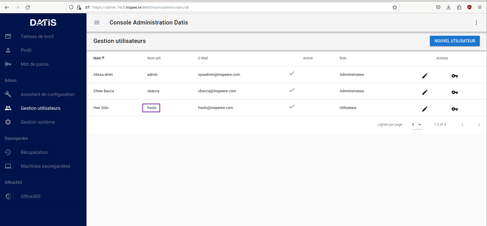
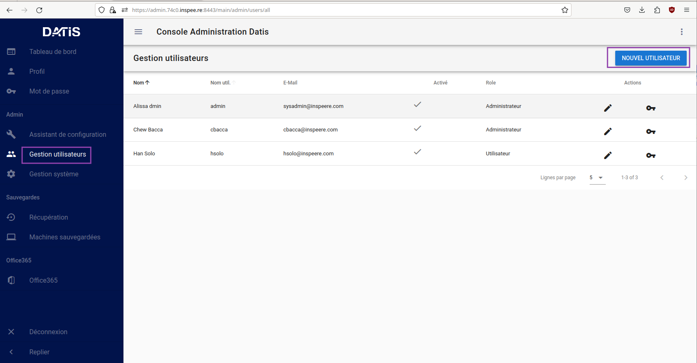
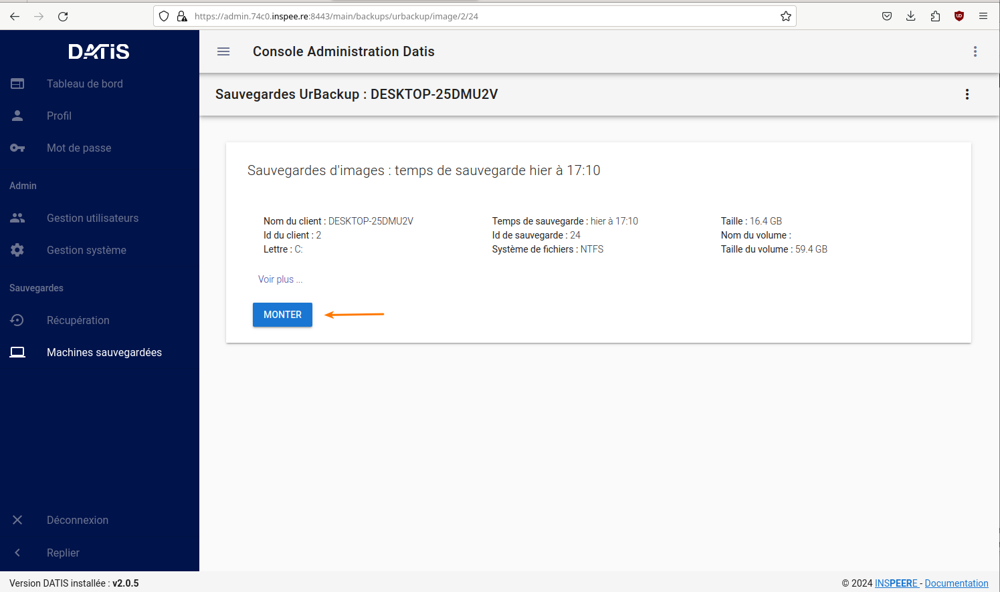
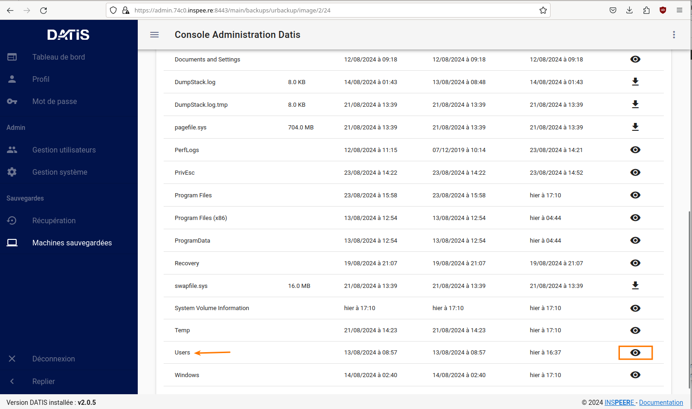
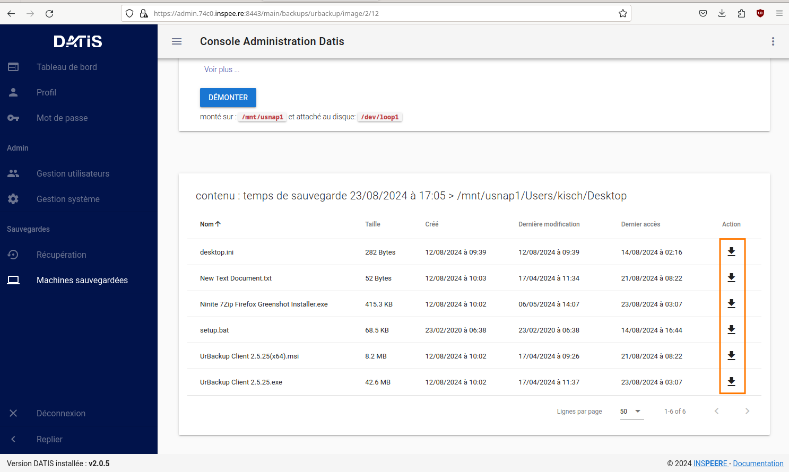

6. Interface DatisAdmin
=======================

.. figure:: ./Figures/1_DatisAdmin_DashBoard_Annot.png
  :width: 480px
  :align: center

  image 1

**1. Tableau de bord de la console d'administration**

 L'image 1  présente le tableau de bord de la console d’administration,
 avec un menu en partie gauche, un rappel de l’état général du système en partie centrale haute,
 et un rappel de l’état de sauvegarde de chaque poste sauvegardé par UrBackup en partie centrale basse.
 Un lien vers la documentation est proposé dans le coin inférieur droit

.. figure:: ./Figures/2_DatisAdmin_2FA_annot.png
  :width: 480px
  :align: center

  image 2

**2. Chaque utilisateur de la console peut activer une authentification à deux facteurs**

 La console peut-être accessible par différents utilisateurs. Chacun peut activer une authentification à double facteur (figure 2).
 Les utilisateurs créés avec le profil Administrateur ont le droit d’ajouter de nouveaux utilisateurs. 
 Les accès des utilisateurs sont centralisés dans une base interne LDAP,
 qui permet d’utiliser les mêmes identifiants pour accéder aux différents services du système INSPEERE Datis.

.. figure:: ./Figures/3_DatisAdmin_Users_Annot.png
  :width: 480px
  :align: center

  image 3

**3. Le menu de gestion des utilisateurs permet de créer ou modifier des comptes 
utilisateurs et de leur générer des profils VPN Individuels.**

 Le Menu des gestion des utilisateurs (image 3) permet d’ajouter de nouveaux utilisateurs, de les activer/désactiver, 
 ou de leur délivrer un profil pour établir une connexion VPN (la clé en partie droite). 
 Le profile VPN permet d’accéder aux consoles de gestion et de supervision, ou à certains services trop vulnérables 
 pour être exposés directement sur Internet (SMB, FTP, ...). Initialement, chaque Datis est livrée avec un premier utilisateur « admin »,
 dont les identifiants sont transmis de façon sécurisée à l'administrateur.

.. figure:: ./Figures/4_DatisAdmin_Systeme_General_Annot.png
  :width: 480px
  :align: center

  image 4

**4. Le menu de gestion du système propose plusieurs onglets de configuration.**

 Le menu de gestion du système (imagee 4) permet de configurer ou de consulter les éléments de la configuration système. 
 Nous revenons plus en détail sur les deux derniers concernant les versions et les rapports ci-après.

.. figure:: ./Figures/5_DatisAdmin_Systeme_Version_annot.png
  :width: 480px
  :align: center

  image 5

**5. Affichage des versions des principaux composants du système, pour une meilleure prise en compte des vulnérabilité potentielles.**

 L’onglet VERSION du menu système (image 5) permet d’afficher les versions actuellement déployées des composants utilisés par le système : 
 version du noyau, du serveur LDAP, VPN, etc. Cette liste permet de vérifier rapidement si le système est vulnérable lors de l’annonce de nouvelles CVE.
 La version courante du système INSPEERE Datis est quant à elle toujours visible en bas à gauche de l’interface DatisAdmin.

.. figure:: ./Figures/6_DatisAdmin_Systeme_Rapports_Annot.png
  :width: 480px
  :align: center

  image 6

**6. Interface de gestion des Rapports.**

 L’onglet RAPPORTS du menu système (image 6) permet d’accéder à l’interface de gestion et consultation des rapports de synthèse. 
 Ces rapports sont complémentaires des rapports techniques et alertes mail produits par UrBackup. 
 Ils sont destinés à un public non spécialiste et permettent de vérifier le bon déroulement des sauvegardes de postes.
 Ce menu permet aussi d’activer l’envoi d’un rapport quotidien à une liste d’utilisateurs convenus (par exemple le client final / adhérent).

.. figure:: ./Figures/7_DatisAdmin_Systeme_Rapport_Visu_Annot.png
  :width: 480px
  :align: center

  image 7

**7. Visualisation d’un rapport.**

 Chaque rapport peut-être soit visualisé sous forme HTML (image 7), soit téléchargé au format PDF. 
 C’est le même format PDF qui est envoyé par mail lorsque la demande de rapport quotidien est activée.

.. figure:: ./Figures/8_DatisAdmin_Recup_Annot.png
  :width: 480px
  :align: center
  
  image 8

**8. La première des deux interfaces de restauration, permet de récupérer des fichiers dans le stockage local 
(fichiers déposés par Samba, Rsync, FTP, etc.)**

 Le menu Récupération (image 8) permet d’accéder à l’historique de la première des deux formes de sauvegardes, 
 celle des fichiers « déposés » sur le système INSPEERE Datis, 
 à l’aide de protocoles tels que Samba, Rsync, FTP, NFS, etc.

 Le système DATIS prend des instantanés ZFS de l’état du stockage fichier selon la politique de rétention locale planifiée. 
 Cette politique est configurable, avec une granularité variable. Par exemple il est possible de prendre un instantané 
 toutes les 5 minutes pendant 1 heure, puis un toutes les heures pendant 24h, puis un par jour pendant 30j, 
 puis un par semaine pendant 3 mois, etc.

 Une fois l’intervalle de recherche affiné (barre de sélection encadrée en rouge au milieu, figure 8), 
 il suffit de cliquer sur le bouton explorer pour accéder à l’explorateur des instantanés et récupérer le fichier ou dossier voulu. 
 La restitution se fait alors soit en écrasant le contenu actuel, soit a côté en ajoutant la date de l’instantané 
 en suffixe du nom de fichier/dossier. 

.. figure:: ./Figures/9_DatisAdmin_Urbackup_Liste_Annot.png
  :width: 480px
  :align: center

  image 9

**9. La deuxième interface de restauration est plus spécifiquement dédiée aux sauvegardes de postes et VMs par UrBackup.**

 Le menu Machines Sauvegardées (image 9) permet d ‘accéder à la deuxième interface de restauration plus spécifiquement dédiée à UrBackup. 
 Elle permet d’obtenir la liste des sauvegardes de postes et VMs gérées par la système UrBackup. Le bouton d’action en bout de ligne permet 
 d’accéder plus spécifiquement aux sauvegardes d’un poste en particulier.
 Il est important de noter que cette interface est complémentaire de l’interface fournie par le système UrBackup. 
 Elle fournit la fonction de restauration granulaire, qui n’est pas disponible autrement par l’interface de UrBackup.

 La restauration granulaire consiste à permettre l’ouverture d’un instantané d’Image disque pour en extraire un fichier. 
 Elle est rendue possible grâce à l’utilisation du backend ZFS avec UrBackup.
 
 Ce backend permet de proposer avec UrBackup une sauvegarde incrémentale perpétuelle, dans laquelle chaque incrément de sauvegarde 
 contient le contenu d’une sauvegarde image complète, mais ne requiert que l’espace supplémentaire d’un incrément. 
 Avec cette forme de sauvegarde, les techniques de sauvegardes complètes,  « full synthetique », ou incrémentales inversée 
 deviennent totalement inutiles : l’espace disque occupé est minimal, et il est possible de réduire le nombre d’instantanés 
 en supprimant n’importe le(s)quel(s), en fonction des objectifs de la politique de rétention.

.. figure:: ./Figures/10_DatisAdmin_Urbackup_ListeOne.png
  :width: 480px
  :align: center

  image 10

**10. Navigation dans les sauvegardes images UrBackup d’un poste en particulier.**

 En cliquant sur le bouton d’action à fin de la ligne correspondant à un poste sauvegardé (image 9), 
 on obtient la liste des sauvegardes de type image et de type fichier de UrBackup. Pour chaque instantané de sauvegarde de type image, 
 il est possible d’ouvrir une nouvelle  page de détails spécifique à cet instantané (bouton action en fin de ligne sur la figure 10).

.. figure:: ./Figures/11_DatisAdmin_UrBackup_ExploreImg_Annot.png
  :width: 480px
  :align: center

  image 11

**11.Ouverture d’un instantané de volume du poste sauvegardé.**

 Lorsque le volume explorer correspond à une partition d’origine (disque C, D, ...), il est possible de « monter » l’image 
 afin d’accéder à son contenu (image 11). Il est alors possible d’explorer le contenu de l’image et d’en télécharger 
 des fichier à l’aide des boutons d’action en fin de ligne.

 Il est important de noter que toute cette séquence d’ouverture est très rapide, car grâce au stockage ZFS, 
 l’accès au contenu d’un instantané ne requiert aucune phase de reconstruction/consolidation : en pratique, 
 chaque instantané est une sauvegarde complète, immédiatement disponible.

Tableau de bord de supervision centralisé
^^^^^^^^^^^^^^^^^^^^^^^^^^^^^^^^^^^^^^^^^

.. figure:: ./Figure_Graf/1_Etat_global_Grafana_Annot.png
  :width: 480px
  :align: center

  image 1

**1. La zone supérieure du tableau de bord présente un « cartouche » par serveur. Chaque cartouche est une matrice 3x2 d’indicateurs de couleur. 
La zone suivante offre un niveau de détail plus élevé. Elle constituée d’une série de lignes d’indicateurs, les « one-liner », une pour chaque serveur.**

 

 La figure 1 montre la partie haute du tableau de bord. Tout en haut, on trouve la zone des « cartouches » qui présente de façon compacte 
 l’état de chaque serveur, à l’aide de 6 indicateurs, organisés en matrice 3x2. Le code couleur est intuitif : 
 vert quand tout va bien, bleu quand un indicateur est sans objet (par exemple lorsque la sauvegarde UrBackup de type fichier n’est pas utilisée), 
 et jaune, puis orange, puis rouge en fonction du niveau d’alerte. Dans le cas présent, les cases oranges indiquent que des sauvegardes UrBackup 
 de type fichier ou image sont en retard sur 3 des 4 serveurs.

 Vient ensuite la zone des « one-liners » qui donne un peu plus d’information sur l’état du stockage ZFS local et distant, 
 pour chaque serveur, sur une ligne par serveur (cadre rouge en partie basse de la figure 23).

.. figure:: ./Figure_Graf/2_Etat_Systeme_Annot.png
  :width: 480px
  :align: center

  image 2

**2. En faisant défiler la page vers le bas, on atteint la zone centrale du tableau de bord, avec les indicateurs système de chaque serveur.
Ici la figure présente les indicateurs pour un serveur. Il faut faire défiler la page pour obtenir les même indicateurs avec les serveurs suivants.**

 La figure 2 montre la zone des indicateurs système d’un serveur. A coté des indicateurs classique de charge et d’occupation mémoire, 
 on trouve les indicateurs concernant l’état du stockage primaire ZFS. La aussi le code couleur est conservé : lorsque c’est vert (ONLINE), 
 le stockage n’a pas d’erreur. Si un disque venait à perdre des secteur, l’état passerait en orange (DEGRADED), et en cas de défaillance grave, 
 il passe en rouge (FAULTED). La quantité de stockage libre/utilisé est aussi un indicateur important à surveiller 
 (2e cadre rouge en partant du haut, dans la figure 13). Enfin, tout en bas de cette zone système, on trouve la courbe du trafic de sauvegarde, 
 avec des couleurs différentes pour le trafic en provenance des postes sauvegardés, et celui à destination des réplicats externes.

.. figure:: ./Figure_Graf/3_Etat_Urbackup_Annot.png
  :width: 480px
  :align: center

  image 3

**3. En faisant encore défiler jusqu’en bas de la page du tableau de bord, on atteint la zone concernant l’état des sauvegardes UrBackup
sur chacun des serveurs. Les informations présentées sont les mêmes que celles présentées sur la console UrBackup, mais regroupées
en un seul et même endroit pour tous les serveurs Datis d’un même client ou tous les clients d’un même partenaire.**

.. _gestion_des_utilisateurs:

Gestion des utilisateurs
^^^^^^^^^^^^^^^^^^^^^^^^

Sur DatisAdmin voici comment se passe la gestion des utilisateurs:
Dans l'exemple quelques utilisateurs ont été créés.

  image 1

**Afin de créer un nouvel utilisateur cliquer sur l'icone "Nouvel Utilisateur".**

  image 2

**Ensuite il en reste qu'à renseigner les champs proposés.**

.. figure:: ./Figures_SMB/Selection_006.png
  :width: 480px
  :align: center

  image 3

Fonctions système
^^^^^^^^^^^^^^^^^

Récupération d'un fichier dans sauvegarde niveau 1
^^^^^^^^^^^^^^^^^^^^^^^^^^^^^^^^^^^^^^^^^^^^^^^^^^

**Grâce à DatisAdmin, cette opération est simple :**
Dans l'onglet "Machines sauvegardées" de DatisAdmin cliquer sur l'explorateur (l'oeil) d'une machine

.. figure:: ./Figures/DatisAdmin_restor1.png
  :width: 480px
  :align: center
  
  image 1

Repérer le disque "C" qui contient tous vos fichiers et dossiers

.. figure:: ./Figures/DatisAdmin_restor2.png
  :width: 480px
  :align: center
  
  image 2

Cliquer ensuite sur le bouton "MONTER"

  image 3

Utiliser le menu déroulant jusqu'à l'utilisateur

  image 4

.. figure:: ./Figures/DatisAdmin_restor5.png
  :width: 480px
  :align: center

  image 5

Choisir enfin le fichier recherché et cliquer le la flèche de téléchargement

  image 6

