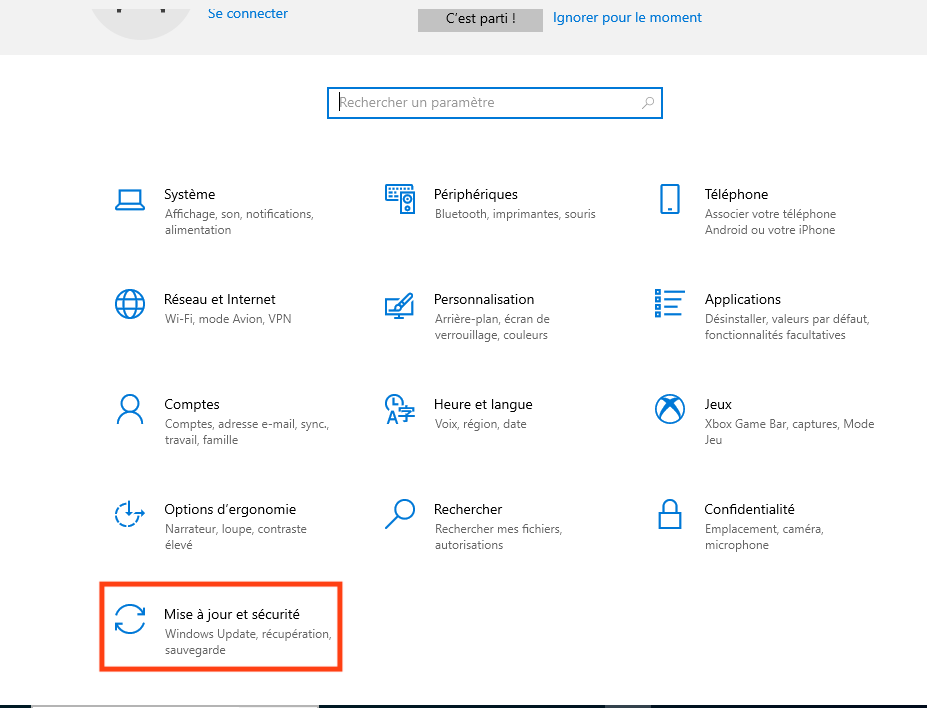
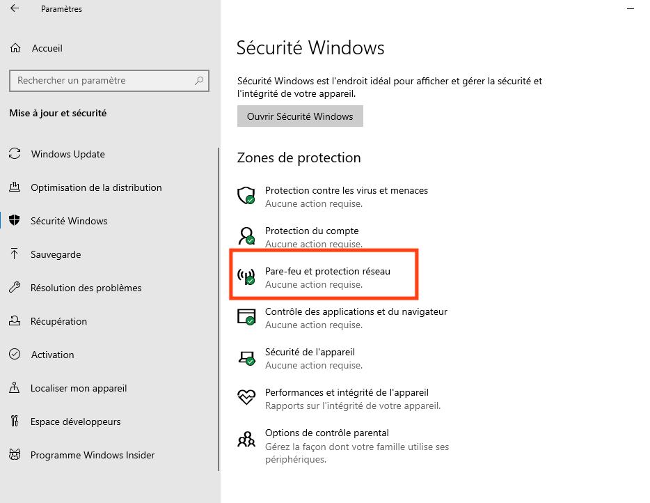
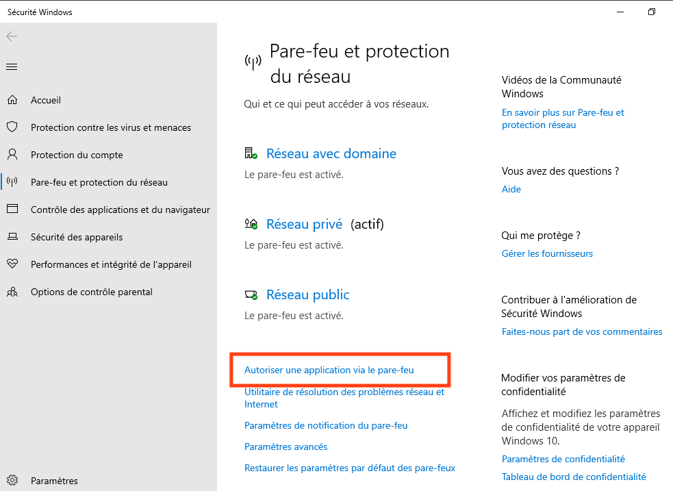
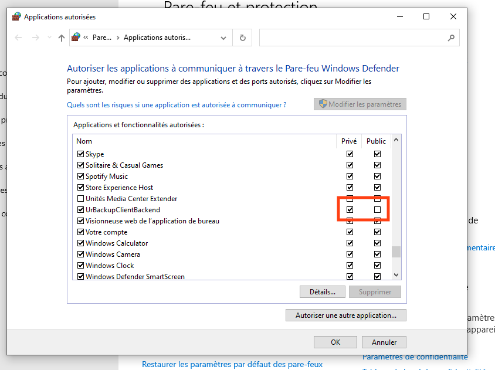
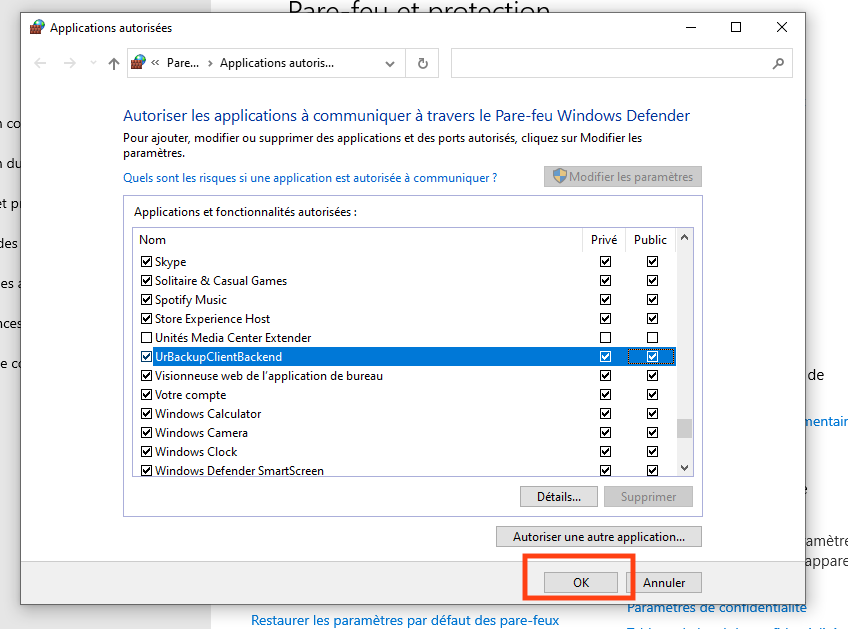

.. role:: red

7. Résolution de problèmes
==========================

7.1 Réinitialisation du mot de passe IPMI
-----------------------------------------

Il faut créer une clé bootable avec SystemRescue.
(Suivre ce lien: `SystemRescue Download <https://www.system-rescue.org/Download>`_)
 
- Booter dessus
 
- Utiliser la commande suivante :

.. code-block:: bash

  $ ipmitool user set password <admin>

- Entrer un nouveau mot de passe

7.2 Accès VPN depuis MacOS
--------------------------

Les dernières versions de MacOS **imposent** l'utilisation de IPv6 quand cette option est disponible.

En effet, si vous accédez à internet par un opeerateur qui fournit un accès IPv6, l'interface de 
configuration réseau de votre MAC ne vous permet pas de désactiver IPv6 pour basculer
sur IPv4 seul.

Or l'accès OpenVPN de votre DATIS ne fonctionne qu'avec IPv4.

Pas panique, une solution existe, il suffit d'ouvrir un terminal de commande 
(Application Utilitaires/Terminal) et de taper l'une des commandes suivantes 
selon votre mode de connexion:

1. Connexion Wi-Fi

   .. code-block:: bash
      
      sudo -setv6off Wi-Fi

2. Connexion cablée Ethernet

   .. code-block:: bash

      sudo -setv6off Ethernet

Si vous êtes connectés simultanément avec les deux modes d'accès, exécutez les deux commandes.

NB1: Ces commandes doivent être exécutées depuis un compte administrateur 
du Mac, et vous demanderont de saisir votre mot de passe admin.

NB2: Si vous n'êtes pas connectés avec le compte administrateur, vous n'avez pas besoin de 
fermer votre session, ajoutez simplement l'option `-u`` suivie du nom de l'utilisateur avec les droits d'admin. 
Par exemple si l'utilisateur avec droit d'admin est `macadmin` alors tapez la commande suivante pour un mode de connexion Wi-Fi:

.. code-block:: bash

   sudo -u macadmin -setv6off Wi-Fi

7.3 Accélérer la première sauvegarde Time Machine
-------------------------------------------------

Par défaut TimeMachine fonctionne avec une priorité très basse de façon (supposément) à ne pas gêner les autres activités de l'utilisateur sur le MAC.

En fait, cette stratégie est héritée d'une époque révolue où les MAC n'avaient pas encore de disques SSD, et où les accès au disque, très lents, étaient très pénalisant.

Pour désactiver cette stratégie au moins jusqu'au prochain démarrage (où elle reviendra automatiquement), il suffit de taper la commande suivante dans un Terminal (l'application Terminal se trouve dans le sous-dossier 'Utilitaires' du dossier 'Applications') :

.. code-block:: bash

   sudo sysctl debug.lowpri_throttle_enabled=0

La vitesse de sauvegarde doit alors augmenter de façon spectaculaire...

7.4 Sauvegarde Time Machine sur une connexion VPN
-------------------------------------------------

La procédure de configuration par défaut, sans VPN, utilise le protcole "Bonjour" pour détecter le volume TimeMachine de la Datis.
Malheureusement, ce protocole ne fonctionne que dans le périmètre du domaine de diffusion de votre réseau local.

En clair, cela signifie que votre volume TimeMachine *par défaut* n'est pas accessible lors d'une connexion VPN.

Heureusement, il y a une solution assez simple, il suffit d'une commande dans un terminal pour résoudre le problème:

.. code-block:: bash

   sudo tmutil setdestination -ap smb://<login>@<ipdatis_par_vpn>/TimeMachine-<mac4>

En n'oubliant pas de remplacer les valeurs entre <> (les <> ne doivent pas être conservés):

  * ``login`` : votre identifiant d'utilisateur **sur la DATIS** 
  * ``ipdatis_par_vnp`` : si vous utilisez le serveur VPN embarqué de votre DATIS, ça sera toujours 10.147.13.111 
  * ``mac4``: l'identifiant à 4 caractères de la DATIS

Cette commande ajoute un nouveau volume TimeMachine, qui lui sera bien accessible par VPN... et même seulement par VPN si vous utilisez le VPN embarqué de la Datis.
Ensuite, TimeMachine sait parfaitement gérer plusieurs volume, et utiliser ceux qui sont disponibles en fonction du moment.

.. _reconfigurer_le_pare_feu:

7.5 (Re)configurer le pare-feux Windows après installation d'un agent UrBackup
------------------------------------------------------------------------------

La procédure de reconfiguration est très simple, en 9 étapes:

1. Ouvrir le menu paramètres

.. figure:: 1_menu_paramètres.png
  :width: 480px
  :align: center

  image 1

2. Cliquer sur Mise à jour et sécurité

  image 2

3. Cliquer à gauche sur Sécurité windows

.. figure:: 3_securite_windows.png 
  :width: 480px
  :align: center

  image 3

4. Cliquer sur Pare-feu et protection réseau

  image 4

5. Cliquer sur la ligne 'Autoriser une application via le pare-feu'

  image 5

6. Cliquer sur le bouclier 'Modifier les paramètres'

.. figure:: 6_modifier_parametres.png
  :width: 480px
  :align: center

  image 6

7. Faire défiler et sélectionner la ligne 'UrBackupClientBackend' 

.. figure:: 7_ligne_urbackup.png
  :width: 480px
  :align: center

  image 7

8. Cocher les cases pour activer les deux profils privé et public

  image 8

9. Cliquer sur Ok pour valider

  image 9

