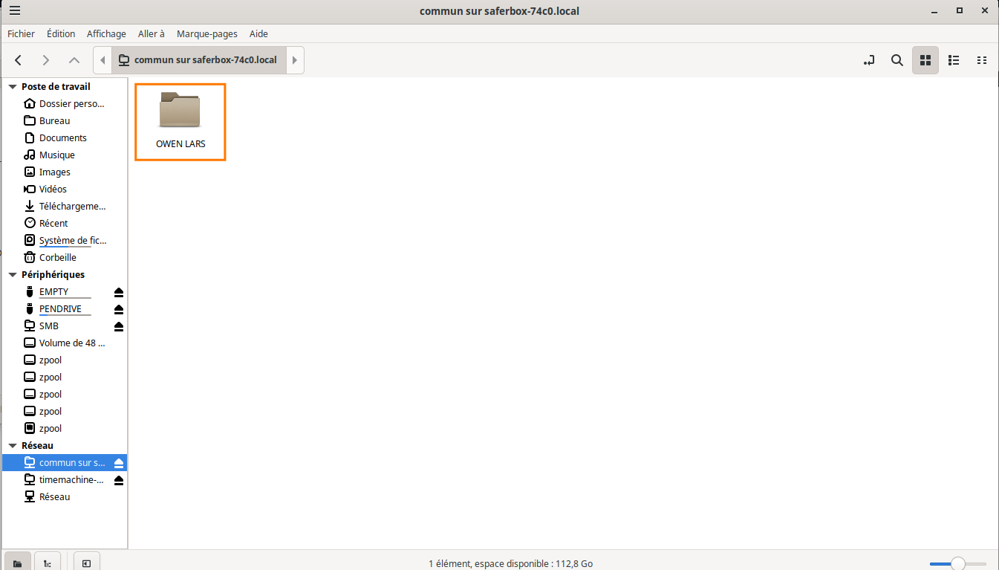
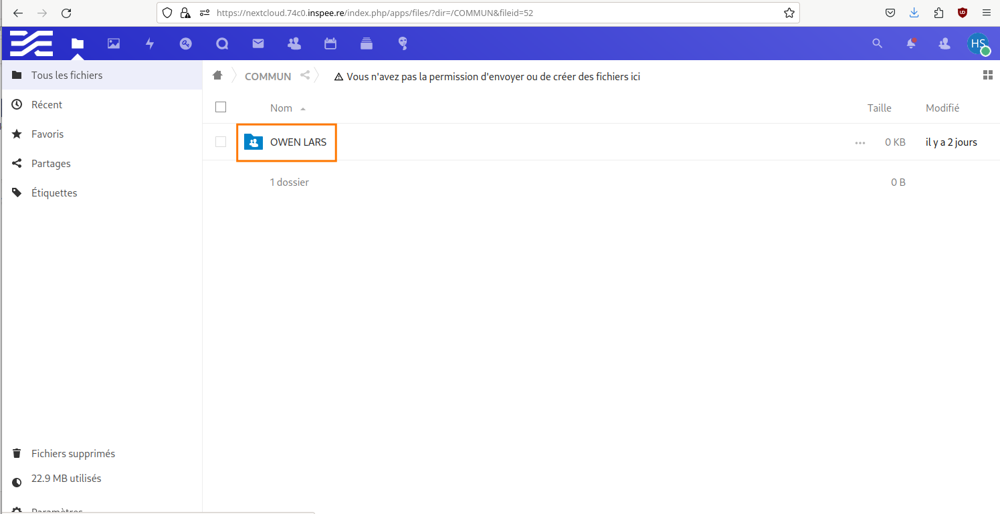
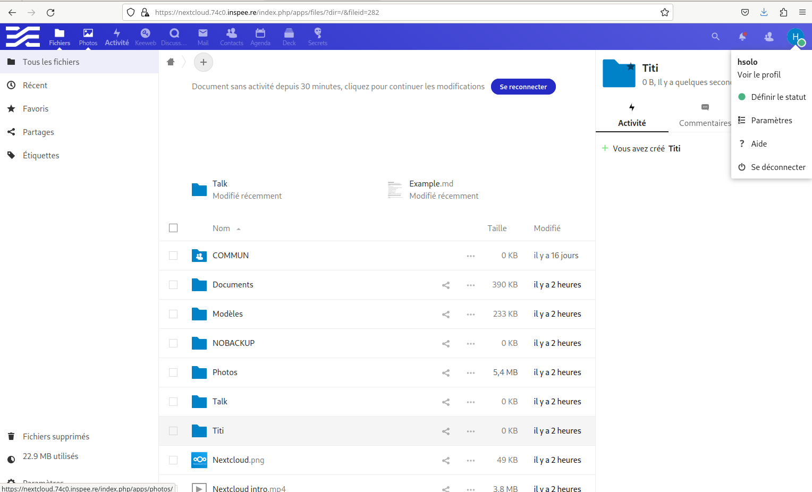

7. Serveur de fichiers (SMB)
============================

Types de Partages
^^^^^^^^^^^^^^^^^

.. panels::
  :header: text-center
  :column: col-lg-12

  Deux types de partages :
  Le premier est collectif (Tout le monde peut partager un dossier Commun)
  Le deuxième est individuel et dépend de la création d'un utilisateur dans DatisAdmin

**Premier cas de figure:**

  image 1

**Comme le montre cette première photo il faut créer un lecteur réseau en faisant un clic droit
sur l'icône "Ce PC" puis, de choisir "Connecter un lecteur réseau..."**

  image 2

**Déterminer la lettre de lecteur et le chemin d'accès au dossier partagé
l'adresse est sous la forme \\smb.xxxx.inspee.re\commun où xxxx représente les 4 digits de l'adresse MAC
de votre Datis.**

  image 3

**Deuxième cas de figure:**

  image 1

**Procéder de façon identique à la première partie (Clic droit sur "Ce PC")
Ensuite "Connecter un lecteur réseau..."**

  image 2

**La différence se fait dans le choix du chemin réseau qui se présentera sous cette forme :
\\smb.xxxx.inspee.re\<nom_de_l'utilisateur>**

  image 3

**Chacun a accès à un dossier personnel.**

Espace de partage (dossier COMMUN)
^^^^^^^^^^^^^^^^^^^^^^^^^^^^^^^^^^

.. panels::
  :header: text-center
  :column: col-lg-12

  A propos du dossier commun
  ^^^^^^^^^^^^^^^^^^^^^^^^^^
  Après avoir créé des utilisateurs dans la DatisAdmin :ref:`gestion_des_utilisateurs` ceux-ci ont accès au
  dossier ``COMMUN``.
  Le dossier commun est à la fois visible sur le PC en local et dans le serveur Nextcloud. Etant synchronisés
  tout ce qu'un utilisateur créera dans le dossier commun le sera aussi dans le même dossier Nextcloud
  ...et inversement!

.. figure:: ./Figures_SMB/SMB_1.png
  :width: 480px
  :align: center

  image 1

  image 2

.. figure:: ./Figures_SMB/SMB_3.png
  :width: 480px
  :align: center

  image 3

**Un dossier nommé OWEN LARS créé dans le dossier COMMUN du PC est synchonisé dans Nextcloud**

  image 4

Partages et Nextcloud
^^^^^^^^^^^^^^^^^^^^^

**Il est possible d'avoir tous les dossiers présents sur Nextcloud en local sur son PC.**

Il faut pour cela tout d'abord créer un dossier spécifique que l'on nomme comme on veut par exemple :
SMB situé dans les Documents :

.. code-block:: bash

  $ /home/luke/Documents# sudo mkdir SMB

.. code-block:: bash

  $ sudo mount -v -t cifs -o user=hsolo //192.168.113.99/hsolo/ SMB/

Output:
Password for hsolo@//192.168.113.99/hsolo/:``<Entrer le mot de passe>``

mount.cifs kernel mount options: ip=192.168.113.99,unc=\\192.168.113.99\hsolo,user=hsolo,pass=********

Pour vérifier que les dossiers sont bien synchronisés créer un dossier "Titi" dans Nextcloud

  image1

.. code-block:: bash

  root@skywalker:/home/luke/Documents#cd SMB

.. code-block:: bash

  luke@skywalker:~/Documents/SMB$ ls

**Output:**
Documents   Modèles  'Nextcloud intro.mp4'  'Nextcloud Manual.pdf'   Nextcloud.png
NOBACKUP   Photos   Readme.md  'Reasons to use Nextcloud.pdf'   Talk   ``Titi``

  
Partages avec sauvegardes
^^^^^^^^^^^^^^^^^^^^^^^^^

Option Nextcloud
^^^^^^^^^^^^^^^^

Fonctionalités par défaut
^^^^^^^^^^^^^^^^^^^^^^^^^

**En construction**

