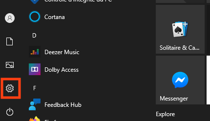
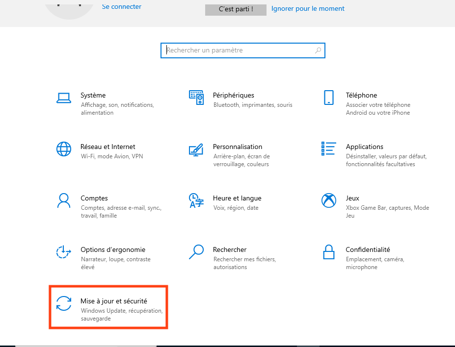
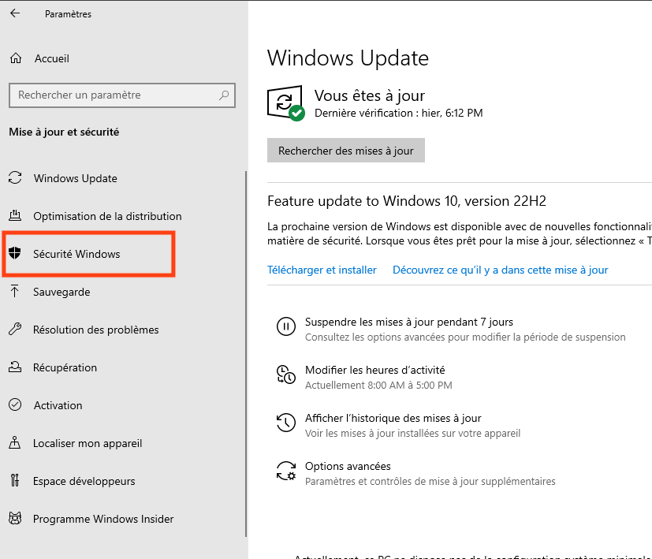
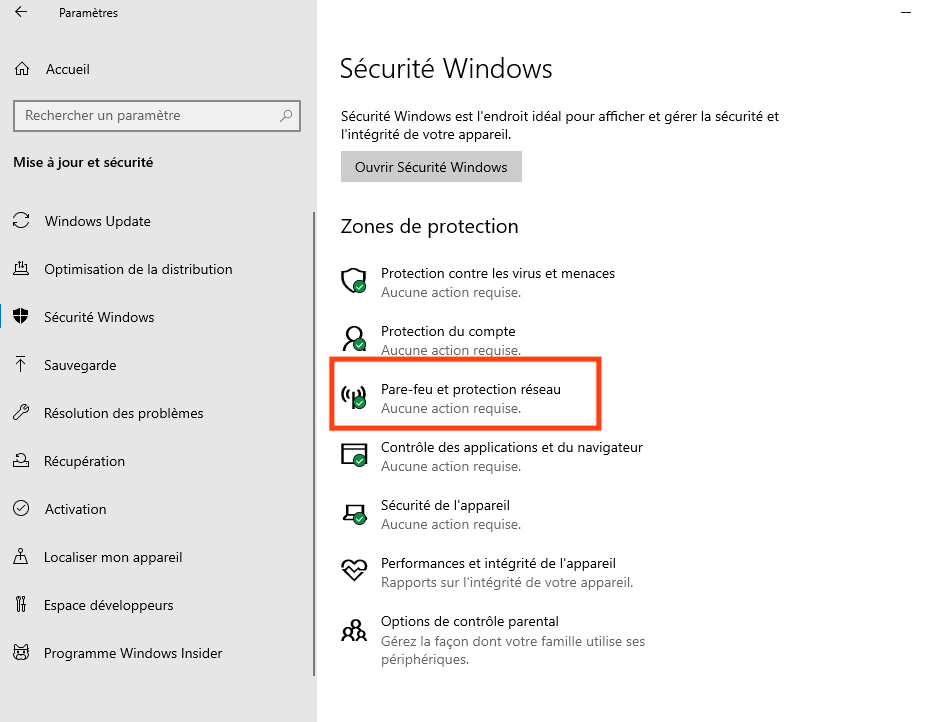
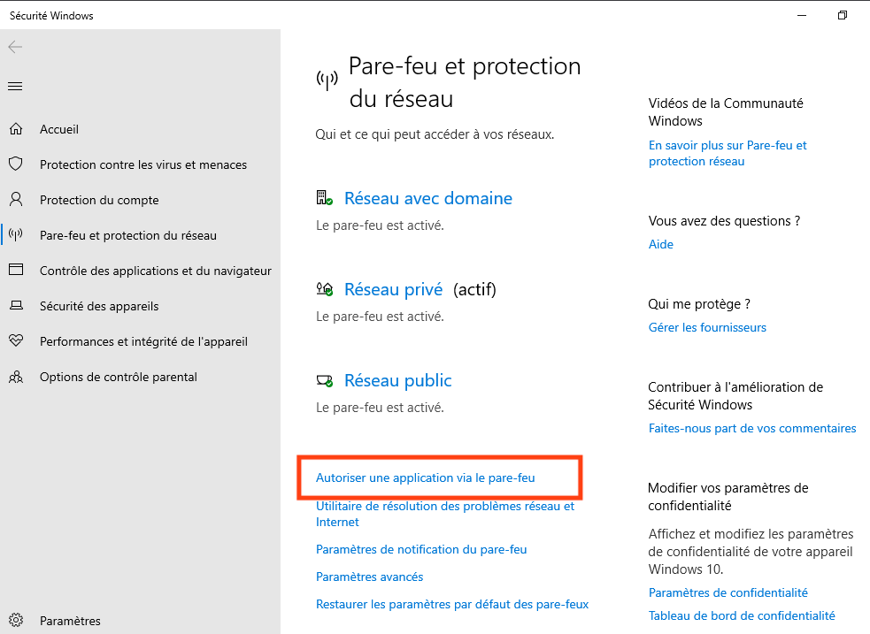
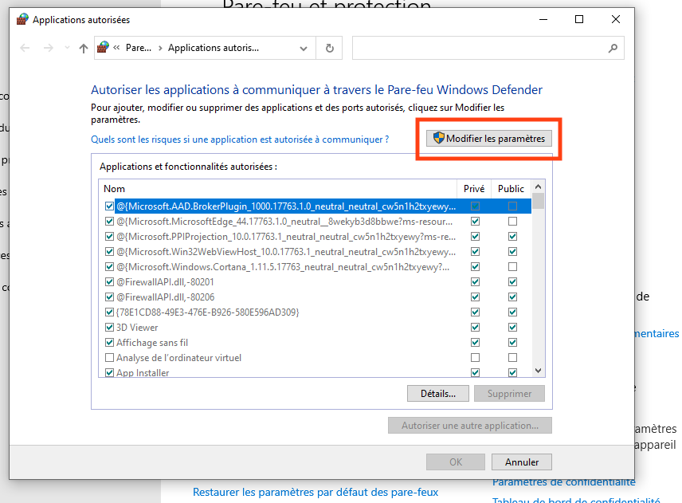
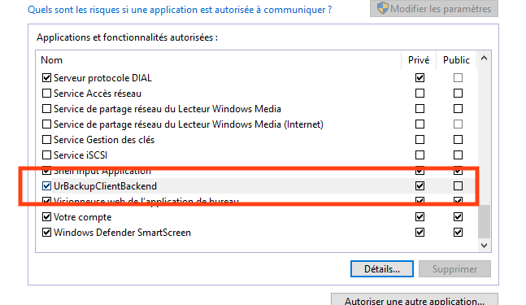
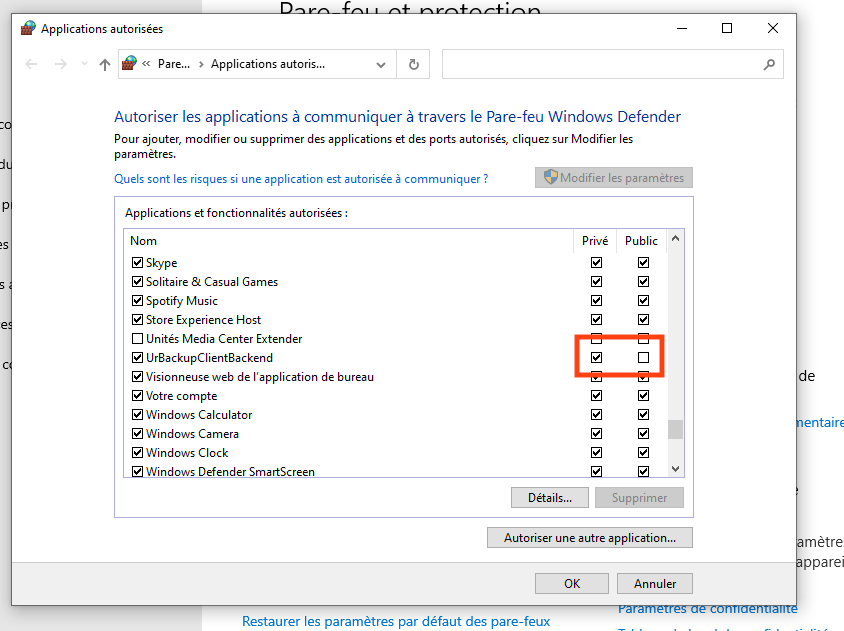
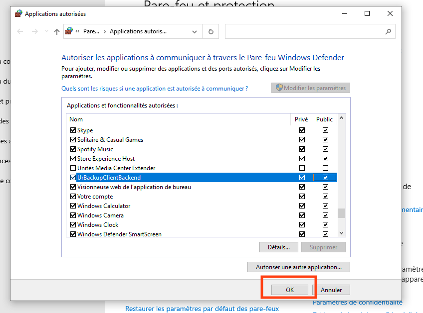

3. Résolution de problèmes
==========================

Accès VPN depuis MacOS
----------------------

Les dernières versions de MacOS **imposent** l'utilisation de IPv6 quand cette option est disponible.

En effet, si vous accédez à internet par un opeerateur qui fournit un accès IPv6, l'interface de 
configuration réseau de votre MAC ne vous permet pas de désactiver IPv6 pour basculer
sur IPv4 seul.

Or l'accès OpenVPN de votre DATIS ne fonctionne qu'avec IPv4.

Pas panique, une solution existe, il suffit d'ouvrir un terminal de commande 
(Application Utilitaires/Terminal) et de taper l'une des commandes suivantes 
selon votre mode de connexion:

1. Connexion Wi-Fi

   .. code-block:: bash
      
      sudo -setv6off Wi-Fi

2. Connexion cablée Ethernet

   .. code-block:: bash

      sudo -setv6off Ethernet

Si vous êtes connectés simultanément avec les deux modes d'accès, exécutez les deux commandes.

NB1: Ces commandes doivent être exécutées depuis un compte administrateur 
du Mac, et vous demanderont de saisir votre mot de passe admin.

NB2: Si vous n'êtes pas connectés avec le compte administrateur, vous n'avez pas besoin de 
fermer votre session, ajoutez simplement l'option `-u`` suivie du nom de l'utilisateur avec les droits d'admin. 
Par exemple si l'utilisateur avec droit d'admin est `macadmin` alors tapez la commande suivante pour un mode de connexion Wi-Fi:

.. code-block:: bash

   sudo -u macadmin -setv6off Wi-Fi

Sauvegardes TimeMachine (sur MAC)
---------------------------------

Accélérer la première sauvegarde qui prend des heures
^^^^^^^^^^^^^^^^^^^^^^^^^^^^^^^^^^^^^^^^^^^^^^^^^^^^^

Par défaut TimeMachine fonctionne avec une priorité très basse de façon (supposément) à ne pas gêner les autres activités de l'utilisateur sur le MAC.

En fait, cette stratégie est héritée d'une époque révolue où les MAC n'avaient pas encore de disques SSD, et où les accès au disque, très lents, étaient très pénalisant.

Pour désactiver cette stratégie au moins jusqu'au prochain démarrage (où elle reviendra automatiquement), il suffit de taper la commande suivante dans un Terminal (l'application Terminal se trouve dans le sous-dossier 'Utilitaires' du dossier 'Applications') :

.. code-block:: bash

   sudo sysctl debug.lowpri_throttle_enabled=0

La vitesse de sauvegarde doit alors augmenter de façon spectaculaire...

Sauvegarde sur une connexion VPN
^^^^^^^^^^^^^^^^^^^^^^^^^^^^^^^^

La procédure de configuration par défaut, sans VPN, utilise le protcole "Bonjour" pour détecter le volume TimeMachine de la Datis.
Malheureusement, ce protocole ne fonctionne que dans le périmètre du domaine de diffusion de votre réseau local.

En clair, cela signifie que votre volume TimeMachine *par défaut* n'est pas accessible lors d'une connexion VPN.

Heureusement, il y a une solution assez simple, il suffit d'une commande dans un terminal pour résoudre le problème:

.. code-block:: bash

   sudo tmutil setdestination -ap smb://<login>@<ipdatis_par_vpn>/TimeMachine-<mac4>

En n'oubliant pas de remplacer les valeurs entre <> (les <> ne doivent pas être conservés):

  * ``login`` : votre identifiant d'utilisateur **sur la DATIS** 
  * ``ipdatis_par_vnp`` : si vous utilisez le serveur VPN embarqué de votre DATIS, ça sera toujours 10.147.13.111 
  * ``mac4``: l'identifiant à 4 caractères de la DATIS

Cette commande ajoute un nouveau volume TimeMachine, qui lui sera bien accessible par VPN... et même seulement par VPN si vous utilisez le VPN embarqué de la Datis.
Ensuite, TimeMachine sait parfaitement gérer plusieurs volume, et utiliser ceux qui sont disponibles en fonction du moment.

Procédures de Restoration
-------------------------

Restoration locale à partir de la sauvegarde de niveau 1
^^^^^^^^^^^^^^^^^^^^^^^^^^^^^^^^^^^^^^^^^^^^^^^^^^^^^^^^

La restauration de fichiers à partir de la sauvegarde de 
niveau 1 se fait à partir du menu sauvegarde de l'interface DatisAdmin.

<Image>

Elle se passe en cinq étapes:

1. Seléctionner une période de recherche. Cette étape à pour objectif 
   de réduire le nombre de d'instantannés (incréments de sauvegarde)
   car ils peuvent être trop nombreux. L'idéal est de ne pas dépasser 50 instantannés.
   Le recherche peut être calendaires ou sur une période d'un certain 
   de nombre de jours avant la date courante. 

2. Afficher les instantannés retenus

3. Naviguer dans les instantannés jusqu'à trouver le fichier ou le dossier
   recherchés

5. Choisir un mode restauration entre:
   
   * Restauration avec écrasement : la version restaurée écrase la version existante
   * Restauration sans écrasement : on ajoute la date au nom de l'élément restauré 
      afin qu'il n'écrase pas la version existante

Restoration locale à partir de la sauvegarde UrBackup
^^^^^^^^^^^^^^^^^^^^^^^^^^^^^^^^^^^^^^^^^^^^^^^^^^^^^

A compléter...

Restoration locale à partir de la sauvegarde O365
^^^^^^^^^^^^^^^^^^^^^^^^^^^^^^^^^^^^^^^^^^^^^^^^^

A compléter...

Restoration Datis complète depuis sauvegarde distante
^^^^^^^^^^^^^^^^^^^^^^^^^^^^^^^^^^^^^^^^^^^^^^^^^^^^^

Pour cette opération vous aurez besoin des éléments suivants:

1. Une clef USB d'Installation (la même que pour une installation initiale)
   Vous pouvez créer une clef installation à partir d'un fichier image au format ISO.
   Si vous disposez pas déjà de ce fichier, vous pouvez le réclamer auprès 
   du `support technique Inspeere <mailto:support@inspeere.com>`_

2. Vos trois clefs d'activation du contrat Datis
   Si vous ne les avez pas conservées, vous pouvez les réclamer 
   auprès du `support technique Inspeere <mailto:support@inspeere.com>`_

3. La clef de chiffrement des données de sauvegarde.
   Vous devez être en possession de cette clef, ou avoir établi un protocole 
   pour sa conservation avec le prestatire en charge de l'installation initiale.
   N'hésitez pas à contacter le `support technique Inspeere <mailto:support@inspeere.com>`_ 
   à ce sujet.

4. Un équipement cible de la restauration.
   Soit la DatisBox originale dont le contenu sera écrasé, soit un nouvel équipement 
   compatible avec le système Datis.
   S'il n'est pas fourni par Inspeere, vous pouvez contacter le 
   `support technique Inspeere <mailto:support@inspeere.com>`_ pour vérifier sa compatibilité.

5. Un écran/clavier ou une console compatible avec l'équipement.
   NB: Si le BIOS a été préconfiguré au préalable et que les disques sont vierge, 
   il est possible de lancer une installation _headless_ en mode totalement 
   automatique.

L'opération de restauration est très simple:

1. Insérer la clef USB dans un port USB3 disponible

2. Démarrer l'équipement.
   Optionnel: en appelant le menu BIOS pour configurer 
   les paramètres du BIOS pour un fonctionnement optimal:
   - Activation du mode hotplug des disques
   - Réduction de la mémoire vidéo partagée au minimum (processeurs AMD)
   - Activation du redémarrage automatique en cas de coupure de courant
   Quitter le BIOS et démarrer sur la clef USB

3. Attendre la fin de l'installation initiale.
   La fin de l'installation est signalée par l'envoi d'un message de 
   terminaison par la Datis à un destinataire convenu d'avance.
   (Contacter le `support technique Inspeere <mailto:support@inspeere.com>`_ 
   pour changer ou vérifier ce destinataire.)
   Le mail contient le lien vers la page de restoration.

4. A défaut de recevoir le mail signalant la fin de l'étape précédente,
   vous pouvez naviguer directement sur la page http://saferbox-XXXX.local/restore/
   où XXXX représente les 4 derniers digits de l'adresse MAC de l'équipement.
   Cette page devient accessible après environ 10-15 minutes d'installation
   (astuce: patientez tant que les indicateurs d'activité des disques sont allumés) 

5. Renseignez les champs du formulaire de erstoration avec les informations demandées 
   (clefs d'activation, clef de déchiffrement des disques, mot de passe administrateur)

6. Patientez jusqu'à la réception des messages de fin de restauration ET d'installation des des services (au minimum deux messages):

   * Datisadmin
   * Sauvegarde des postes
   * Autres services en option (p. ex Nextcloud)
      La durée de la restauration est de 40 mins minimum pour rétablir l'ensemble des services.
      Elle dépend du volume de données et de la bande passant disponible.
      Sur une connexion Internet par fibre Gbit, la vitesse de restauration sera au maximum de 110GO/h.
      Néanmoins, sur une connexion partagée, le débit est souvent moindre.  

.. note::
    Pour les clients qui n'ont pas une bande passante suffisante, Inspeere  ou 
    votre prestataire peuvent vous fournir un service de restoration à 
    partir de leur réseau.

    Dans ce cas vous recevez une Datis pré-restaurée mais chiffrée, dans laquelle il 
    ne reste plus qu'à insérer la clef de déchiffrement.

.. _reconfigurer_le_pare_feu:

Reconfigurer le pare-feux Windows après installation d'un agent UrBackup
------------------------------------------------------------------------

La procédure de reconfiguration est très simple, en 9 étapes:

1. Ouvrir le menu paramètres

2. Cliquer sur Mise à jour et sécurité

3. Cliquer à gauche sur Sécurité windows

4. Cliquer sur Pare-feu et protection réseau

5. Cliquer sur la ligne 'Autoriser une application via le pare-feu'

6. Cliquer sur le bouclier 'Modifier les paramètres'

7. Faire défiler et sélectionner la ligne 'UrBackupClientBackend' 

8. Cocher les cases pour activer les deux profiles privé et public

9. Cliquer sur Ok pour valider

