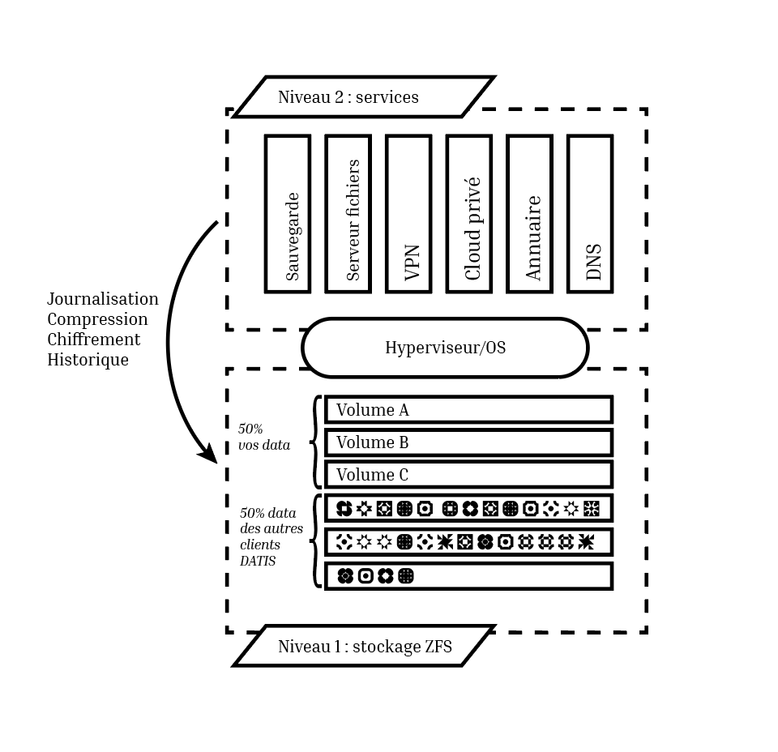
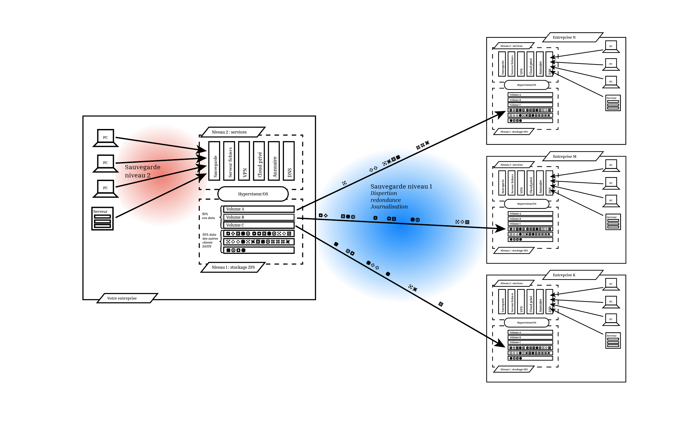

.. _eval_besoins:

1. J'ai besoin de comprendre, expliquez-moi ce que vous faites!
----------------------------------------------------------------

Ci-après, nous abordons les questions suivantes:

  * :ref:`pas_expert`
  * :ref:`pourquoi_inspeere`
  * :ref:`quantite_stockage`
  * :ref:`tolerance_pannes`
  * :ref:`peu_ressources`
  * :ref:`besoins+fonctionnement_sauvegarde`
  * :ref:`config_sauvegarde`
  * :ref:`multi_site`

.. _pas_expert:

Je ne suis pas expert, comment répondre à ces questions??
^^^^^^^^^^^^^^^^^^^^^^^^^^^^^^^^^^^^^^^^^^^^^^^^^^^^^^^^^

Les produits et le service Inspeere sont proposés en priorité par 
l'intermédiaire de distributeurs agréés. Ces spécialistes sont 
formés et parfaitement rôdés à notre solution et pourront vous 
aider à répondre à toutes ces questions sans effort ni perte de 
temps inutile.

N'hésitez pas à nous contacter par l'intermédiaire de 
`ce formulaire de contact <https://www.inspeere.com/tester-mon-eligibilite/>`_
vousa serez pris en charge *simplement* et *rapidement* dans votre démarche.

Néanmoins, la curiosité et le questionnement sont légitimes, alors n'hésitez 
pas à lire les rubriques suivantes!

.. link-button:: eval_besoins
   :type: ref
   :classes: btn-outline-primary btn-sm
   :text: Retour à la liste ...

.. _pourquoi_inspeere:

Pourquoi choisir la solution Inspeere plutôt qu'une autre?
^^^^^^^^^^^^^^^^^^^^^^^^^^^^^^^^^^^^^^^^^^^^^^^^^^^^^^^^^^

.. dropdown:: Choisir Inspeere pour partager nos valeurs...

   Inspeere est projet avec un engagement et des ambitions fortes:

   1. Pour la souveraineté numérique. Nous disons stop au vol et à l'exploitation non
      consentie de notre patrimoine numérique. Avec Inspeere vos données, même
      externalisées par nos soins, restent, par construction, inviolables et
      infalsifiables. Comprimées et chifrées à la source, vous seul en possédez 
      la clef. Les GAFAM peuvent aller voir ailleurs!

   2. Pour réduire notre dépendance aux DataCenter et à la centralisation numérique. 
      La transition numérique ne doit pas nécessairement conduire à
      la croissance sans fin du parc mondial de DataCenters. On peut nous asséner
      sans relâche que les DataCenter sont de plus en plus écologiques, cela
      ne compensera jamais la fait qu'ils s'en construit toujours plus et qu'ils
      sont de plus en plus grands! La solution d'Inspeere est collbaorative, sans
      DataCenter. 
      
   3. Pour une démarche résolument éco-responsable. L'obsolescence programmée, par le 
      jeu des durées de garanties limitées, conduit à un terrible gâchis de matériel 
      et à des cycles de vie artificiellement courts, qui sont désastreux pour 
      l'envrionnement. 
      Pourtant, la quantité d'énergie dépensée (et de carbone émise) pour la fabrication 
      d'un matériel informatique neuf est sans commune mesure avec les quantités 
      d'energie que cet équipement utilisera durant sa faible durée d'exploitation. 
      Inspeere peut proposer à ses clients qui le 
      souhaitent, l'utilisation de matériel reconditionné comme les disques durs. Dans 
      ce cas, le matériel est garanti comme s'il était neuf. Au-delà, Inspeere innove
      aussi en concevant de nouvelles chaînes de valorisation de materiels qui ont
      atteint les limites de garanties usuelles (3 à 5 ans) mais sont encore en parfait 
      état de fonctionnement. Pour nos clients, la différence est indécelable, mais pour
      l'environnement, ca fait une grosse différence!

.. dropdown:: Choisir Inspeere pour l'innovation...

   Inspeere propose une solution *innovante*, issue de la recherche publique
   ou elle a été mûrie pendant de longues années avant d'être transférée au
   sein d'Inspeere, par ses concepteurs. Cette innovation se traduit par des 
   brevets, mais aussi un certain nombre de savoirs secrets, qui rendent notre 
   solution unique. Nous sommes par exemple les seuls au monde, à notre 
   connaissance, à savoir faire fonctionner ls système de fichiers ZFS en mode 
   totalement distribué. Mais chut! C'est un secret.

   L'innovation dans la solution d'Inspeere nous permet de proposer un service 
   fiable et robuste mais à la pointe de la technologie, car:

   1. En grande partie construit à partir de briques OpenSource très fiables 
      et robustes (système Linux/Debian, système de fichiers ZFS, hyperviseur 
      Proxmox, orchestration Ansible, ...)

   2. Sans compromis sur la technologie: entre petites ou grandes entreprises,
      seul le volume de données change, mais les besoins technologiques sont 
      identiques. En fait, ils sont même plus fort dans les petites structures 
      où les compétences informatiques font souvent défaut (ce à quoi nous sommes
      *très* attentifs!)

   3. Un modèle de tarification simple: avec la solution Inspeere, le service
      n'est plus vendu au kilo (ou plus exactement au TO). La solution comporte un
      équipement matériel, placé sur site dans le réseau de l'entreprise, et un 
      service de sauvegarde. Inspeere propose plusieurs niveaux de service, mais 
      ensuite, pour un niveau de service choisi, le coût du service est fixé une 
      fois pour toutes, quel que soit le volume de données. En revanche, et en 
      toute logique, la partie materielle doit elle suivre la volumétrie du 
      stockage. Mais en comparaison des offres concurrentes, nos tarifs sont
      *très* intéressant (car nous n'avons pas besoin de payer du stockage au 
      kilo dans un DataCenter).

.. dropdown:: Choisir Inspeere pour la sécurité...

   Chez Inspeere la sécurité est au centre de nos préoccupations, surtout par 
   les temps qui courrent. Au lieu d'appliquer la sécurité en tentant seulement
   de construire une forteresse inviolable, nous construisons un système qui
   applique la stratégie dite de "la guérilla". Ainsi, au premier niveau de défense
   constitué d'un pare-feu extrêmement fiable et robuste, réputé pour sa performance 
   (shorewall), nous ajoutons une multitude de mécanismes qui rendent la 
   progression de l'Adversaire quasiment impossible. 

   Citons par exemple:

   .. dropdown:: Le choix du système Linux
   
      Bien qu'un grand nombre de serveurs fonctionnent
      sous Linux, aujourd'hui 99% des attaques portent sur les système Windows,
      (et plus récemment sur les MAC). Ce n'est pas un hasard: Linux (et ses cousins 
      de la famille BSD) savent déjà très bien se défendre, tant par leur héritage
      Unix, que par le fait qu'ils sont portés par la communauté OpenSource. 
      Aujourd'hui, en matière de sécurité, le modèle OpenSource fait l'unanimité: 
      les failles sont détéctées rapidement par une très large communauté d'experts,
      issue aussi bien des milieux académiques que de l'industrie, et les 
      correctifs mis en production en temps réel.

   .. dropdown:: Plusieurs niveaux de défense interne anti-intrusion 
   
      Lorsque ces système 
      détectent 
      une attaque, par exemple lors de plusieurs tentatives de connexions qui 
      échouent, l'adresse d'origine de l'attaquant est automatiquement mise en
      liste noire pour une certaine durée. Ces dispositifs sont donc très efficaces
      pour repérer et bloquer rapidement les attaques dites de type "brute-force", 
      et dans une certaine mesure, par déni de service. 

   .. dropdown:: Une défense anti-intrusion collective
   
      Les tentatives d'intrusion repérées par
      les équipements d'Inspeere sont remontées auprès d'Inspeere, qui les analyse et
      met à jour en temps réel une liste noire globale. Ainsi, individuellemnt, les 
      équipements d'Inspeere ne sont pas seuls face au reste du monde, mais ils forment
      une grande famille, très soudée et agissent de façon collective. C'est
      l'ADN d'Inspeere.   

   .. dropdown:: Le cloisonnement 
   
      Les différents constituants de la solution Inspeere sont
      enfermés dans des prisons virtuelles que constituent les containeurs LXC.
      Cette technologie permet plusieurs choses: d'abord, si par un exploit, l'un
      des constituants tombait sous le contrôle de l'Adversaire, alors ce
      constituant ne pourrait pas simplement prendre le contrôle des autres éléments.
      Il devrait encore parvenir à s'échapper de cette prison interne, ce qui demande
      un deuxième exploit.

   .. dropdown:: La reduction de privilège
   
      C'est une autre chose que permettent les conteneurs.
      Nombre d'attaques profitent du fait qu'une fois dans la place avec les 
      privilèges administrateur, la partie est gagnée. Ce n'est
      pas vrai dans le cas de la solution Inspeere, car le privilège d'administrateur
      est automatiquement perdu en cas de "sortie de prison", c'est-à-dire dans 
      l'hypothèse où l'adversaire parviendrait à s'échapper de la prison ci-dessus.

   .. dropdown:: L'authentification centralisée
   
      S'il est bien un élément critique en matière de
      sécurité c'est l'authentification, et en particulier les mots de passe. Avec la
      solution Inspeere, le changement de mot de passe est à la fois simplifié et
      sécurisé par la mise en place d'une infra-structure centalisée interne à
      la solution: le changement de mot de passe se fait à un seul endroit, et il est
      bien protégé. Evidemment l'accès à cette procédure n'est possible qu'en 
      intranet (ou via le VPN). 

   .. dropdown:: Authentification 2 facteurs sur les accès extranet 
   
      La solution Inspeere offre
      à ses clients qui le souhaitent, la possibilité d'accéder à leur données et
      documents en mobilité, via le nuage privé Nextcloud. La version de Nextcloud 
      déployée par Inspeere est renforcée. D'abord car elle bénéficie des sécurités
      ci-dessus, telle que la détection d'Intrusion et l'authentification centralisée.
      Mais elle peut encore être renforcée par les clients qui le souhaitent, en 
      permettant l'activation de solutions d'authentification à deux facteurs.

   .. dropdown: Gestion rigoureuse des permissions
   
      Avec la solution Nextcloud, la solution
      Inspeere offre deux moyens d'accéder à ses données: soit au travers de
      Nextcloud, qui offre une interface conviviale mais peu adaptée à la gestion
      de gros volumes de données, soit par des partages en réseau, par le biais
      du protocole SMB. Inspeere a fait un effort particulier d'intégration de ces
      deux mécanismes, pour garantir que les permissions d'accès attribuées d'un
      coté soient toujours alignées sur celles de l'autre coté, via le mécanisme très
      puissant des ACLs Posix. Inspeere est la seule solution à notre connaissance
      à proposer ce niveau d'intégration.

   .. dropdown:: Les sauvegardes sont en lecture seule, par construction
   
      Les sauvegardes 
      d'Inspeere sont inaltérables, par construction, grâce au système ZFS. 
      Avec la solution Inspeere, un rançongiciel ne peut pas modifier les données 
      exitantes d'une sauvegarde locale pour les crypter. La seule chose qu'il peut 
      faire, c'est détruire 
      le système en effaçant les données qu'il contient. Mais dans ce cas l'attaque 
      ne pourrait faire l'objet d'aucune demande rançon. Et quand bien même une 
      telle situation se produisait, la sauvegarde externalisée très robuste 
      d'Inspeere bénéficie du même mécanisme de sécurité, avec en plus toute la
      puissance du stockage distribué redondant. C'est littéralement  mission 
      impossible!

   .. dropdown:: Les sauvegardes externes chiffrées à la source, et distribuées de facon redondante. 
   
      Avec Inspeere, vos sauvegardes ne sont pas stockées seulement sur 
      un ou quelques sites, qui constitueraient automatiquement des points de 
      vulnérabilité, mais sur plusieurs, avec une forte tolérance aux pannes. 
   
   
 
.. dropdown:: Choisir Inspeere pour la performance

   Le fait de disperser les données de sauvegarde sur de multiples sites de stockage, avec 
   redondance, permet d'optimiser considérablement la performance de la solution d'Inspeere
   lors de la récurpération des sauvegardes. 

   En effet, en matière de sauvegarde, la phase la plus critique est celle de la récupération
   des données. Non seulement les données doivent être retrouvées sans altération ni perte 
   (c'est la moindre des choses pour une sauvegarde), mais cette récupération doit aller vite, 
   car l'utilisateur en a généralement besoin pour reprendre son activité.

   Idéalement, il est souhaitable que cette récupération se fasse à une vitesse proche de la
   vitesse maximum du réseau, y compris si le réseau est très rapide. Pour cela Inspeere 
   bénéficie de multiples facteurs d'accélération, dus à son fonctionnement multi-cibles:

   .. dropdown:: 1. Stratégie Diviser pour Régner

      Comme les données sont divisées en multiples parties de sauvegarde qui
      sont dispersées, le téléchargement peut atteindre une vitesse qui permet de cumuler les 
      vitesses (bande passante) des multiples cibles de sauvegarde. Si les sauvegardes 
      sont stockées sur 30 sites qui disposent chacun de 100Mbit/s au moment de la 
      récupération, alors potentiellement la vitesse maximale de la récupération peut 
      atteindre 30 x 100Mbit/s = 3 Gbit/s. Si les 30 sites disposent chacun de 1Gbit/s,
      la limite passe à 30Gbit/s. Autant dire que dans ce cas, la seule limite se situe 
      au niveau du matériel, et non plus de la sauvegarde.

   .. dropdown:: 2. Redondance des données
   
      Comme nous avons ajouté de la redondance, la bande passante des sources redondante
      peut aussi être exploitée de facon intelligente pour accélérer d'autant la récupération.
      Dès lors qu'il y a plusieurs choix possibles, il est par exemple assez naturel de choisir 
      les plus rapides, de facon à ne pas être ralenti par celles qui sont surchargées. Cela 
      permet de se rapprocher au maximum de la limite théorique exposée ci-dessus. La priorité
      chez Inspeere, c'est de saturer la connexion réseau pour que la récupération soit la plus
      rapide et efficace possible.

   .. dropdown:: 3. Gestion des ressources brevetée
   
      La solution Inspeere gère les ressources de stockage de la sauvegarde de facon 
      rigoureuse, en surveillant continuellement les performances de chaque site de stockage,
      au fur et à mesure des sauvegardes et récupérations, selon un procédé breveté. Les sites 
      de stockage qui subissent des défaillances ou dont les performances sont diminuées sont 
      détectés rapidement et, si besoin, remplacés par de nouveau site plus performant, de 
      facon à toujours garantir une Qualité de Service minimale. 

   .. dropdown:: 4. Technique de sauvegarde avancée
   
      La technique de sauvegarde avancée utilisée par Inspeere permet à la fois la 
      sauvegarde incrémentale (lors de chaque sauvegarde, on n'envoie que ce qui change),
      et la récupération sélective d'un état de sauvegarde consolidé : on choisit la date de 
      la sauvegarde à récupérer, et le système n'envoie que le strict minimum de données 
      necéssaires pour la récupération de cette sauvegarde, en une seule fois. Autrement dit, 
      si la sauvegarde correspond à l'envoi de 1000 incréments depuis la toute première 
      sauvegarde, on n'a pas besoin de récupérer successiveemnt ces 1000 états de sauvegarde.
      La procédure de récupération est capable de retrouver directement, en une seule fois, 
      la 1000e sauvegarde comme si elle avait été une première sauvegarde complète. 
      Non seulement ca économise un temps de transfert considérable, mais grâce à ZFS cette 
      opération de consolidation est instantanée, et le transfert commence immédiatement 
      sans attendre la fin d'un quelconque calcul de consolidation d'état.

.. link-button:: eval_besoins
   :type: ref
   :classes: btn-outline-primary btn-sm
   :text: Retour à la liste...

.. _quantite_stockage:

Combien d'espace de stockage pour les sauvegardes?
^^^^^^^^^^^^^^^^^^^^^^^^^^^^^^^^^^^^^^^^^^^^^^^^^^

La solution Inspeere est constituée d'une appliance (un serveur) placé sur 
le réseau intranet de l'entreprise. Ce serveur sert de point de concentration local
pour les données à sauvegarder.

Pour cela, Inspeere fournit un certain nombre d'outils très simple pour:

1. Déposer des fichiers directement sur l'appliance en intranet, par exemple 
   à l'aide d'un volume en réseau (protocole SMB)
2. Déposer des fichiers sur l'appliance en mobilité (ou inrtranet), à l'aide du système de 
   nuage privé NextCloud intégré à notre solution
3. Concentrer des sauvegardes de postes de travail Windows ou Linux, 
   en réseau, soit à l'aide d'outils de synchronisation de fichiers simples 
   tels que ``rsync``, ou à l'aide d'outils de backup fournis par Inspeere et reposant 
   sur un agent très simple à installer sur chaque poste à sauvegarder. Sur une machine Windows.
   ce dernier système à base d'agent permet de faire des sauvegardes de type image virtuelle 
   de disque, pour une restoration complète de l'etat de la machine sauvegardée, ou une 
   sauvegarde de type fichiers, pour une restauration sélective des fichiers à recupérer 
   (ou les deux)
4. Sur Mac, concentrer les sauvegardes TimeMachine en permettant aux 
   utilisateur de voir notre système comme un disque externe TimeMachine (enfantin!) 

Lors du choix de sa nouvelle solution Inspeere, l'utilisateur doit donc anticiper ses 
besoins d'espace de stockage pour la concentration de ses données existantes et futures,
et ce sur plusieurs années. Ce calcul n'est pas très complexe, mais il ne peut pas être
automatisé. En revanche, le distributeur choisi pour la fourniture et l'installation 
de la solution Inspeere saura parfaitement vous accompagner pour cette évaluation.

Cette évaluation doit en effet tenir compte de différents éléments, comme par exemple
la dégradation sensible des performances (et de la durée de vie) des disques lorsqu'ils 
deviennent trop plein. 
En l'occurence, il est fortement déconseillé de dépasser le seuil des 90% d'occupation 
de l'espace disque. 

La bonne nouvelle, c'est que le système Inspeere (plus précisément ZFS), comprime 
les données qui peuvent l'être lors de la concentration.
Par exemple, nous avons expérimenté qu'un disque d'ordinateur portable MacBook 
qui contenait 400GO de données, n'occupait au final que 230Go sur le serveur 
inspeere, après compression, soit une réduction de 42,5%. 

Néanmoins comme il est difficile de prédire quel taux de compression sera 
effectivement atteint, dans le doute, il reste conseillé de considerer que le ratio 
sera au pire de 1:1.

Au final, le calcul est donc relativement simple:

1. Faire la somme des volumes de données à sauvegarder actuellement sur les postes en réseau, 
2. Ajouter le volume des données supplémentaires qui seront eventuellement centralisées 
   par Nextcloud
3. Ajouter le volume de données associés aux éventuels service supplémentaires choisis en option
4. Calculer le taux d'accroissement annuel du volume total de données
5. Appliquer ce taux d'accroissement à la durée d'exploitation prévue de la 
   solution Inspeere (typiquement 3 ou 5 ans)
6. Ajouter une marge d'erreur de 20-25% 
7. Ajouter 10% pour eviter le remplissage complet et rester sous le seuil des 90%.

Le résultat de ce calcul permet alors de déterminer le seuil de **capacité utile** dont 
l'utilisateur a besoin.

.. link-button:: eval_besoins
   :type: ref
   :classes: btn-outline-primary btn-sm
   :text: Retour à la liste...

.. _tolerance_pannes:

Pourquoi la solution Inspeere est-elle robuste?
^^^^^^^^^^^^^^^^^^^^^^^^^^^^^^^^^^^^^^^^^^^^^^^

La solution Inspeere utilise simultanément de multiples cibles de sauvegarde distantes.
Pour cela, les données initiales sont divisées en un certain nombre de fragments, mais 
seule une partie de ces fragments est indispensable à la récupération des sauvegardes.
Les autres sont là pour la redondance, afin de garantir la tolérance aux pannes de notre 
solution. Car toutes les cibles de sauvegardes sont équivalentes et interchangeables.

En pratique, la solution Inspeere peut utiliser jusqu'à 48 fragments, dont 16 pour la 
redondance. Cela signifie que le système peut tolérer jusqu'à 16 pannes simultanées 
avant que la sauvegarde ne devienne effectivement irrécupérable. 

Mais cela ne peut jamais arriver, car dès qu'une panne est détectée, le système Inspeere 
lance immédiatement une action de réparation pour reconstituer la redondance initiale. 
Cette combinaison d'un niveau de redondance élevé
et d'une stratégie de récupération dite "impatiente" ( *eager* ), rend la solution
quasiment invulnérable, car chaque cible de stockage est sur un site géographique et dans
un réseau différent (et alimenté en courant a priori par une source différente). AUCUN 
DataCenter ne peut égaler ce niveau de service!

Sans compter que ces éléments s'ajoutent aussi à la tolérance aux pannes interne de 
chaque appliance Inspeere. En effet les appliances sont toutes équipées de 
disques redondant. Selon les modèles, il peut s'agir de disques en mode RAID1 (miroir), 
RAID5 (n+1), ou RAID5 + hot spare (n+1+1). Et sur les modèles les plus hauts de gamme,
nous savons utiliser toute la puissance de ZFS sur les très grosses configurations, 
pour proposer les formes les plus avancées de RAID (RAID50, RAID60 et même plus encore). 

Ajoutons de plus que ces solutions RAID permettent aussi 
d'améliorer la performance d'accès de l'appliance.
En effet, le système de fichier ZFS sait parfaitement tirer partie de la redondance des 
disques pour accélérer les transferts. Ainsi sur une solution en RAID5 avec 4 disques,
les lectures se font simultanément sur les 4 disques, avec un débit résultant proche
du quadruple du débit d'un disque seul.

.. link-button:: eval_besoins
   :type: ref
   :classes: btn-outline-primary btn-sm
   :text: Retour à la liste...

.. _peu_ressources:

Pourquoi la solution Inspeere utilise-t-elle aussi peu de ressources?
^^^^^^^^^^^^^^^^^^^^^^^^^^^^^^^^^^^^^^^^^^^^^^^^^^^^^^^^^^^^^^^^^^^^^

La réponse tient dans ces deux éléments technologiques:

 * Le codage de Reed-Solomon
 * Le système de fichiers ZFS

.. panels::
   :header: text-center
   :column: col-lg-12 

   Le codage de Reed-Solomon
   ^^^^^^^^^^^^^^^^^^^^^^^^^

   Il existe deux manières d'ajouter de la tolérance aux pannes: soit on fait de la 
   duplication, soit on utilise un code d'effacement ( *erasure coding* ) tel que Reed Solomon.

   La duplication consiste faire n copies identiques des données. C'est simple, mais ca 
   consomme beaucoup, beaucoup d'espace. Par exemple, pour tolérer 16 pannes simultannées avec 
   la techniques de duplication, on a besoin d'un espace de stockage 16x plus important que
   le volume initial, soit un cout de 1500%.

   Avec un codage d'effacement, au contraire, on est capable de supporter un grand nombre 
   de pannes avec un volume réduit.

   Le codage d'effacement Reed-Solomon est la même technique que l'on retrouve dans la technologie
   RAID. Dans le cas de la solution d'Inspeere, nous construisons un super-RAID, capable d'aller 
   jusqu'à (n+16), soit l'équivalent de 16 disques de redondance.

   Et pourtant ce choix extrême reste très peu consommateur de ressource, car il ne conduit
   qu'à une augmentation de 50% du volume de stockage. Toute la subtilité du modèle 
   Reed-Solomon tient dans le rapport entre le nombre total de fragments (ou disques) et le 
   niveau de redondance. Reed-Solomon laisse libre le choix des valeurs, que l'on appelle ses
   paramètres et que l'on note RS(n,k), ou n est le nombre total de fragments (ou disques) 
   et k le nombre de fragments minimal. Ainsi le codage RS(n,k) tolère jusqu'à (n-k) pannes 
   simultannées.

   Dans le cas du RAID5 sur 4 disques on a donc un codage RS(4,3), et on se trouve avec 
   un disque de redondance sur 4. Et dans ce cas, le RAID5 "coute" 25% de ressources 
   supplémentaires. Mais si on décide de faire du RAID5 sur 10 disques, alors le cout de la 
   redondance tombe a 10% (1 disque sur 10). Dans le cas de la solution Inspeere, nous placons 
   la barre à 50% de redondance, mais avec un grand nombre de "disques" virtuels. La valeur 
   des paramètres que nous choisissons est variable, et peut atteindre le niveau RS(48,32). 
   Dans ce cas
   le niveau de redondance est maximal, permettant de tolérer jusqu'à 16 pannes est atteint,
   dans une configuration de sauvegarde avec 48 cibles.

   ---
   :column: col-lg-12 

   Le système de fichiers ZFS
   ^^^^^^^^^^^^^^^^^^^^^^^^^^

   Pour le stockage et la sauvegarde de vos données, Inspeere s'appuie sur le 
   système de fichiers ZFS. 
   Dire qu'il s'agit d'une référence en la matière serait un euphémsime. 
   En matière de stockage et de fichiers, ZFS sait simplement tout faire, 
   et bien mieux que tous les autres. Là ou d'autres systèmes s'évertuent 
   à gérer des partitions sur quelques disques, ZFS est capable de prendre en 
   charge des 10aines et des 10aines de disques pour atteindre des capacités 
   de stockage faramineuses de l'ordre du Zeta-octet (d'où le Z de ZFS).

   Or savoir gérer une telle quantité de données implique de se poser et savoir 
   répondre à des questions d'un autre ordre: par exemple, cela implique de 
   considérer que sur la quantité, il y a forcément toujours quelques bits qui 
   finissent par changer de valeurs de facon "spontanée". ZFS a donc pris le parti de 
   constamment vérifier l'intégrité des données, et surtout, de les réparer 
   automatiquement quand une erreur est détectée! L'idée est simple, mais sa
   réalisation efficace et fiable est une véritable prouesse.

   Il en est bien d'autres, mais nous n'allons pas toutes les décrire ici 
   pour rester (assez) concis.

   Selon l'adage, qui peut le plus peut le moins, et donc chez Inspeere nous utilisons
   ZFS pour répondre aux besoins de tous nos clients, que ce soit pour 1TO, 
   100TO ou 1PO (péta-Octet = 1000 TO).

   Ainsi, non seulement ZFS permet le chiffrement et la compression des 
   données à la source, ainsi eventuellement que leur déduplication, mais 
   il permet aussi de les capturer instantanément sous la forme d'instantanés 
   ( *snapshots* ).
   Comme leur création est très facile et ne consomme quasiment aucune 
   ressource (dans ZFS), ils peuvent au besoin être créés de facon très 
   fréquente, et en très grand nombre.

   Les snapshots de ZFS sont donc l'ingrédient idéal qui sert de base à notre 
   outil de sauvegarde.
   Ils nous pernmettent, grâce à ZFS, de construire un véritable "mille-feuille" 
   de vos données, où chaque couche, sous la forme d'un snapshot, représente 
   un incrément de sauvegarde, capturé à une date donnée. Grâce à cette technique, 
   seule les nouvelles données sont  sauvegardées. Mais ce n'est pas tout. 

   Lorsque nous envoyons les données 
   sous forme de snapshot depuis une machine avec ZFS vers une autre machine avec
   ZFS, bien que les données soit chiffrées et donc indécodable, le ZFS de 
   la destination continue de les voir comme un mille-feuille, et ca c'est 
   un détail anodin qui change tout.

   Cela signifie que lors de la récupération de la sauvegarde, on pourra choisir
   la couche de mille-feuille qui nous intéresse, et dans ce cas, ZFS n'envoie 
   que le strict nécessaire. Autrement dit avec ZFS, il n'y a pas besoin de 
   faire de multiples sauvegardes complètes, comme avec de nombreux autres 
   systèmes de sauvegarde. 

   Et donc, au final, chaque donnée à sauvegarder, n'a besoin d'être sauvegardée
   qu'une et une seule fois (1,5 fois, si l'on tient compte de la redondance).

.. link-button:: eval_besoins
   :type: ref
   :classes: btn-outline-primary btn-sm
   :text: Retour à la liste...

.. _besoins+fonctionnement_sauvegarde:

Comment fonctionne la sauvegarde d'Inspeere?
^^^^^^^^^^^^^^^^^^^^^^^^^^^^^^^^^^^^^^^^^^^^

Commençons par expliquer les principes de fonctionnement du système DATIS d'Inspeere.
Le système DATIS, c'est une *appliance*, c'est-à-dire la combinaison d'un équipement 
dédié, un serveur de fichiers, et d'un logiciel très complet. Les deux sont 
indissociables. Par exemple, il n'est pas possible d'installer la partie logicelle de 
DATIS sur un NAS Synology ou QNAP. En revanche, DATIS sait très bien travailler avec 
des NAS. Bien que généralement compact, l'équipement matériel est un vrai serveur (Linux).
Pour certaines configurations musclées, il pourra même prendre la forme d'un serveur
haute performance en rack, et être secondé par une ou plusieurs baies de disque, pour 
atteindre des capacités allant jusqu'à plusieurs Peta-octets. Le système DATIS n'a
aucune limite d'échelle, ce sont vos besoins qui définissent le cahier des charges. 

   Le système DATIS d'Inspeere comporte deux niveaux.

Comme le montre la figure ci-dessus, le système DATIS d'Inspeere comporte deux niveaux:

- **Niveau service**. Grâce au puissant système de virtualisation *Proxmox*, 
  conçu initialement pour les DataCenter, Datis n'est rien moins qu'un nano-DataCenter.
  Il peut embarquer de nombreux services professionels, et les faire 
  tourner de façon très sure, performante et sécurisée. Lorsqu'un service du niveau 2 
  sauve ses données, celles-ci sont alors enregistrées par le niveau stockage.
   

- **Niveau stockage**. C'est celui qui héberge vos data et celles des autres. 
  Le niveau stockage assure automatiquement et sans ralentissement que les données sont
  journalisées, comprimées, et chiffrées. Les différentes versions restent disponibles
  en cas de besoin (historique), mais sans gaspiller l'espace inutilement. 
  La technologie de pointe qui assure ces opérations n'est autre que le système de 
  fichiers ZFS, que l'on trouve au coeur des équipements de stockage de pointe dans les
  DataCenter ou les gros serveurs, avec des capacités de stockage et d'extension 
  quasi-illimitées. Mais le système DATIS est avant-tout dimensionné en fonction de 
  VOS besoins, ni plus, ni moins, sachant bien sûr que l'espace accordé aux autres ne 
  vous est pas subtilisé. Nous avons simplement doublé l'espace de stockage 
  initial par rapport à vos besoins, pour garantir qu'il ne vous fera jamais défaut;

Maintenant que nous avons vus les deux niveaux, nous pouvons mieux comprendre 
le fonctionnement de la sauvegarde. En fait, DATIS ne propose pas une sauvegarde, 
mais DEUX, une à chaque niveau, comme l'illustre le schema suivant:

   Les deux niveaux de sauvegarde du système DATIS.

Au niveau du stockage, la technologie unique développée par le CNRS et l'Université 
Côte d'Azur, dont Inspeere exploite le brevet exclusif, permet de sauvegarder vos data
(toujours comprimées et chiffrées) en les découpant d'abord en petit morceaux, puis
en ajoutant de la redondance, pour tolérer les pannes, et enfin en envoyant les morceaux
sur de multiples sites de stockage. 

Cette technologie de dispersion constitue déjà une révolution en matière de 
confidentialité et de sécurité. Mais comme nous sommes aussi très soucieux de 
l'environnement, nous avons choisi d'opérer cette dispersion sur des sites qui 
ne sont pas des DataCenter, mais d'autres utilisateurs de la solution. Le nombre 
de sites choisi, jusqu'a quelques dizaines, est suffisant pour profiter de l'effet 
de groupe, mais tout en restant raisonnable, pour éviter d'impliquer un trop 
grand nombre de destinations.

Entre-elles, les DATIS forment donc de petites communautés de sauvegarde qui 
fonctionnent en vase clos. 

Au niveau du stockage, cette sauvegarde de niveau 1 est ce qui se fait de mieux.
Elle porte sur des objets appelés `volumes` et `datasets` (jargon ZFS). On peut
en définir à loisir autant que l'on veut, le système ZFS n'a AUCUNE limite. Ces 
objets ont chacun une politique de sauvegarde qui lui est propre. 

La politique de sauvegarde permet de définir la durée de retention, la fréquence 
des sauvegardes, et la stratégie d'effeuillement (suppression  des versions 
obsoletes de l'historique), qui peut bien-sûr être progressive. 
Une fois passé le cap de la première sauvegarde, forcément complète, toutes 
les sauvegardes suivantes sont incrémentales, car ZFS les consolide au fur et à 
mesure en offrant la garantie totale d'intégrité du bout en bout quelle que 
soit la durée de vie de l'objet (ZFS vérifie en permanence que les données ne 
sont pas abîmées ou perdues, et corrige automatiquement lorsque cela se produit).

Au dessus de cette sauvegarde de niveau 1 ultra-performante, la sauvegarde des 
postes de travail est un service qui se place au niveau 2, et que nous appelons donc
logiquement, la sauvegarde de niveau 2.

Cette sauvegarde de niveau 2 prend en charge la sauvegarde des postes et serveurs. 
Elle a donc pour objectif de concentrer les data de l'entreprise qui se trouvent 
sur les postes de travail, serveurs, NAS, machines virtuelles et autres baies de 
stockage, vers le système DATIS. Et une fois concentrées sur DATIS, ces données 
issues de la sauvegarde de niveau 2 sont sauvegardées à leur tour au niveau 1 
qui les disperse comme expliqué précédemment.

Ces deux niveaux sont totalement indépendant, ce qui rend le système globalement 
très sûr. D'un point de vue sécurité, par exemple, les deux sauvegardes sont 
"étanches" l'une par rapport à l'autre. En cas de problème au niveau 2, la 
sauvegarde de niveau 1 peut être utilisée pour remettre le système DATIS, ou 
l'un de ses objets de stockage, exactement dans l'état où il se trouvait à une date 
antérieure (par exemple avant une attaque Cyber/Ransomware).

Une différence importante entre les deux niveaux de sauvegarde est que la sauvegarde 
de niveau 2 proposée par defaut par DATIS, est un composant qui peut facilement être 
remplacé ou secondé par un autre.

Par défaut, DATIS propose en effet la solution OpenSource UrBackup, qui offre un
excellent rapport qualité/prix, et répondra brillamment aux besoins de nombreux clients.
Néanmoins, ce choix peut être remis en question sans crainte. Certains de nos clients
préfèrent par exemple utiliser une solution telle que VEEAM, qui est leader sur le 
marché de la sauvegarde de machines virtuelles. La mise en oeuvre d'une solution
complète avec VEEAM au niveau 2 et Datis en externalisation au niveau 1 est 
absolument triviale.

.. panels::
   :header: text-center

   :column: col-lg-12 
   
   A propos de DataCenters
   ^^^^^^^^^^^^^^^^^^^^^^^

   Comme l'a démontré si tristement (et involontairement) l'incendie des DataCenter d'OVH à Strasbourg,
   par leur nature centralisée, les DataCenter sont vulnérables. Par construction.
   
   On peut donc déployer autant de systèmes de sécurité que l'on veut pour **compenser** 
   cette vulnérabilité, cela ne la fera jamais disparaître. C'est un peu comme chercher
   à faire flotter un caillou au milieu de l'océan. Un jour il finira au fond, inéxorbalement,
   ce n'est qu'une question de temps.

   Car l'incendie n'est pas le seul danger qui plane sur les DataCenters:

   - en 2014, c'est l'ouragan Sandie qui s'abattait sur New York et inondait ses DataCenters. 
   
   - En 2018, c'est l'incendie de Paradise, en Californie, qui est passé très 
     près du DataCenter de BackBlaze et ses milliers de baies de stockage. 

   - En janvier 2021, c'est une attaque terroriste qui a été stoppée par le FBI 
     à l'encontre de l'un des DataCenter d'Amazon. 

   Ce ne sont là que quelques exemples, choisis pour leur diversité. Par construction, 
   la nature centralisée des DataCenter les rend vulnérable de tous les cotés. 
   
   A l'origine, Internet avait d'ailleurs été conçu de façon décentralisée par la DARPA, 
   justement pour éviter ce type de vulnérabilité, face à la menace d'une attaque nucléaire.
   Un comble que l'Internet actuel soit allé à ce point à contre-sens de l'idée originale.

   Enfin, la maintenance de ces infra-structures les expose à moyen terme à un
   grave problème d'obsolescence, que la politique de l'autruche actuelle n'empêchera pas:
   tous ces DataCenters, contruits à peu près à la même période, vont vieillir à la 
   même vitesse... et donc finir par tomber en panne ou demander des investissements 
   colossaux en même temps! 
   
   Or il est bien connu que la réparation et la rénovation coutent bien plus cher qu'une 
   construction neuve. 
   
   Chez Inspeere, nous pensons donc que la solution des DataCenter pour construire
   UNE sauvegarde sécurisée mais centralisée est une abbération, et une logique de profit à 
   très court terme (en plus d'être peu écologique). Nous pensons que c'est tout l'inverse de ce dont 
   une sauvegarde a besoin. Et donc, justement, nous sommes très fiers de proposer exactement
   l'inverse. Et un même un peu surpris d'être quasiment les seuls à suivre cette ligne,
   compte tenu des enjeux considérables que représentent les sauvegardes!

.. link-button:: eval_besoins
   :type: ref
   :classes:  btn-outline-primary btn-sm
   :text: Retour à la liste...

.. _`config_sauvegarde`: 

Qui configure ma sauvegarde?
^^^^^^^^^^^^^^^^^^^^^^^^^^^^

C'est le technicien qui vient installer l'équipement dans vos locaux qui assure les 
dernière étapes de configuration.

Comme expliqué au paragraphe précédent ( :ref:`fonctionnement_sauvegarde` ), la sauvegarde 
Inspeere comporte deux niveaux: un niveau de **concentration** des données depuis les postes
de travail et serveurs de l'entreprise vers l'équipement Inspeere DATIS placé dans vos locaux,
et un niveau d'**externalisation** des données de l'équipement DATIS vers d'autres
équipements DATIS.

Chaque niveau possède des politiques de sauvegarde indépendante. Le niveau **concentration** 
est généralement configuré sur place par le technicien, lors de l'installation de l'équipement.
Mais dans certains cas, cette étape peut être entièrement réalisée à distance par les équipes
techniques de votre distributeur Inspeere.

Le niveau **externalisation** est lui, en principe, pré-configuré en amont, lors de la 
préparation de votre équipement DATIS en usine ou chez le partenaire distributeur. C'est
normalement Inspeere qui se charge de ce réglage. Par la suite, cette configuration 
peut néanmoins faire l'objet d'ajustements ou de corrections.

.. link-button:: eval_besoins
   :type: ref
   :classes: btn-outline-primary btn-sm
   :text: Retour à la liste...

.. _multi_site:

Nous avons plusieurs sites. Peut-on déployer la solution en interne, entre-nous?
^^^^^^^^^^^^^^^^^^^^^^^^^^^^^^^^^^^^^^^^^^^^^^^^^^^^^^^^^^^^^^^^^^^^^^^^^^^^^^^^

Oui, pour les entreprises et structures qui possèdent plusieurs sites ou agences, 
ou les regroupements tels que les franchises ou les collectivités, le système DATIS 
peut-être déployé en mode "vase clos", entre les différents sites du client ou du groupement.

Le nombre de sites et leur connectivité réseau doivent néanmoins être étudiés précisément. 
Ce type de configuration doit donc faire l'objet d'une petite étude préalable. Contactez-nous 
via `ce formulaire de contact <https://www.inspeere.com/tester-mon-eligibilite/>`_ pour de plus
amples renseignements.

.. link-button:: eval_besoins
   :type: ref
   :classes: btn-outline-primary btn-sm
   :text: Retour à la liste...
