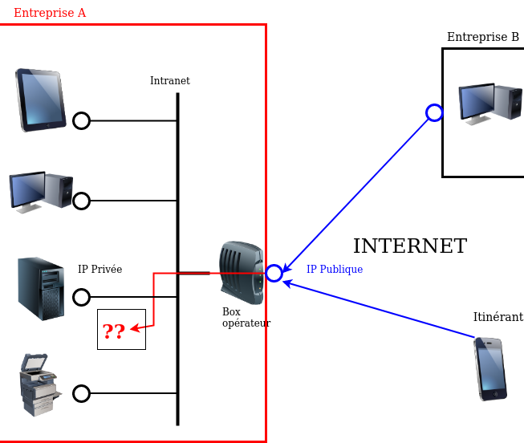

.. _mise_en_service:

2. Mise en service
------------------

Selon la prestation d'installation retenue en collaboration avec votre 
distributeur, votre solution Inspeere peut être livrée soit pré-installée et 
pré-activée, soit prête à être activée. 

Dans les deux cas votre distributeur assurera la réalisation 
des étapes suivantes de l'installation, dans vos locaux:

* :ref:`pre_requis`
* :ref:`mise_en_place`
* :ref:`ip_statique`
* :ref:`config_dnat`
* :ref:`filtrage_sortant`
* :ref:`config_backup`
* :ref:`compte_admin`

A l'exception éventuellement de la première section ( :ref:`pre_requis` ), ces éléments vous
sont uniquement fournis à titre d'information, aucune intervention n'est requise de votre
part. La mise en oeuvre de ces prescriptions est assurée par un **technicien 
spécialiste formé par Inspeere**.

Dans les cas les plus simples, la mise en service peut durer moins d'une heure.
Son déroulé est le suivant:

1. Mise en place physique
2. Configuration IP statique
3. Démarrage équipement
4. Défiltrage sortant 
5. Configuration DNAT
6. Déploiement des clients de sauvegarde sur les postes de travail

Puis, 30mins au moins après l'étape 3:

7. Création d'un compte Administrateur
8. Configuration de la sauvegarde des postes de travail
9. Configuration des services supplémentaires en option (selon clients) 

.. _pre_requis:

Préparation avant l'installation
^^^^^^^^^^^^^^^^^^^^^^^^^^^^^^^^

Pour éviter toute perte de temps inutile, lors de la venue du technicien pour
l'installation, nous conseillons aux clients qui le peuvent de rechercher ou 
vérifier les éléments suivants:

1. Vérifier que la connexion Internet sur le site d'installation est bien 
de type DSL ou fibre, et dédiée:

- Sauf rare exception, les connexions de type cellulaire (4G/5G) ne sont pas 
  supportées (connexion entrante impossible depuis Internet)

- En cas de connexion partagée (hotel d'entreprise, tiers lieu), informer
  votre distributeur au plus vite, afin qu'il coordonne son intervention
  en amont de sa venue avec l'administrateur réseau de votre site

- Si vous avez souscrit un contrat particulier auprès de l'opérateur Free,
  vous devrez demander à ce dernier l'attribution d'une IP publique dédiée 
  (procédure automatique via `votre console de gestion Free  <https://subscribe.free.fr/login/>`_ )

2. Préparer un emplacement à l'abri de l'humidité, du soleil, de la poussière
avec une prise réseau et une prise éléctrique (ou informez votre distributeur
en amont de l'installation)

3. L'équipement Inspeere doit impérativement être alimenté par une alimentation
protégée (onduleur, prise HQ). Si vous ne disposez pas d'un tel équipement, 
vérifiez sur votre bon de commande que sa fourniture est bien prévue par le
technicien en charge de l'installation

4. Accès administrateurs. Si l'installation d'une sauvegarde des postes et 
serveurs est prévue, assurez-vous que le technicien aura bien un accès 
administrateur à ces postes, ou mettez-le si besoin en relation avec votre 
prestataire informatique 

.. _mise_en_place:

Mise en place physique
^^^^^^^^^^^^^^^^^^^^^^

Le plus souvent, l'équipement est pré-installé en usine ou par le distributeur. 
La mise en place physique est donc très simple, il suffit de le connecter au réseau
interne de l'entreprise et à une source d'alimentation protégée.

Neanmoins, dans la mesure où cet équipement a pour but de vous protéger des 
catastrophes, nous conseillons, dans la mesure du possible, d'éviter de le placer 
juste à coté du ou des serveurs qu'il est supposé protéger.

Comme un serveur, cet équipement devra rester en service 24h/24, 7j/7. Pensez à 
en informer les personnels, au besoin à l'aide d'une signalétique adéquate, pour
éviter sa mise hors tension (week-end, vacances).

Après son installation, pour fonctionner, l'équipement d'Inspeere n'a besoin 
d'aucun écran, clavier ou souris et il est entièrement supervisé à distance. 

Comme tout équipement qui comporte des disques durs, l'équipement Inspeere est
sensible aux fortes chaleurs. Il est normalement très bien ventilé, ce qui permet
d'éviter le recours systématique à la climatisation. En revanche vous devez 
impérativement veiller à ne pas obstruer les orifices de ventilation, en laissant 
un espace raisonnable pour la circulation d'air.

Une ventilation bruyante est un signe courant de surchauffe, et souvent 
précurseur d'une défaillance matérielle. N'hésitez pas à en avertir votre 
distributeur.

.. _config_dnat:

Routage du traffic entrant
^^^^^^^^^^^^^^^^^^^^^^^^^^

Votre équipement Inspeere Datis est un équipement ACTIF sur Internet. 
Bien entendu, il doit impérativement pouvoir envoyer vos données de sauvegarde 
vers d'autres équipements Inspeere sur Internet. Mais réciproquement, 
il doit aussi pouvoir recevoir des données de sauvegarde des autres 
équipements. Et, selon les options choisies, il peut aussi
fournir d'autres services, qui peuvent être accessibles au reste d'Internet.

Votre équipement doit donc être *joignable* depuis Internet, alors 
qu'il se trouve connecté sur le réseau **intranet** de votre entreprise.
Il faut donc faire en sorte que les données trouvent toujours leur chemin.
Ce travail est en grande partie automatisé par le système Datis, qui met
en place de multiple mécanismes automatiques pour garantir que le traffic
trouve toujours son chemin.

En revanche, il y a une partie du problème que le système Datis ne peut
pas résoudre tout seul, c'est la '*redirection DNAT*'.
En effet, pour être joignable sur Internet, un équipement doit 
être litéralement *schyzophrène*: il doit avoir deux personalités, sous
la forme de deux adresses IP: une adresse IP *publique* dans Internet, et 
une adresse IP *privée* dans l'intranet.

La redirection DNAT est un réglage, généralement très simple, qui se 
configure au niveau de la box Internet de votre operateur, et qui permet 
d'associer les deux identités, l'IP publique avec l'IP privée, pour certains 
*ports* choisis. De plus, la redirection peut éventuellement être restreintes
à certaines origines, mais l'équipement d'Inspeere n'utilise pas cette
possibilité.  

Pour fonctionner dans de bonnes condition, l'appliance Inspeere doit donc 
être joignable depuis l'extranet, sur les ports suivants, à l'aide de ces 
redirections DNAT:

+---------------------+-----------+-------+---------------------------------+
| IP origine          | port dest | proto | description                     |
+=====================+===========+=======+=================================+
| toutes              | 443       |  TCP  | Servies extranet                |
+---------------------+-----------+-------+---------------------------------+
| toutes              | 1194      |  UDP  | VPN                             |
+---------------------+-----------+-------+---------------------------------+
| toutes              | 600-606   |  TCP  | Sauvegardes                     |
+---------------------+-----------+-------+---------------------------------+
| toutes              | 22        |  TCP  | Ssh (optionel, mais recommandé) |
+---------------------+-----------+-------+---------------------------------+

.. _ip_statique:

Affectation d'une IP statique
^^^^^^^^^^^^^^^^^^^^^^^^^^^^^

Le problème du routage DNAT décrit ci-dessus est qu'il est *statique* 
(l'association entre IP publique et privée est figée), alors que 
l'IP intranet est souvent *dynamique* (elle peut changer sans prévenir). 
Et donc, sans précaution particulière, ce qui a marché pendant un certain 
temps, finit invariablement par tomber en panne dès que l'IP privée 
change, et cela, bien-sûr, de façon imprévisible.

Pour éviter ce problème, il faut donc changer la configuration du service
qui affecte l'IP privée (DHCP, qui se trouve sur la box de l'opérateur 
Internet), pour le forcer à donner toujours la même IP privée, pour qu'elle 
devienne ainsi une IP *statique*.

Sur le principe cette opération est très simple: elle consiste à associer l'adresse 
MAC de l'appliance [#mac]_ à sa future adresse IP dans le réseau local.

Mais attention, l'adresse IP devra être choisie pour faire partie du sous-réseau 
intranet auquel sera connecté l'appliance Inspeere. Les serveurs DHCP des FAI sont 
généralement configurés pour distribuer des adresses IP sur une plage 
"centrale" de valeurs entre la valeur minimum 0 (qui est réservée) et la 
valeur 255 (qui est réservée aussi).
Les adresses entre 200 et 250 sont généralement de bons choix. [#ping]_

.. _filtrage_sortant: 

(De)filtrage du traffic sortant
^^^^^^^^^^^^^^^^^^^^^^^^^^^^^^^

Les mesures de sécurité sont variables d'une entreprise à l'autre. Dans 
les environnements les plus stricts, les connexions sortantes sont systèmatiquement 
bloquées ou relayées par un *proxy* filtrant.

Dans ce cas, il faut configurer le Firewall (ou le faire configurer) afin de "défiltrer" 
les connexions sortantes qui ont les caractéristiques suivantes:

+-----------------------+-------------+-----+----------------------------+
| IP dest               | port dest   |proto| description                |
+=======================+=============+=====+============================+
| toutes                | 600-606     | TCP | ssh serveur backup         |
+-----------------------+-------------+-----+----------------------------+
| docker.inspeere.com   | 5000-5001   | TCP | Dépôt docker Inspeere      |
+-----------------------+-------------+-----+----------------------------+
| toutes                | 443         | TCP | HTTPS                      |
+-----------------------+-------------+-----+----------------------------+
| toutes                | 80          | TCP | HTTP                       |
+-----------------------+-------------+-----+----------------------------+
| toutes                | 11371       | TCP | HKP                        |
+-----------------------+-------------+-----+----------------------------+
| mail.inspeere.net     | 25          | TCP | Notifications systemes/mail|
+-----------------------+-------------+-----+----------------------------+
| toutes                | 587         | TCP | Soumission mail            |
+-----------------------+-------------+-----+----------------------------+
| toutes                | 20-21       | TCP | FTP downloads              |
+-----------------------+-------------+-----+----------------------------+
| reverse1.inspeere.com | 22          | TCP | Reverse ssh                |
+-----------------------+-------------+-----+----------------------------+
| toutes                | 3478-3479   | UDP | STUN (visio)               |
+-----------------------+-------------+-----+----------------------------+
| toutes                | 55415       | UDP | sauvegarde  postes         |
+-----------------------+-------------+-----+----------------------------+

.. _config_backup:

Configuration de la sauvegarde de postes de travail
^^^^^^^^^^^^^^^^^^^^^^^^^^^^^^^^^^^^^^^^^^^^^^^^^^^

Première mise sous tension
^^^^^^^^^^^^^^^^^^^^^^^^^^

Configuration backup des postes Windows
^^^^^^^^^^^^^^^^^^^^^^^^^^^^^^^^^^^^^^^

Configuration backup des poste MACOS via TimeMachine
^^^^^^^^^^^^^^^^^^^^^^^^^^^^^^^^^^^^^^^^^^^^^^^^^^^^

.. _compte_admin:

Création d'un compte administrateur
^^^^^^^^^^^^^^^^^^^^^^^^^^^^^^^^^^^

.. rubric:: Footnotes

.. [#mac] L'adresse MAC est un identifiant constitué de 6 nombres hexadécimaux de deux digits séparés par des deux-points, comme par exemple ``01:AB:45:F8:C5:87``. Cette addresse MAC est fournie par Inspeere à l'avance à votre installateur. 

.. [#ping] Pour être sûr de ne pas créer un conflit, la personne en charge de l'installation devra vérifier que l'adresse n'est pas déjà utilisée, par exemple à l'aide la commande ``ping`` depuis un terminal.
